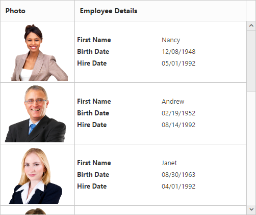

# Row
It represents the record details that are fetched from the datasource.

## Row Hover
You can see the mouse hovering effect on the corresponding grid rows using `EnableRowHover` property. By default its value is `true`.
The following code example describes the above behavior.




     @{Html.EJ().Grid<OrdersView>("FlatGrid")
         .Datasource((IEnumerable<object>)ViewBag.datasource)
         .AllowPaging()   
         .EnableRowHover(true)        
         .Columns(col =>
          {
             col.Field("OrderID").Add();
             col.Field("EmployeeID").Add();
             col.Field("ShipCity").Add();
             col.Field("ShipCountry").Add();
             col.Field("Freight").Add();
        }).Render();
      }



     namespace MVCSampleBrowser.Controllers
      {
       public class GridController : Controller
        {
         public IActionResult Default()
          {
            var DataSource = new NorthwindDataContext().OrdersViews.ToList();
            ViewBag.datasource = DataSource;
            return View();
           }
        }
      }

 
The following output is displayed as a result of the above code example.

## Details Template

It provides a detailed view /additional information about each row of the grid. You can render any type of JsRender template and assign the script template id in the `DetailsTemplate` property. And also you can change HTML elements in detail template row into JavaScript controls using `DetailsDataBound ` event.

On enabling details template, new column will be added in grid with an expander button in it and that can be expanded or collapsed to show or hide the underlying details row respectively.

N> It's a standard way to enclose the template within the `script` tag with `type` as "text/x-jsrender".

The following code example describes the above behavior.




   @{Html.EJ().Grid<EmployeeView>("DetailTemplate")
          .Datasource((IEnumerable<object>)ViewBag.datasource)
          .DetailsTemplate("#tabGridContents")
          .ClientSideEvents(eve => { eve.DetailsDataBound("detailGridData"); })
          .Columns(col =>
               {
                     col.Field("EmployeeID").Add();
                     col.Field("FirstName").Add();
                     col.Field("Title").Add();
                     col.Field("City").Add();
                     col.Field("Country").Add();
                }).Render();
             }



     namespace MVCSampleBrowser.Controllers
       {
         public class GridController : Controller
           { 
             public IActionResult DetailTemplate()
               {
                   var DataSource = new NorthwindDataContext().EmployeeViews.ToList();
                   ViewBag.datasource = DataSource;
                   return View();
                }
           }
      }



   



The following output is displayed as a result of the above code example.

## Row Template

Row template enables you to set the customized look and behavior to grid all rows. `RowTemplate` property can be used bind the `id` of HTML template.
The following code example describes the above behavior.









@{Html.EJ().Grid<EmployeeView>("RowTemplate")
        .Datasource((IEnumerable<object>)ViewBag.datasource)
        .Query("new ej.Query().take(2)")
        .RowTemplate("#templateData")    // row template
        .Columns(col =>
            {
                col.HeaderText("Photo").Width(30).Add();
                col.HeaderText("Employee Details").Width(70).Add();
            }).Render();
       
}


namespace MVCSampleBrowser.Controllers
  {
	   public class GridController : Controller
         {
               public IActionResult RowTemplate()
                {
                     var DataSource = new NorthwindDataContext().EmployeeViews.ToList();
                      ViewBag.datasource = DataSource;
                      return View();
                }
         }
  }



The following output is displayed as a result of the above code example.

## Alternate row styling

Alternate row styling enhances the readability of grid rows by setting different background color for every alternate row. You can enable the alternative row styling in grid by using `EnableAltRow` property. 

By default its value is `true`, so the following code example describes the how to turn off alternate row behavior.




   @{Html.EJ().Grid<OrdersView>("Grid")
         .Datasource((IEnumerable<object>)ViewBag.datasource)
         .AllowPaging()
         .EnableAltRow(false)
         .Columns(col =>
            {
               col.Field("OrderID").Add();
               col.Field("EmployeeID").Add();
               col.Field("ShipCity").Add();
               col.Field("ShipCountry").Add();
               col.Field("Freight").Add();
            }).Render();
}



     namespace MVCSampleBrowser.Controllers
      {
        public class GridController : Controller
         {
           public IActionResult Default()
            {
               var DataSource = new NorthwindDataContext().OrdersViews.ToList();
               ViewBag.datasource = DataSource;
               return View();
            }
        }
     }

 
The following output is displayed as a result of the above code example.

