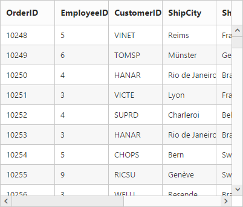

# Scrolling

Scrolling can be enabled by setting `AllowScrolling`  as `true`. The height and width can be set to grid by using the properties  `Height` and `Width` property of  `ScrollSettings`. 

 N> If `Width`  and `Height`  is not defined in the `ScrollSettings`  property then the horizontal and vertical scrollbar is enabled, only when the grid width exceeds the browser width.

The height and width can be set in percentage and pixel. The default value for `Height`  and `Width`  in `ScrollSettings`  is 0 and `auto` respectively.

The following code example describes the above behavior.

 


	  @{Html.EJ().Grid<OrdersView>("Scrolling")
            .Datasource((IEnumerable<object>)ViewBag.datasource)
            .AllowScrolling()
            .ScrollSettings(col => { col.Width(400).Height(300); })             
            .Columns(col =>
            {
                col.Field("OrderID").Add();
                col.Field("EmployeeID").Add();
                col.Field("CustomerID").Add();
                col.Field("ShipCity").Add();
                col.Field("ShipCountry").Add()
                col.Field("ShipAddress").Add();
                col.Field("ShipPostalCode").Add();
                col.Field("Freight").Format("{0:C}").Add();    
            }).Render();
      	}


		
	    namespace MVCSampleBrowser.Controllers
     	 {
          public partial class GridController : Controller
          {
           public IActionResult Scrolling()
             {
                var DataSource = new NorthwindDataContext().OrdersViews.ToList();
                ViewBag.datasource = DataSource;
                return View();
              }
            }
         }

 

The following output is displayed as a result of the above code example.

## Set Width and Height in pixel 

To specify the `Width` and `Height` property of  `ScrollSettings` in pixel, by set the pixel value as integer. 

The following code example describes the above behavior.

 


	  @{Html.EJ().Grid<OrdersView>("Scrolling")
            .Datasource((IEnumerable<object>)ViewBag.datasource)
            .AllowScrolling()
            .ScrollSettings(col => { col.Width(500).Height(300); })             
            .Columns(col =>
            {
                col.Field("OrderID").Add();
                col.Field("EmployeeID").Add();
                col.Field("CustomerID").Add();
                col.Field("ShipCity").Add();
                col.Field("ShipCountry").Add();
                col.Field("ShipAddress").Add();
                col.Field("ShipPostalCode").Add();
                col.Field("Freight").Format("{0:C}").Add();    
            }).Render();
      	}


		
        namespace MVCSampleBrowser.Controllers
     	 {
          public partial class GridController : Controller
          {
           public IActionResult Scrolling()
             {
                var DataSource = new NorthwindDataContext().OrdersViews.ToList();
                ViewBag.datasource = DataSource;
                return View();
              }
           }
         }

 

The following output is displayed as a result of the above code example.

## Set Width and Height in percentage

To specify the `Width` and `Height` property of  `ScrollSettings`  in percentage, by set the percentage value as string.

The following code example describes the above behavior.

 


	  @{Html.EJ().Grid<OrdersView>("Scrolling")
            .Datasource((IEnumerable<object>)ViewBag.datasource)
            .AllowScrolling()
            .ScrollSettings(col => { col.Width("70%").Height("5%"); })             
            .Columns(col =>
            {
                col.Field("OrderID").Add();
                col.Field("EmployeeID").Add();
                col.Field("CustomerID").Add();
                col.Field("ShipCity").Add();
                col.Field("ShipCountry").Add();
                col.Field("ShipAddress").Add();
                col.Field("ShipPostalCode").Add();
                col.Field("Freight").Format("{0:C}").Add();    
            }).Render();
      	}


		
	    namespace MVCSampleBrowser.Controllers
     	 {
          public partial class GridController : Controller
          {
           public IActionResult Scrolling()
             {
                var DataSource = new NorthwindDataContext().OrdersViews.ToList();
                ViewBag.datasource = DataSource;
                return View();
              }
           }
         }

 

The following output is displayed as a result of the above code example.

## Set Width as auto

Specify `Width`  property of `ScrollSettings`  as auto, then the scrollbar is rendered only when the grid width exceeds the browser window width.

The following code example describes the above behavior.

 


	  @{Html.EJ().Grid<OrdersView>("Scrolling")
            .Datasource((IEnumerable<object>)ViewBag.datasource)
            .AllowScrolling()
            .ScrollSettings(col => { col.Width("auto").Height(300); })            
            .Columns(col =>
            {
                col.Field("OrderID").Add();
                col.Field("EmployeeID").Add();
                col.Field("CustomerID").Add();
                col.Field("ShipCity").Add();
                col.Field("ShipCountry").Add();
                col.Field("ShipAddress").Add();
                col.Field("ShipPostalCode").Add();
                col.Field("Freight").Format("{0:C}").Add();    
            }).Render();
       	}


		
	    namespace MVCSampleBrowser.Controllers
     	 {
          public partial class GridController : Controller
          {
           public IActionResult Scrolling()
             {
                var DataSource = new NorthwindDataContext().OrdersViews.ToList();
                ViewBag.datasource = DataSource;
                return View();
              }
           }
         }

 

The following output is displayed as a result of the above code example.

## Frozen Columns

Specify `FrozenColumns`  property of `ScrollSettings`  to freeze the columns(upto the specified frozenColumns value) at the time of scrolling. Horizontal scrollbar must be enabling while specifying `FrozenColumns`  then only you can scroll and see the remaining columns with freeze pane.

N> `AllowScrolling`  must be `true` while specifying `FrozenColumns` .

The following code example describes the above behavior.

 


	  @{Html.EJ().Grid<OrdersView>("Scrolling")
            .Datasource((IEnumerable<object>)ViewBag.datasource)
            .AllowScrolling()
            .ScrollSettings(col => { col.Width(550).Height(300).FrozenColumns(2); })             
            .Columns(col =>
            {
                col.Field("OrderID").Add();
                col.Field("EmployeeID").Add();
                col.Field("CustomerID").Add();
                col.Field("ShipCity").Add();
                col.Field("ShipCountry").Add();
                col.Field("ShipAddress").Add();
                col.Field("ShipPostalCode").Add();
                col.Field("Freight").Format("{0:C}").Add();    
            }).Render();
        }


		
        namespace MVCSampleBrowser.Controllers
     	 {
          public partial class GridController : Controller
          {
           public IActionResult Scrolling()
             {
                var DataSource = new NorthwindDataContext().OrdersViews.ToList();
                ViewBag.datasource = DataSource;
                return View();
              }
           }
         }

 

The following output is displayed as a result of the above code example.

### Freeze particular columns:

To freeze selected columns in grid at the time of scrolling, by set `IsFrozen`  property of columns as `true`. `IsFrozen`  columns are rendered first in the grid even the columns index is different while declaring the `Columns` .

The following code example describes the above behavior.

 


	  @{Html.EJ().Grid<OrdersView>("Scrolling")
            .Datasource((IEnumerable<object>)ViewBag.datasource)
            .AllowScrolling()
            .ScrollSettings(col => { col.Width(550).Height(400); })              
            .Columns(col =>
            {
                col.Field("OrderID").Add();
                col.Field("EmployeeID").Add();
                col.Field("CustomerID").Add();
                col.Field("Freight").Format("{0:C}").IsFrozen(true).Add(); 
                col.Field("OrderDate").Format("{0:dd/MM/yyyy}").Add();
                col.Field("ShipCity").Add();
                col.Field("ShipCountry").Width(100).IsFrozen(true).Add();
                col.Field("ShipAddress").Add();
                col.Field("ShipPostalCode").Add();         
            }).Render();
       	}


		
        namespace MVCSampleBrowser.Controllers
         {
          public partial class GridController : Controller
          {
           public IActionResult Scrolling()
             {
                var DataSource = new NorthwindDataContext().OrdersViews.ToList();
                ViewBag.datasource = DataSource;
                return View();
              }
           }
         }

 

The following output is displayed as a result of the above code example.

### Frozen Columns alert Messages:

1. If `AllowScrolling`  is false while using `FrozenColumns`  then "Enable `AllowScrolling`  while using frozen Columns" alert message is thrown.
2. If `FrozenColumns`  is specified out of the grid column view then "Frozen columns should be in grid view area" alert message is thrown.
3. Frozen Rows and Columns are not supported the following features
 Grouping
 Row Template
 Detail Template
 Hierarchy Grid 
 Batch Editing

If any one of the above feature is enabled along with Frozen Rows and Columns, then "Frozen Columns and Rows are not supported for Grouping, Row Template, Detail Template, Hierarchy Grid and Batch Editing" alert message is thrown.

## Frozen Rows

Specify `FrozenRows`  property of `ScrollSettings`  to freeze rows(upto the specified FrozenRows value) at the time of scrolling. Vertical scrollbar must be enabling while specifying `FrozenRows`  then only you can scroll and see the remaining rows with freeze pane.

N> `AllowScrolling`  must be `true` while specifying `FrozenRows` .

The following code example describes the above behavior.

 


	  @{Html.EJ().Grid<OrdersView>("Scrolling")
            .Datasource((IEnumerable<object>)ViewBag.datasource)
            .AllowScrolling()
            .ScrollSettings(col => { col.Width(550).Height(300).FrozenRows(4); })             
            .Columns(col =>
            {
                col.Field("OrderID").Add();
                col.Field("EmployeeID").Add();
                col.Field("CustomerID").Add();   
                col.Field("ShipCity").Add();
                col.Field("ShipCountry").Add();
                col.Field("ShipAddress").Add();
                col.Field("ShipPostalCode").Add();
                col.Field("Freight").Format("{0:C}").Add();    
            }).Render();
       	}


		
        namespace MVCSampleBrowser.Controllers
     	 {
          public partial class GridController : Controller
          {
           public IActionResult Scrolling()
             {
                var DataSource = new NorthwindDataContext().OrdersViews.ToList();
                ViewBag.datasource = DataSource;
                return View();
              }
           }
        }

 

The following output is displayed as a result of the above code example.

## Touch scroll

In touch  supported devices you can scroll and show the content by swipe left, right, top and bottom. Disable touch scroll by setting `EnableTouchScroll`  property of `ScrollSettings`  as `false`.

The following code example describes the above behavior.

 


	  @{Html.EJ().Grid<OrdersView>("Scrolling")
            .Datasource((IEnumerable<object>)ViewBag.datasource)
            .AllowScrolling()
            .ScrollSettings(col => { col.Width(550).Height(300).EnableTouchScroll(false); })             
            .Columns(col =>
            {
                col.Field("OrderID").Add();
                col.Field("EmployeeID").Add();
                col.Field("CustomerID").Add();
                col.Field("ShipCity").Add();
                col.Field("ShipCountry").Add();
                col.Field("ShipAddress").Add();
                col.Field("ShipPostalCode").Add();
                col.Field("Freight").Format("{0:C}").Add();    
            }).Render();
       	}


		
         namespace MVCSampleBrowser.Controllers
     	 {
          public partial class GridController : Controller
          {
           public IActionResult Scrolling()
             {
                var DataSource = new NorthwindDataContext().OrdersViews.ToList();
                ViewBag.datasource = DataSource;
                return View();
              }
           }
         }

 

## Virtual Scrolling

The virtual scrolling support allows you to load data that you require (load data based on page size) without buffering the entire huge database. To enable virtual scrolling by setting `AllowVirtualScrolling`  property of `ScrollSettings`  as `true`. 

We also have an enhanced virtual scrolling feature with an improvised virtual scrolling performance. To enable improvised virtual scrolling feature by setting `EnableVirtualization` property of `ScrollSettings` as true and it doesn't requires `AllowVirtualScrolling` to enabled. It allows you to load the grid with data while scrolling. In order to enable this, you need to enable `EnableVirtualization` property of the `ScrollSettings`. Some of the relevant functionalities of this are,

1.	White space will not be appeared in the Grid. 
2.	Improved page rendering performance. 
3.  It can render nearly 500 thousand records.

It supports two mode of virtualization. They are,

1. Normal Mode
2. Continuous Mode

N> Enhanced Virtual Scrolling supports only Normal mode
N> The following features are not supported by virtual scrolling 
N> 1. Grouping
N> 2. Frozen Rows 
N> 3. Cell merging 
N> 4. Detail template 
N> 5. Row template 
N> 6. Hierarchy
N> 7. Editing

### Normal Mode:

It allows you to load the grid with data while scrolling. This can be achieved by setting `VirtualScrollMode`  as `Normal`.

The following code example describes the above behavior.

 


	  @{Html.EJ().Grid<OrdersView>("Scrolling")
            .Datasource((IEnumerable<object>)ViewBag.datasource)
            .AllowScrolling()
            .ScrollSettings(col => { col.Width(550).Height(300).AllowVirtualScrolling(true).VirtualScrollMode(VirtualScrollMode.Normal); })             
            .Columns(col =>
            {
                col.Field("OrderID").Add();
                col.Field("EmployeeID").Add();
                col.Field("CustomerID").Add();
                col.Field("ShipCity").Add();
                col.Field("ShipCountry").Add();
                col.Field("ShipAddress").Add();
                col.Field("ShipPostalCode").Add();
                col.Field("Freight").Format("{0:C}").Add();    
            }).Render();
       	}


		
        namespace MVCSampleBrowser.Controllers
     	 {
          public partial class GridController : Controller
          {
           public IActionResult Scrolling()
             {
                var DataSource = new NorthwindDataContext().OrdersViews.ToList();
                ViewBag.datasource = DataSource;
                return View();
              }
           }
        }



The following output is displayed as a result of the above code example.

#### Enhanced Virtual Scrolling:

In order to enable this, you need to set the `EnableVirtualization` property of the `ScrollSettings` as true. 

The following code example describes the above behavior.

 


	  @{Html.EJ().Grid<OrdersView>("Scrolling")
            .Datasource((IEnumerable<object>)ViewBag.datasource)
            .AllowScrolling()
            .ScrollSettings(col => { col.Width(550).Height(300).EnableVirtualization(true); })             
            .Columns(col =>
            {
                col.Field("OrderID").Add();
                col.Field("EmployeeID").Add();
                col.Field("CustomerID").Add();
                col.Field("ShipCity").Add();
                col.Field("ShipCountry").Add();
                col.Field("ShipAddress").Add();
                col.Field("ShipPostalCode").Add();
                col.Field("Freight").Format("{0:C}").Add();    
            }).Render();
       	}


		
        namespace MVCSampleBrowser.Controllers
     	 {
          public partial class GridController : Controller
          {
           public IActionResult Scrolling()
             {
                var DataSource = new NorthwindDataContext().OrdersViews.ToList();
                ViewBag.datasource = DataSource;
                return View();
              }
           }
        }



The following output is displayed as a result of the above code example.

### Continuous Mode:

In Continuous mode, the data is loaded in grid when the scrollbar reaches the end.  You can enable the continuous mode by setting the `VirtualScrollMode`  property as `Continuous`.

The following code example describes the above behavior.

 


	  @{Html.EJ().Grid<OrdersView>("Scrolling")
            .Datasource((IEnumerable<object>)ViewBag.datasource)
            .AllowScrolling()
            .ScrollSettings(col => { col.Width(550).Height(300).AllowVirtualScrolling(true).VirtualScrollMode(VirtualScrollMode.Continuous); })             
            .Columns(col =>
            {
                col.Field("OrderID").Add();
                col.Field("EmployeeID").Add();
                col.Field("CustomerID").Add();
                col.Field("ShipCity").Add();
                col.Field("ShipCountry").Add();
                col.Field("ShipAddress").Add();
                col.Field("ShipPostalCode").Add();
                col.Field("Freight").Format("{0:C}").Add();    
            }).Render();
       	}


		
        namespace MVCSampleBrowser.Controllers
     	 {
          public partial class GridController : Controller
          {
           public IActionResult Scrolling()
             {
                var DataSource = new NorthwindDataContext().OrdersViews.ToList();
                ViewBag.datasource = DataSource;
                return View();
              }
           }
        }



The following output is displayed as a result of the above code example.

 
