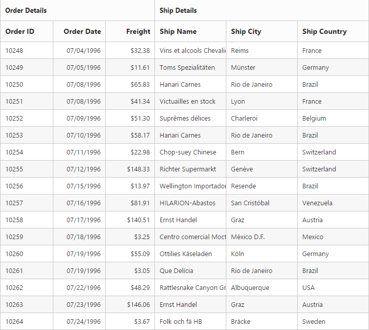

# Stacked Headers

The stacked headers helps you to group the logical columns in grid. It can be shown by setting `ShowStackedHeader` as `true` and by defining `StackedHeaderRows`.

## Adding Stacked header columns

To stack columns in stacked header, you need to define `Column` property in `StackedHeaderColumns` with field names of visible columns.





@{Html.EJ().Grid<OrdersView>("Grid")
	.Datasource((IEnumerable<object>)ViewBag.datasource)
	 .ShowStackedHeader()
        .StackedHeaderRows(row =>
        {
            row.StackedHeaderColumns(column =>
            {
                column.HeaderText("OrderDetails").Column(col =>
                {
                    col.Add("OrderID");
                    col.Add("OrderDate");
                    col.Add("Freight");
                }).Add();
                column.HeaderText("Ship Details").Column(col =>
                {
                    col.Add("ShipName");
                    col.Add("ShipCity");
                    col.Add("ShipCountry");
                }).Add();
            }).Add();
        })
        .Columns(col =>
        {
            col.Field("OrderID").HeaderText("Order ID").Width(80).Add();
            col.Field("OrderDate").HeaderText("Order Date").Width(80).Format("{0:MM/dd/yyyy}").TextAlign(TextAlign.Right).Add();
            col.Field("Freight").HeaderText("Freight").TextAlign(TextAlign.Right).Width(75).Format("{0:C}").Add();
            col.Field("ShipName").HeaderText("Ship Name").Width(110).Add();
            col.Field("ShipCity").HeaderText("Ship City").Width(110).Add();
            col.Field("ShipCountry").HeaderText("Ship Country").Width(110).Add();
        }).Render();
       }




namespace SyncfusionMvcApplication3.Controllers

{
    public class HomeController : Controller
    {
        public IActionResult Index()
        {
            var DataSource = new NorthwindDataContext().OrdersViews.ToList();
            ViewBag.datasource = DataSource;
            return View();

        }
    }
}


 

