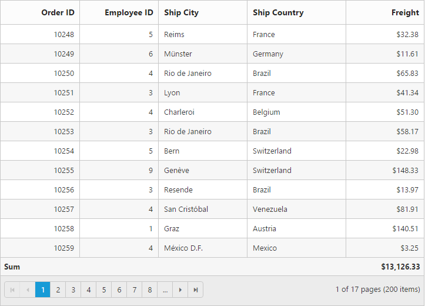
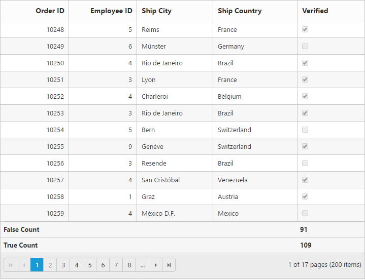

# Summary 

Summary rows visibility can be controlled by `ShowSummary` property and it can be added to grid by using `SummaryRow` array property. The following code example describes the above behavior.





@{Html.EJ().Grid<OrdersView>("Summary")
	.Datasource((IEnumerable<object>)ViewBag.datasource)
	.ShowSummary()
	.SummaryRow(row =>
	{
		row.Title("Sum").SummaryColumns(col => { col.SummaryType(SummaryType.Sum).Format("{0:C}").DisplayColumn("Freight").DataMember("Freight").Add(); }).Add();
	})
	.AllowPaging()
	.Columns(col =>
	{
		col.Field("OrderID").HeaderText("Order ID").IsPrimaryKey(true).TextAlign(TextAlign.Right).Width(80).Add();
		col.Field("EmployeeID").HeaderText("Employee ID").TextAlign(TextAlign.Right).Width(80).Add();
		col.Field("ShipCity").HeaderText("Ship City").Width(90).Add();
		col.Field("ShipCountry").HeaderText("Ship Country").Width(100).Add();
		col.Field("Freight").HeaderText("Freight").TextAlign(TextAlign.Right).Width(80).Format("{0:C}").Add();

	}).Render();
}




namespace SyncfusionMvcApplication3.Controllers

{
    public class HomeController : Controller
    {
        public IActionResult Index()
        {
            var DataSource = new NorthwindDataContext().OrdersViews.ToList();
            ViewBag.datasource = DataSource;
            return View();

        }
    }
}


 

## Supported Aggregates 

Following are the supported list of aggregates 

* Sum
* Average
* Maximum
* Minimum
* False Count
* True Count

### Sum, Average, Maximum and minimum

Summaries with `Sum`,`Average`,`Maximum` and `Minimum` aggregate can be defined by using  `SummaryType` in `SummaryColumns` collections. These aggregate are used in `Number` column.





@{Html.EJ().Grid<OrdersView>("Summary")
	.Datasource((IEnumerable<object>)ViewBag.datasource)
	.ShowSummary()
	.SummaryRow(row =>
	{
		row.Title("Sum").SummaryColumns(col => { col.SummaryType(SummaryType.Sum).Format("{0:C}").DisplayColumn("Freight").DataMember("Freight").Add(); }).Add();
		row.Title("Average").SummaryColumns(col => { col.SummaryType(SummaryType.Average).Format("{0:C}").DisplayColumn("Freight").DataMember("Freight").Add(); }).Add();
		row.Title("Maximum").SummaryColumns(col => { col.SummaryType(SummaryType.Maximum).Format("{0:C}").DisplayColumn("Freight").DataMember("Freight").Add(); }).Add();
		row.Title("Minimum").SummaryColumns(col => { col.SummaryType(SummaryType.Minimum).Format("{0:C}").DisplayColumn("Freight").DataMember("Freight").Add(); }).Add();
	  })
	.AllowPaging()
	.Columns(col =>
	{
		col.Field("OrderID").HeaderText("Order ID").IsPrimaryKey(true).TextAlign(TextAlign.Right).Width(80).Add();
		col.Field("EmployeeID").HeaderText("Employee ID").TextAlign(TextAlign.Right).Width(80).Add();
		col.Field("ShipCity").HeaderText("Ship City").Width(90).Add();
		col.Field("ShipCountry").HeaderText("Ship Country").Width(100).Add();
		col.Field("Freight").HeaderText("Freight").TextAlign(TextAlign.Right).Width(80).Format("{0:C}").Add();

	}).Render();
}




namespace SyncfusionMvcApplication3.Controllers

{
    public class HomeController : Controller
    {
        public IActionResult Index()
        {
            var DataSource = new NorthwindDataContext().OrdersViews.ToList();
            ViewBag.datasource = DataSource;
            return View();

        }
    }
}


 

### True and False Count 

Summaries with `True` and `False` count aggregate can be defined by using `SummaryType`,`SummaryColumns` collections. `True` and `False` count aggregates are used for Boolean columns.





@{Html.EJ().Grid<OrdersView>("Summary")
	.Datasource((IEnumerable<object>)ViewBag.datasource)
	.ShowSummary()
	.SummaryRow(row =>
	{
		row.Title("False Count").SummaryColumns(col => { col.SummaryType(SummaryType.Falsecount).DisplayColumn("Verified").DataMember("Verified").Add(); }).Add();
		row.Title("True Count").SummaryColumns(col => { col.SummaryType(SummaryType.Truecount).DisplayColumn("Verified").DataMember("Verified").Add(); }).Add();
		
	})  
	.AllowPaging()
	.Columns(col =>
	{
		col.Field("OrderID").HeaderText("Order ID").IsPrimaryKey(true).TextAlign(TextAlign.Right).Width(80).Add();
		col.Field("EmployeeID").HeaderText("Employee ID").TextAlign(TextAlign.Right).Width(80).Add();
		col.Field("ShipCity").HeaderText("Ship City").Width(90).Add();
		col.Field("ShipCountry").HeaderText("Ship Country").Width(100).Add();
		col.Field("Verified").HeaderText("Verified").Width(80).Add();

	}).Render();
}




namespace SyncfusionMvcApplication3.Controllers

{
    public class HomeController : Controller
    {
        public IActionResult Index()
        {
            var DataSource = new NorthwindDataContext().OrdersViews.ToList();
            ViewBag.datasource = DataSource;
            return View();

        }
    }
}


 

## Custom Summary

Custom Summary can be used to create summary values based on your required custom logic and calculations. To enable Custom Summary, `SummaryType` should be `Custom` and `CustomSummaryValue` property need to define as function. In this property `CustomSummaryValue` function, you need to use Grid instance to access `model.dataSource` and `model.currentViewData`. After the custom calculation, the returned value will be displayed in corresponding Summary cell.




@{Html.EJ().Grid<OrdersView>("Summary")
	.Datasource((IEnumerable<object>)ViewBag.datasource)
	.ShowSummary()
	.SummaryRow(row =>
	{
		 row.Title("Currency").SummaryColumns(col => { col.SummaryType(SummaryType.Custom).CustomSummaryValue("currency").DisplayColumn("Freight").Format("{0:C2}").Add(); }).Add(););
		
		
	})  
	.AllowPaging()
	.Columns(col =>
	{
		col.Field("OrderID").HeaderText("Order ID").IsPrimaryKey(true).TextAlign(TextAlign.Right).Width(70).Add();
		col.Field("CustomerID").HeaderText("CustomerID").TextAlign(TextAlign.Right).Width(70).Add();
		col.Field("ShipCity").HeaderText("Ship City").Width(70).Add();
		col.Field("EmployeeID").HeaderText("Employee ID").TextAlign(TextAlign.Right).Width(70).Add();
		col.Field("Freight").HeaderText("Freight").TextAlign(TextAlign.Right).Width(70).Format("{0:C}").Add();

	}).Render();
}




namespace SyncfusionMvcApplication3.Controllers

{
    public class HomeController : Controller
    {
        public IActionResult Index()
        {
            var DataSource = new NorthwindDataContext().OrdersViews.ToList();
            ViewBag.datasource = DataSource;
            return View();

        }
    }
}







 

## Group Summary

Group Summary is used to summarize values of a particular column based on group and it shows at bottom of each Group. To enable Group Summary for particular Group, you need to define `ShowTotalSummary` as false.





@{Html.EJ().Grid<OrdersView>("Summary")
	.Datasource((IEnumerable<object>)ViewBag.datasource)
	.ShowSummary()
	.SummaryRow(row =>
	{
		row.ShowTotalSummary(false).SummaryColumns(col => 
		{ 
			col.SummaryType(SummaryType.Sum)
			.Format("{0:C2}")
			.DisplayColumn("Freight")
			.DataMember("Freight")
			.Prefix("Sum = ")
			.Add(); 
		}).Add();
	})
	.AllowPaging()
	.AllowSorting()
	.AllowGrouping()
	.GroupSettings(group => { group.GroupedColumns(col => { col.Add("CustomerID"); }); })
	.Columns(col =>
	{
		col.Field("OrderID").HeaderText("Order ID").IsPrimaryKey(true).Width(80).Add();
		col.Field("CustomerID").HeaderText("CustomerID").TextAlign(TextAlign.Right).Width(75).Add();
		col.Field("ShipCity").HeaderText("Ship City").Width(150).Add();	
		col.Field("EmployeeID").HeaderText("Employee ID").TextAlign(TextAlign.Right).Width(75).Add();		
		col.Field("Freight").HeaderText("Freight").TextAlign(TextAlign.Right).Width(75).Format("{0:C}").Add();

	}).Render();
}




namespace SyncfusionMvcApplication3.Controllers

{
    public class HomeController : Controller
    {
        public IActionResult Index()
        {
            var DataSource = new NorthwindDataContext().OrdersViews.ToList();
            ViewBag.datasource = DataSource;
            return View();

        }
    }
}





W> Minimum one column should be grouped to show summary details.

## Group Caption Summary

To show summaries in each Group's Caption row, particular summary row should have `ShowTotalSummary` as `false` and `ShowCaptionSummary` as `true`.




@{Html.EJ().Grid<OrdersView>("Summary")
	.Datasource((IEnumerable<object>)ViewBag.datasource)
	.ShowSummary()
	.SummaryRow(row =>
	{
		row.ShowTotalSummary(false).SummaryColumns(col => 
		{ 
			col.SummaryType(SummaryType.Average)
			.Format("{0:C2}")
			.DisplayColumn("Freight")
			.DataMember("Freight")
			.Prefix("Average = ")
			.Add(); 
		}).Add();
	})
	.AllowPaging()
	.AllowSorting()
	.AllowGrouping()
	.GroupSettings(group => { group.GroupedColumns(col => { col.Add("EmployeeID"); }); })
	.Columns(col =>
	{
		col.Field("OrderID").HeaderText("Order ID").IsPrimaryKey(true).Width(80).Add();
		col.Field("CustomerID").HeaderText("CustomerID").TextAlign(TextAlign.Right).Width(75).Add();
		col.Field("ShipCity").HeaderText("Ship City").Width(150).Add();	
		col.Field("EmployeeID").HeaderText("Employee ID").TextAlign(TextAlign.Right).Width(75).Add();		
		col.Field("Freight").HeaderText("Freight").TextAlign(TextAlign.Right).Width(75).Format("{0:C}").Add();

	}).Render();
}




namespace SyncfusionMvcApplication3.Controllers

{
    public class HomeController : Controller
    {
        public IActionResult Index()
        {
            var DataSource = new NorthwindDataContext().OrdersViews.ToList();
            ViewBag.datasource = DataSource;
            return View();

        }
    }
}





W> Minimum one column should be grouped to show summary details.

## Format

To format Summary values, `Format` property needs to be assigned in `SummaryColumns` collection object.  To know more about formatting options. Please refer [**globalize.js**](https://github.com/jquery/globalize/tree/v0.1.1#)





@{Html.EJ().Grid<OrdersView>("Summary")
	.Datasource((IEnumerable<object>)ViewBag.datasource)
	.ShowSummary()
	.SummaryRow(row =>
	{
		row.Title("Sum").SummaryColumns(col => { col.SummaryType(SummaryType.Sum).Format("{0:C}").DisplayColumn("Freight").DataMember("Freight").Add(); }).Add();
	})
	.AllowPaging()
	.Columns(col =>
	{
		col.Field("OrderID").HeaderText("Order ID").IsPrimaryKey(true).TextAlign(TextAlign.Right).Width(80).Add();
		col.Field("EmployeeID").HeaderText("Employee ID").TextAlign(TextAlign.Right).Width(80).Add();
		col.Field("ShipCity").HeaderText("Ship City").Width(90).Add();
		col.Field("ShipCountry").HeaderText("Ship Country").Width(100).Add();
		col.Field("Freight").HeaderText("Freight").TextAlign(TextAlign.Right).Width(80).Format("{0:C}").Add();

	}).Render();
}




namespace SyncfusionMvcApplication3.Controllers

{
    public class HomeController : Controller
    {
        public IActionResult Index()
        {
            var DataSource = new NorthwindDataContext().OrdersViews.ToList();
            ViewBag.datasource = DataSource;
            return View();

        }
    }
}


 

## Handling Aggregation in server side

The Aggregation at server side is handled by using `aggregate` key. While using remote data, Summary Row must be handled by returning summary column datasource into the `aggregate` property of `result` object.

The following code example describes the above behavior.





@{Html.EJ().Grid<OrdersView>("Summary")

  .Datasource(ds => ds.URL("/Grid/DataSource").Adaptor("UrlAdaptor"))
  .ShowSummary()
  .AllowPaging()
  .SummaryRow(row =>
   {
       row.ShowTotalSummary(true)
       row.Title("Sum").SummaryColumns(col ={
       col.SummaryType(SummaryType.Sum)
       .DisplayColumn("Freight")
       .DataMember("Freight")
       .Format("{0:C}")
       .Add();
    }).Add();
})

.Columns(col =>
{
   col.Field("OrderID").HeaderText("Order ID").Width(100).Add();
   col.Field("EmployeeID").HeaderText("Employee ID").Width(100).Add();
   col.Field("Freight").HeaderText("Freight").Width(100).Format("{0:C}").Add();
   col.Field("ShipCity").HeaderText("Ship City").Width(100).Add();
}).Render();

}





namespace MvcApplication4.Controllers
{
    public partial class GridController: Controller
       {
        public IActionResult GridFeatures()
           {

			 return View();
           }

     public IActionResult DataSource(DataManager dm)
       {
            IEnumerable DataSource = OrderRepository.GetAllRecords();
		    DataOperations ds = new DataOperations();
            List<string> str = new List<string>();
            if (dm.Aggregates != null)
             {
               for (var i = 0; i < dm.Aggregates.Count; i++)
               str.Add(dm.Aggregates[i].Field);
               result.aggregate = ds.PerformSelect(DataSource, str);
             }

       DataSource = ds.PerformSkip(DataSource, dm.Skip);
       result.result = ds.PerformTake(DataSource, dm.Take);
       result.count = DataSource.AsQueryable().Count();
       return Json(result, JsonRequestBehavior.AllowGet);

       }

    public class DataResult
       {
         public IEnumerable result { get; set; }
         public int count { get; set; }
         public IEnumerable aggregate { get; set; }
       }

   }

}


 

The following output is displayed as a result of the above code example.

