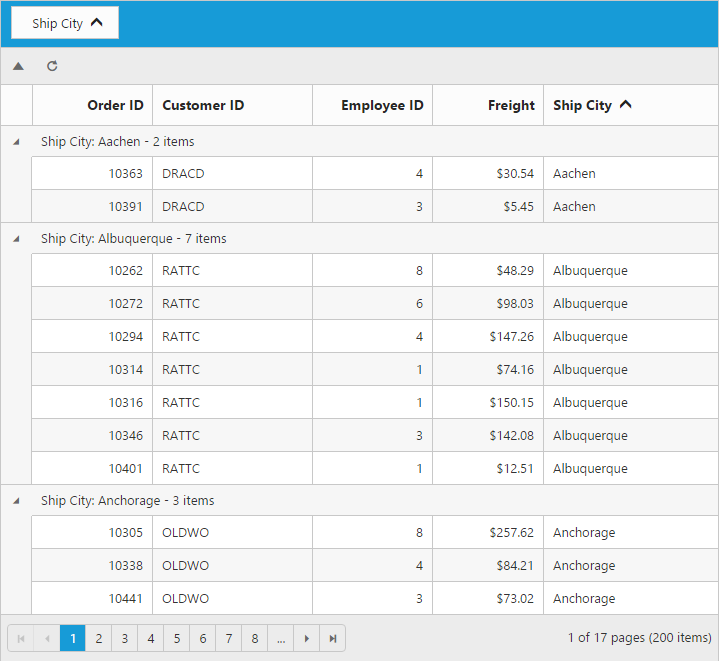

# Toolbar

Toolbar can be shown by defining `ShowToolbar` property in `ToolbarSettings`. Toolbar has option to add default items in `ToolbarItems` and customized items in `CustomToolbarItems`.

## Default Toolbar items

The following table shows default toolbar items and its action. 

<table>
<tr>
<th>
Default toolbar items</th><th>
Action</th></tr>
<tr>
<td>
Add</td><td>
Add a new row</td></tr>
<tr>
<td>
Edit</td><td>
Edit an existing</td></tr>
<tr>
<td>
Delete</td><td>
Delete a row</td></tr>
<tr>
<td>
Update</td><td>
Update edited or added row</td></tr>
<tr>
<td>
Cancel</td><td>
Cancel edited or added row</td></tr>
<tr>
<td>
Search</td><td>
Search text in records</td></tr>
</table>




using System;
using System.Collections.Generic;
using System.Linq;
using System.Web;
using System.Web.Mvc;
using SyncfusionMvcApplication1;
using SyncfusionMvcApplication1.Models;
namespace SyncfusionMvcApplication1.Controllers
{
    public class GridController : Controller
    {
        //
        // GET: /Grid/
        public IActionResult GridFeatures()
        {
            var DataSource = new NorthwindDataContext().OrdersViews.ToList();
            ViewBag.datasource = DataSource;
            return View();
        }
    }
}





@{Html.EJ().Grid<object>("FlatGrid")
        .Datasource((IEnumerable<object>)ViewBag.datasource)
        .EditSettings(edit => { edit.AllowAdding().AllowDeleting().AllowEditing(); })
        .ToolbarSettings(toolbar =>
        {
            toolbar.ShowToolbar().ToolbarItems(items =>
            {
                items.AddTool(ToolBarItems.Add);
                items.AddTool(ToolBarItems.Edit);
                items.AddTool(ToolBarItems.Delete);
                items.AddTool(ToolBarItems.Update);
                items.AddTool(ToolBarItems.Cancel);
            });

        })
        .AllowPaging()
        .Columns(col =>
        {
            col.Field("OrderID").HeaderText("Order ID").IsPrimaryKey(true).TextAlign(TextAlign.Right).Width(90).Add();
            col.Field("CustomerID").HeaderText("Customer ID").Width(90).Add();
            col.Field("EmployeeID").HeaderText("Employee ID").TextAlign(TextAlign.Right).Width(80).Add();
            col.Field("Freight").HeaderText("Freight").TextAlign(TextAlign.Right).Width(80).Format("{0:C}").Add();
            col.Field("ShipName").HeaderText("Ship Name").Width(150).Add();

        }).Render();
 }


  

I> `AllowAdding`, `AllowEditing` and `AllowDeleting` need to be enabled for add, delete, edit, save & cancel in `ToolbarItems`. `AllowSearching` to be enabled while adding Search in toolbar to perform search action.

## Custom Toolbar items

Custom toolbar is used to create your own toolbar items in toolbar. It can add by defining `CustomToolbarItems` in `ToolbarSettings`.  Actions for this customized toolbar is defined in `ToolbarClick` event.




using System;
using System.Collections.Generic;
using System.Linq;
using System.Web;
using System.Web.Mvc;
using SyncfusionMvcApplication1;
using SyncfusionMvcApplication1.Models;
namespace SyncfusionMvcApplication1.Controllers
{
    public class GridController : Controller
    {
        //
        // GET: /Grid/
        public IActionResult GridFeatures()
        {
            var DataSource = new NorthwindDataContext().OrdersViews.ToList();
            ViewBag.datasource = DataSource;
            return View();
        }
    }
}





@{Html.EJ().Grid<OrdersView>("FlatGrid")
        .Datasource((IEnumerable<object>)ViewBag.datasource)
        .AllowPaging()
        .EditSettings(edit => { edit.AllowAdding().AllowDeleting().AllowEditing(); })
        .ToolbarSettings(toolbar =>
            {
                toolbar.ShowToolbar(true).CustomToolbarItems(new List<object>() { "Collapse", new Syncfusion.JavaScript.Models.CustomToolbarItem() { TemplateID = "#Refresh" } });
            })
        .AllowGrouping()
        .GroupSettings(group => { group.GroupedColumns(new List<String>() { "ShipCity" }); })
        .ClientSideEvents(eve => { eve.ToolbarClick("onToolBarClick"); })
        .Columns(col =>
        {
            col.Field("OrderID").HeaderText("Order ID").IsPrimaryKey(true).TextAlign(TextAlign.Right).Width(75).Add();
            col.Field("CustomerID").HeaderText("Customer ID").Width(100).Add();
            col.Field("EmployeeID").HeaderText("Employee ID").TextAlign(TextAlign.Right).Width(75).Add();
            col.Field("Freight").HeaderText("Freight").TextAlign(TextAlign.Right).Width(70).Format("{0:C}").Add();
            col.Field("ShipCity").HeaderText("Ship City").Width(110).Add();

        }).Render();
}


  

