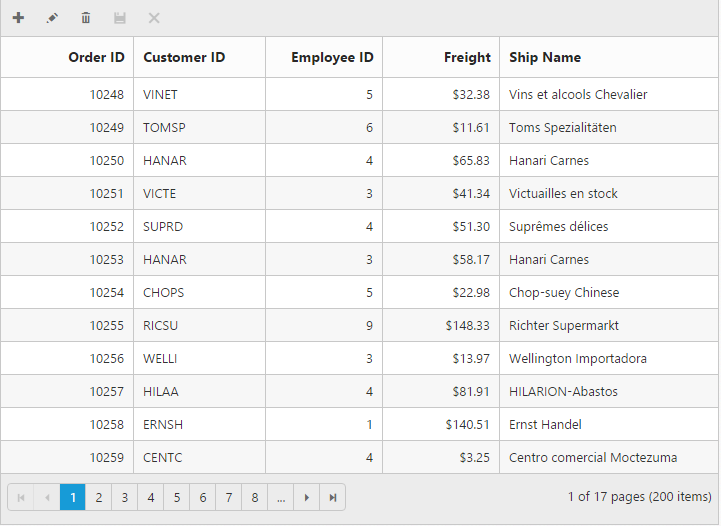

# Toolbar

Toolbar can be shown by defining `show-toolbar` property in `toolbar-settings`. Toolbar has option to add default items in `toolbar-items` and customized items in ` custom-toolbar-items`.

## Default Toolbar items

The following table shows default toolbar items and its action. 

<table>
<tr>
<th>
Default toolbar items</th><th>
Action</th></tr>
<tr>
<td>
Add</td><td>
Add a new row</td></tr>
<tr>
<td>
Edit</td><td>
Edit an existing</td></tr>
<tr>
<td>
Delete</td><td>
Delete a row</td></tr>
<tr>
<td>
Update</td><td>
Update edited or added row</td></tr>
<tr>
<td>
Cancel</td><td>
Cancel edited or added row</td></tr>
<tr>
<td>
Search</td><td>
Search text in records</td></tr>
</table>




using System;
using System.Collections.Generic;
using System.Linq;
using System.Web;
using System.Web.Mvc;
using SyncfusionMvcApplication1;
using SyncfusionMvcApplication1.Models;
namespace SyncfusionMvcApplication1.Controllers
{
    public class GridController : Controller
    {
        //
        // GET: /Grid/
        public IActionResult GridFeatures()
        {
            var DataSource = new NorthwindDataContext().OrdersViews.ToList();
            ViewBag.datasource = DataSource;
            return View();
        }
    }
}





<ej-grid id="FlatGrid" allow-paging="true" datasource="ViewBag.DataSource">
    <e-edit-settings allow-adding="true" allow-editing="true" allow-deleting="true"></e-edit-settings>
    <e-toolbar-settings show-toolbar="true" toolbar-items='@new List<string> {"add","edit","delete","update","cancel"}' />
    <e-context-menu-settings enable-context-menu="true"></e-context-menu-settings>
    <e-columns>
        <e-column field="OrderID" is-primary-key="true" header-text="Order ID" text-align=Right></e-column>
        <e-column field="CustomerID" header-text="CustomerID"></e-column>
        <e-column field="EmployeeID" header-text="Employee ID" text-align="Right"></e-column>
        <e-column field="Freight" format="{0:c2}" header-text="Freight"></e-column>
        <e-column field="ShipName" header-text="ShipName"></e-column>
    </e-columns>
</ej-grid>


  

I> `allow-adding`, `allow-editing` and `allow-deleting` need to be enabled for add, delete, edit, save & cancel in `toolbar-items`. `allow-searching` to be enabled while adding Search in toolbar to perform search action.