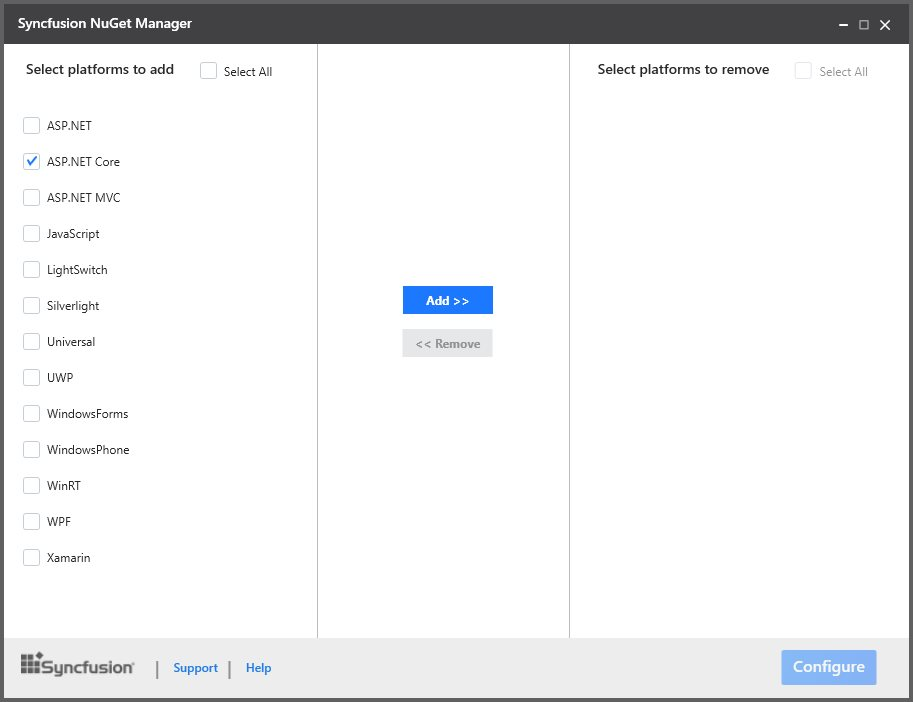

# Installation 

## Installation

* Download the setup file (.exe) of Essential Studio for ASP.NET Core product from this [link](http://www.syncfusion.com/downloads/aspnetcore) with your Syncfusion account.
* You can now follow the steps mentioned in the [setup guide](http://help.syncfusion.com/common/essential-studio/essential-studio-installer-for-individual-platform) install the specific/entire platform in your machine.

## Configuring Syncfusion NuGet Packages in Visual Studio 

Syncfusion ASP.NET Core NuGet packages are available [here](http://nuget.syncfusion.com/package/aspnetcore).

N> If you wish to use the ASP.NET Core NuGet packages then Essential Studio or ASP.NET Core platform installation not required to implement with Syncfusion ASP.NET Core controls. 

### NuGet Configuration  

Syncfusion NuGet Package feed links are configured in Visual Studio in the following ways,

1. Syncfusion NuGet Package Manager
2. NuGet Package Manager settings

#### Syncfusion NuGet Package Manager

The steps to configure the Syncfusion ASP.NET Core NuGet Packages in Visual Studio are as follows,

1. **Syncfusion NuGet Manager** is allows you to **add** the Syncfusion NuGet sources (for available platforms) to NuGet Package Manager. Download the [Syncfusion NuGet Manager](http://www.syncfusion.com/downloads/support/directtrac/general/ze/SyncfusionNuGetManager-2143130196)utility.
2. Extract zip file and run the SyncfusionNuGetManager.exe
3. Syncfusion NuGet Manager Window will be opened.
4. Select the platform **ASP.NET Core** from **“Select platforms to add”** (Left side of the window) column and click **Add>>** button. Then click **Configure** button.

   

5. Once Syncfusion NuGet Manager added the Syncfusion NuGet sources, the changes will be reflected in package sources of your Visual Studio. 

   

**Note:** Get the more details about Syncfusion NuGet Manager utility from [here](https://help.syncfusion.com/extension/syncfusion-nuget-packages/syncfusion-nuget-manager).

#### NuGet Package Manager settings

The steps to configure the Syncfusion ASP.NET Core NuGet Packages in Visual Studio are as follows,

1. In Visual Studio, navigate to `Tools | NuGet Package Manager | Package Manager Settings`, the options dialog will appear on the screen as shows below,

   

2. Select `NuGet Package Manager | Package Sources` and click `Add` button to add the `Package Name` and `Package Source` of Syncfusion NuGet Packages.    

   **Name**: Name of the package that listed in Available package sources  
   **Source**: Syncfusion ASP.NET Core NuGet Package feed URL
   [http://nuget.syncfusion.com/nuget_aspnetcore/nuget/getsyncfusionpackages/aspnetcore](http://nuget.syncfusion.com/nuget_aspnetcore/nuget/getsyncfusionpackages/aspnetcore)
    
   

   N> The `Source` text box in the above image denotes the location of the NuGet packages and the `Name` section, allows you to provide a unique name for NuGet Packages Source.
   Syncfusion Asp.Net.Core NuGet packages are available in [ASP.NET MVC](http://nuget.syncfusion.com/aspnetmvc) NuGet repository until v14.2.0.32.
   
I> Syncfusion other platforms NuGet packages feed links are available [here](http://nuget.syncfusion.com/)

### NuGet Installation

Syncfusion ASP.NET Core NuGet can install once configured the package source. The NuGet installation steps as below,

1. Once configured the Package source with Syncfusion NuGet Packages, right click on project and choose `Manage NuGet Packages | Browse | <Package Source Name>`.
   
   I> We are providing the Syncfusion AspNet Core NuGet packages as preview. So, please make sure `Include prerelease` option is enabled in your NuGet Package Manager for ASP.NET Core platform.  

   

2. The NuGet Packages are listed which are available in package source location. Install the required packages to your application by clicking `Install` button.

   N> NuGet packages can be install directly through the **command line** (Package Manager Console). Further details click [here](http://help.syncfusion.com/extension/syncfusion-nuget-packages/nuget-install-and-configuration#install-from-package-manager-console)

### Updating a NuGet Package

Using the `Manage NuGet Packages` in Visual Studio, NuGet packages can be update.
 
1. Right click on Project and Navigate to the `Manage NuGet Packages` and click on the `Updates` tab to check for updates.

2. Select the `Updates -> <Syncfusion Package Source>`. Refer to the following screenshot for more information.

   

3. If there is a new version of NuGet you will see it in the list of available updates.

4. Select NuGet Package in the list and click `Update`. When the update is complete, close and re-open all open instances of Visual Studio.

   N> By clicking `Update All` button, all NuGet packages are getting update. When the update is complete, close and re-open all open instances of Visual Studio.
   
## Configuring Syncfusion NuGet Packages from command line in Linux/MAC 
   
### NuGet Configuration
   
1. Download the latest NuGet executable from [here](https://dist.nuget.org/win-x86-commandline/latest/nuget.exe).  

2. Open the downloaded executable location in command window and run the following command,

     mono nuget.exe Sources Add –Name [Source name] –Source [source location]

     For Ex: mono nuget.exe Add –Name “Syncfusion Source” –Source “http://nuget.syncfusion.com/nuget_aspnetcore/nuget/getsyncfusionpackages/aspnetcore”
                                                                                  
3. Once the Source gets added successfully the confirmation message will be shown like below.

     For Linux OS :

     

     For MAC OS:

     

### NuGet Installation

Once the NuGet source has been added, then install the NuGet package which is available in that source by using following command.

mono nuget.exe install [Package name] 

For Ex: mono nuget.exe install “Syncfusion.AspNet.Core” – Pre release 

For Linux OS :

For MAC OS :

## Configuring Syncfusion Bower Packages

### Overview

[Bower](http://bower.io) is a package manager for the Web. Syncfusion Bower package allows you to use the Syncfusion JavaScript Widgets in an efficient way.

I>Syncfusion JavaScript Bower package is available as [public Git Repository](https://github.com/syncfusion/JavaScript-Widgets) and also registered as Syncfusion-JavaScript in the Bower registry.

### Bower Installation

To configure the Bower in your machine you need to install [node, npm](http://nodejs.org) and [git](http://git-scm.org). For more information to configure the Bower package please refer the official site for [bower](http://bower.io/#install-bower). 
Syncfusion JavaScript Bower package can be configured in the following ways.

1. Using command prompt.

2. Using bower.json file.

3. From local directory.

#### Using command prompt

Perform the below steps to install Syncfusion Bower Package via command prompt in your web application.

1. Open your web project’s location in a command prompt window.

2. Then run the command Bower install <package name>.

   ~~~
   bower install syncfusion-javascript
   ~~~
   
   

3. The Bower will install the Syncfusion JavaScript files into the project location to develop with Syncfusion controls.

N>To install a particular version of a Bower package, you need to provide the version as suffix of the package name while installing. For instance, run the below command, Eg: To install the package of version 13.3.0.18. 
N>'bower install Syncfusion-javascript#13.3.0.18'

#### Using bower.json file

In another way, you can add the packages to the bower.json file by simply specify the package name. This will install/restore the packages to your project. Please refer the below image.
 

N>ASP.NET 5 (preview) projects have bower.json file by default. If your project doesn’t have bower.json file then run the below command from your project directory by Command prompt. 
N>'bower init'

#### From local directory

You can install the Syncfusion Bower package from a local directory. To perform this follow the below steps.

1. Navigate the [Syncfusion JavaScript Bower repository](https://github.com/syncfusion/JavaScript-Widgets/) location on GitHub and download the repository as zip by click the “Download ZIP” button and extract the contents in your computer’s any of the local directory.

   

2. Then run the install command by providing the package content’s location. 

   

### Bower Update

To update the installed Bower packages, run the command Bower update <package name>.

~~~
bower update syncfusion-javascript
~~~

## Configuring Syncfusion npm Packages

### Overview

npm is the Package Manager for JavaScript. npm makes it easy for JavaScript developers to share and reuse the code and it makes it easy to update the code that you're sharing.

### Syncfusion npm package

Syncfusion JavaScript npm package is available as [public Git Repository](https://github.com/syncfusion/JavaScript-Widgets) and also registered as syncfusion-javaScript in the npm registry.

### Syncfusion npm Installation 

To configure the npm,  install the [Nodejs](http://nodejs.org/) and update the npm. For more information to configure the npm packages refer the official site of [npm](https://docs.npmjs.com/getting-started/installing-node). 

syncfusion-javascript npm package can be configured in following ways.

1. Using Command prompt

2. Using package.json file.

3. From local directory

#### Using command prompt

Follow the below steps to install Syncfusion JavaScript npm package via command prompt in required web application location.

1. Open project’s location in command prompt window.

2. Run the installation command for npm.

   ~~~
   npm install syncfusion-javascript
   ~~~

   

3. npm install the Syncfusion JavaScript assets into the project location to develop with Syncfusion controls.  

N> As per standard Syncfusion used the 3 digit version for npm packages. To install a particular version of npm package, provide the version as suffix of the package name while installing. For instance, run the below command, 
N> E.g. The below command installs Syncfusion JavaScript package of version 14.1.0.46. 
N> 'npm install Syncfusion-javascript@14.1.46'

#### Using package.json file

Add the Syncfusion JavaScript packages to the package.json by simply specify the package name. This will install/restore the package to the Visual Studio project. Refer the below image.

N> ASP.NET 5 (preview) projects have package.json file by default. Visual Studio project doesn’t have package.json file then, run the below command using the project command prompt.  
N> 'npm init'

#### From Local Directory

Install the Syncfusion JavaScript npm package from a local directory.

1. Navigate the [Syncfusion JavaScript repository](https://github.com/syncfusion/JavaScript-Widgets) location on GitHub and download the repository as zip by click the “Download ZIP” button and extract the contents in your computer’s any of the local directory.

   

2. Run the install command by providing the package content location.

   

### npm Update

#### Updating global packages

To update the globally installed npm packages, run the below command to update the package by globally.

~~~
npm install g- syncfusion-javascript
~~~

### Updating local packages

To update the locally installed npm packages, run the below command to update the package by local location.

~~~
npm update
~~~

## Configuring Syncfusion JSPM Packages

### Overview

JSPM is a package manager for [SystemJS universal module loader](https://github.com/systemjs/systemjs), built on top of the dynamic [ES6 module loader](https://github.com/ModuleLoader/es6-module-loader). This can load any module format (ES6, AMD, CommonJS and globals) directly from any registry such as npm and GitHub with flat versioned dependency management. Any custom registry endpoints can be created through the Registry API.

### Syncfusion JavaScript JSPM

Syncfusion JavaScript JSPM package is available as [public Git Repository](https://github.com/syncfusion/JavaScript-Widgets) and also registered as Syncfusion-JavaScript in the npm registry too.

### Syncfusion JSPM Installation 

#### Using Command prompt 

Follow the below steps to install Syncfusion JavaScript JSPM package via command prompt in required web application location.

1. Open project’s location in command prompt window.

2. A) To install the Syncfusion JavaScript JSPM package via GitHub repository.

   ~~~
   jspm install syncfusion=github:syncfusion/Javascript-Widgets
   ~~~
   
   

   B) To install the Syncfusion JavaScript JSPM package via npm repository.
   
   ~~~
   jspm install npm:syncfusion-javascript
   ~~~
   
N> As per standard Syncfusion used the 3 digit version for JSPM packages. To install a particular version of JSPM package, need to provide the version as suffix of the package name while installing. For instance, run the below command,  
N> E.g. The below command installs Syncfusion JavaScript package of version 14.1.0.46.  
N> 'JSPM install syncfusion=github:syncfusion/JavaScript-Widgets@14.1.46'

### JSPM Update

To update all the installed packages by using below command.

~~~
jspm update
~~~

To update specific package by using below commands.

~~~
jspm update npm:syncfusion-javascript
~~~

  (Or)
  
~~~
jspm update syncfusion=github:syncfusion/JavaScript-Widgets
~~~