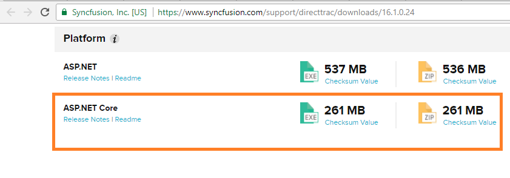
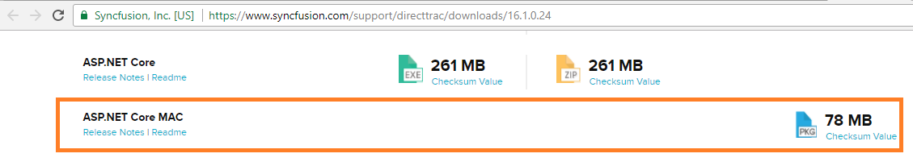

# Download

To download the Syncfusion ASP.NET Core platform, follow the below steps.

1. If you are a licensed user, click [here](https://www.syncfusion.com/downloads/latest-version) . 

   
   
2. For evaluation users, download [here](https://www.syncfusion.com/downloads) .

   
   
3. For Mac machines, Syncfusion provides separate installer (.pkg) which can be downloaded from the same downloads section.

   

  

