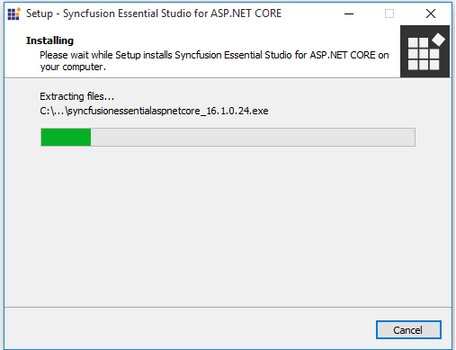
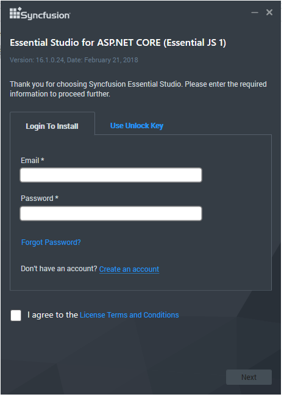
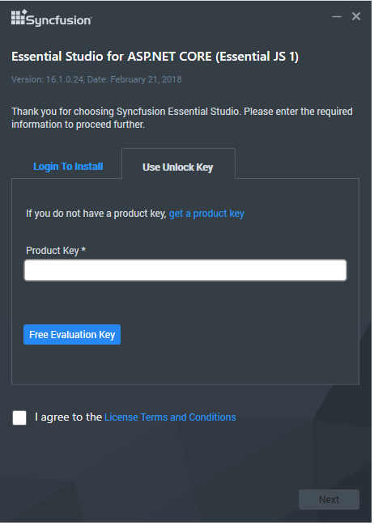
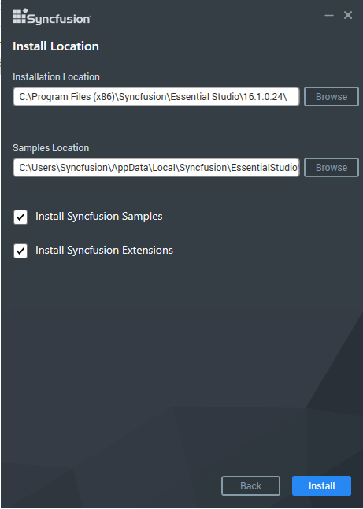
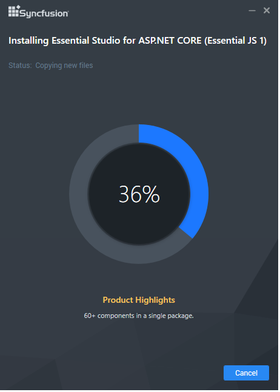
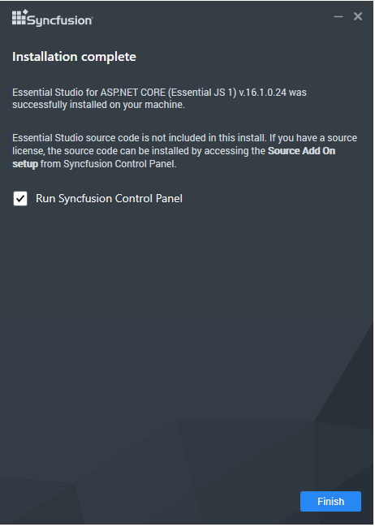

# Installation and Deployment

## Installing with UI   

The following procedure illustrates how to install Essential Studio ASP.NET Core platform.

1. Close all the running Visual Studio instances.

2. Double-click the Syncfusion ASP.NET Core platform Setup file. The Setup Wizard opens and extracts the package automatically.

   

   N> The Setup wizard extracts the syncfusionessentialaspnetcore_(version).exe dialog, displaying the unzip operation of the package.

3. You have two options to unlock the Syncfusion setup:

   
   a) *Login To Install*
   
   b) *Use Unlock Key*
   
   
   
   **Login To Install**

   

   N> You can provide the email ID and password registered with Syncfusion for unlocking the Syncfusion setup and your license will be configured.

   **Use Unlock Key**

      

4. After reading the License Terms and Conditions, check the **I agree to the License Terms and Conditions** check box.

5. Click Next. Select the Installation, Samples Folder and Advanced Options screen opens. 

    

   N> To install in the displayed default location, click Install. You can also browse and choose a location by clicking Browse. When you have already installed any other same version‘s setup, you cannot change the install and samples path.

   * Select the **Install Syncfusion Samples** check box to install Syncfusion samples, or leave the check box clear, when you do not want to install Syncfusion samples.
   * Select the **Install Syncfusion Extensions** checkbox to configure the Syncfusion Extensions in Visual Studio or clear this check box when you do not want to configure the Syncfusion Extensions in Visual Studio.

6.  Click Install.

    

7. The Completed screen is displayed once the ASP.NET Core platform is installed.

    

8. Select the **Run Syncfusion Control Panel** check box to launch the Syncfusion Control Panel after installing.

9. Click Finish. Syncfusion ASP.NET Core platform is installed in your system and the Syncfusion Essential Studio [Syncfusion Control Panel](http://help.syncfusion.com/common/essential-studio/utilities#dashboard ) is launched automatically.

## Installing in silent mode

The Syncfusion Essential Studio Platform Installer supports installing/uninstalling the setup through Command Line. The following sections illustrate this ability. 

### Command Line Installation

Follow the steps below to install through Command Line in Silent mode.

1. Double-click the Syncfusion Essential Studio platform setup file. The Setup Wizard opens and extracts the package automatically. 
2. The syncfusionessentialaspnetcore_(version).exe file is extracted into the Temp folder.
3. Run %temp%. The Temp folder will open. The syncfusionessentialaspnetcore_(version).exe file is available in one of the folders.
4. Copy the extracted syncfusionessentialaspnetcore_(version).exe file in local drive.
5. Cancel the Wizard.
6. Open the Command Prompt in administrator mode and pass the following arguments.

   
   **Arguments:** “Copied setup file path\syncfusionessentialaspnetcore_(version).exe” /Install silent /PIDKEY:“(product unlock key)” [/log “{Log file path}”] [/InstallPath:{Location to install}] [/InstallSamples:{true/false}]

   N> [..] – Arguments inside the square brackets are optional.

   **Example:** “D:\Temp\syncfusionessentialaspnetcore_x.x.x.x.exe” /Install silent /PIDKEY:“product unlock key” /log “C:\Temp\EssentialStudio_Platform.log” /InstallPath:C:\Syncfusion\x.x.x.x /InstallSamples:true

	
7. Setup is installed.

   N> x.x.x.x needs to be replaced with the Essential Studio version and the Product Unlock Key needs to be replaced with the Unlock Key for that version.
   

### Command Line Uninstallation

Syncfusion Essential Studio supports uninstalling the setup through Command Line in Silent mode. The following steps illustrate this. 

1. When you do not have the extracted setup (syncfusionessentialaspnetcore_(version).exe) then follow the steps from 2 to 7.
2. Double-click the Syncfusion Essential Studio platform setup file. The Setup Wizard opens and extracts the package automatically.
3. The syncfusionessentialaspnetcore_(version).exe file is extracted into the Temp folder.
4. Run %temp%. The Temp folder will open. The syncfusionessentialaspnetcore_(version).exe file is available in one of the folders.
5. Copy the syncfusionessentialaspnetcore_(version).exe file in local drive. 
6. Cancel the Wizard.
7. Open the Command Prompt in administrator mode and pass the following arguments.
   
   **Arguments:** “Copied setup file path\syncfusionessentialaspnetcore_(version).exe” /uninstall silent 

   **Example:** “D:\Temp\syncfusionessentialaspnetcore_x.x.x.x.exe" /uninstall silent

8. Setup is uninstalled.

   N> x.x.x.x needs to be replaced with the Essential Studio version installed in your machine.
