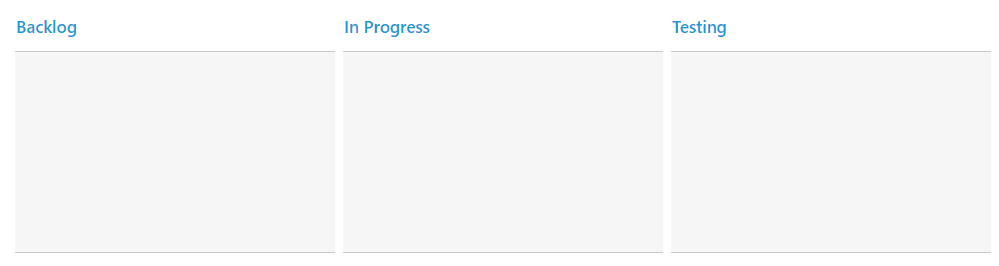
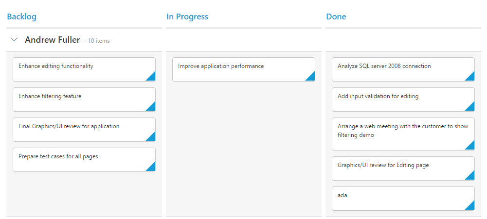
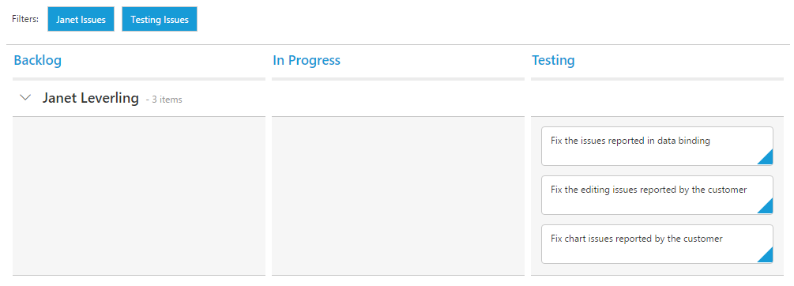

# Getting Started

To run Kanban sample in ASP.NET Core 1.0.1, Please refer the `ASP.NET Core` documentation to initially configure the common specifications. 

## Data Binding

You can bind the data to Kanban control by either locally or remotely. Assign the remote service URL to `e-datamanager` property of Kanban control to bind remote data using `ej.DataManager`.



    <ej-kanban id="KanbanBoard">
        <e-datamanager url="//mvc.syncfusion.com/Services/Northwnd.svc/Tasks"></e-datamanager> 
        <e-kanbancolumns>
            <e-kanbancolumn header-text="Backlog"></e-kanbancolumn>
            <e-kanbancolumn header-text="In Progress"></e-kanbancolumn>
            <e-kanbancolumn header-text="Testing"></e-kanbancolumn>      
        </e-kanbancolumns>
    </ej-kanban>



## Mapping Values

In order to display cards in Kanban control, you need to map the database fields to Kanban cards and ` e-kanbancolumn`. The required mapping field are listed as follows
*	`key-field ` -  Map the column name to use as `key` values to columns.
*	`e-kanbancolumn`- Map the corresponding `key` values of `key-field` column to each columns
*	`content` - Map the column name to use as content to cards in the Fields.
*	`primary-key`- Map the column name to use as Primary Key in Fields.



    <ej-kanban id="KanbanBoard" key-field="Status">
        <e-datamanager url="//mvc.syncfusion.com/Services/Northwnd.svc/Tasks"></e-datamanager> 
        <e-kanbancolumns>
            <e-kanbancolumn header-text="Backlog" key=@(new List<string>(){"Open"})>        
            </e-kanbancolumn>
            <e-kanbancolumn header-text="In Progress" key=@(new List<string>() {"InProgress"})></e-kanbancolumn>
            <e-kanbancolumn header-text="Done" key=@(new List<string>() {"Close"}) ></e-kanbancolumn>
        </e-kanbancolumns>
        <e-kanbanfield content="Summary" primary-key="Id">
        </e-kanbanfield>
    </ej-kanban>



## Enable Swimlane

`Swimlane` can be enabled by mapping the ` swimlane-key ` to appropriate column name in ` DataSource`. This enables the grouping of the cards based on the mapped column values.



    <ej-kanban id="KanbanBoard" key-field="Status">
        <e-datamanager url="//mvc.syncfusion.com/Services/Northwnd.svc/Tasks"></e-datamanager> 
        <e-kanbancolumns>
            <e-kanbancolumn header-text="Backlog" key=@(new List<string>(){"Open"})>        
            </e-kanbancolumn>
            <e-kanbancolumn header-text="In Progress" key=@(new List<string>() {"InProgress"})></e-kanbancolumn>
            <e-kanbancolumn header-text="Done" key=@(new List<string>() {"Close"}) ></e-kanbancolumn>
        </e-kanbancolumns>
        <e-kanbanfield content="Summary" primary-key="Id" swimlane-key="Assignee">
        </e-kanbanfield>
    </ej-kanban>



## Adding Filters



    <ej-kanban id="KanbanBoard" key-field="Status">
        <e-datamanager url="//mvc.syncfusion.com/Services/Northwnd.svc/Tasks"></e-datamanager>
        <e-kanbancolumns>
            <e-kanbancolumn header-text="Backlog" key=@(new List<string>(){"Open"})>
            </e-kanbancolumn>
            <e-kanbancolumn header-text="In Progress" key=@(new List<string>() {"InProgress"})></e-kanbancolumn>
            <e-kanbancolumn header-text="Testing" key=@(new List<string>() {"Testing"})></e-kanbancolumn>
        </e-kanbancolumns>
        <e-kanbanfield content="Summary" primary-key="Id" swimlane-key="Assignee">
        </e-kanbanfield>
        <e-kanbanfilter-settings>
            <e-kanbanfilter-setting text="Janet Issues" query="new ej.Query().where('Assignee', 'equal', 'Janet Leverling')" description="Displays issues which matches the assignee as 'Janet Leverling`"></e-kanbanfilter-setting>
            <e-kanbanfilter-setting text="Testing Issues" query="new ej.Query().where('Status', 'equal', 'Testing')" description="Display the issues of 'Testing'"></e-kanbanfilter-setting>
        </e-kanbanfilter-settings>
    </ej-kanban>



