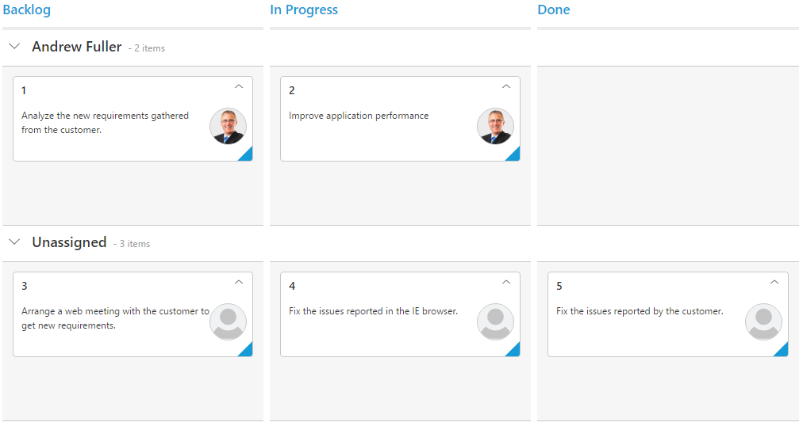
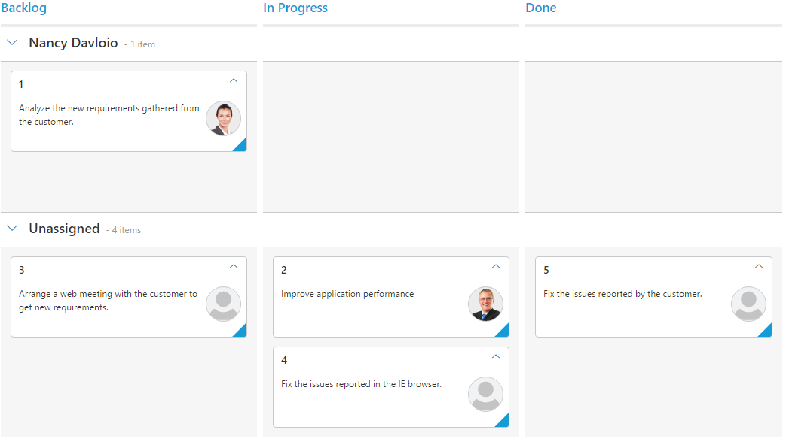
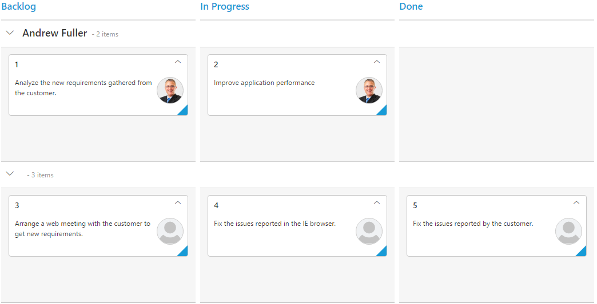

# Swim lanes

Swim lanes are a horizontal categorization of issues in the Kanban control which brings transparency to the workflow. This can be enabled by mapping the `swimlane-key` to appropriate column name in the `dataSource`.

The following code example describes the above behavior.





     <ej-kanban id="KanbanBoard" key-field="Status" dataSource="ViewBag.datasource\">
            <e-kanbancolumns>
                <e-kanbancolumn header-text="Backlog" key=@(new List<string>(){"Open"})>
                </e-kanbancolumn>
                <e-kanbancolumn header-text="In Progress" key=@(new List<string>() {"InProgress"})></e-kanbancolumn>
                <e-kanbancolumn header-text="Done" key=@(new List<string>() {"Close"})></e-kanbancolumn>
            </e-kanbancolumns>
            <e-kanbanfield content="Summary" primary-key="Id" swimlane-key="Assignee" image-url="ImgUrl">
            </e-kanbanfield>
     </ej-kanban>





    namespace samplebrowser.Controllers
{
    public partial class KanbanBoardController : Controller
    {
        List<Tasks> Task = new List<Tasks>();

        public ActionResult Default()
        {
            Task.Add(new Tasks(1, "Open", "Analyze the new requirements gathered from the customer.", "Story", "Low", "Analyze,Customer", 3.5, "Nancy Davloio", "../content/images/kanban/1.png", 1));
            Task.Add(new Tasks(2, "InProgress", "Improve application performance", "Improvement", "Normal", "Improvement", 6, "Andrew Fuller", "../content/images/kanban/2.png", 1));
            Task.Add(new Tasks(3, "Open", "Arrange a web meeting with the customer to get new requirements.", "Others", "Critical", "Meeting", 5.5, "Janet Leverling", "../content/images/kanban/3.png", 2));
            Task.Add(new Tasks(4, "InProgress", "Fix the issues reported in the IE browser.", "Bug", "Release Breaker", "IE", 2.5, "Janet Leverling", "../content/images/kanban/3.png", 2));
            Task.Add(new Tasks(5, "Testing", "Fix the issues reported by the customer.", "Bug", "Low", "Customer", 3.5, "Steven walker", "../content/images/kanban/5.png", 1));
            Task.Add(new Tasks(6, "Close", "Arrange a web meeting with the customer to get the login page requirements.", "Others", "Low", "Meeting", 2, "Michael Suyama", "../content/images/kanban/6.png", 1));
            Task.Add(new Tasks(7, "Validate", "Validate new requirements", "Improvement", "Low", "Validation", 1.5, "Robert King", "../content/images/kanban/7.png", 4));
            Task.Add(new Tasks(8, "Close", "Login page validation", "Story", "Release Breaker", "Validation,Fix", 2.5, "Laura Callahan", "../content/images/kanban/8.png", 2));
            Task.Add(new Tasks(9, "Testing", "Fix the issues reported in Safari browser.", "Bug", "Release Breaker", "Fix,Safari", 1.5, "Nancy Davloio", "../content/images/kanban/1.png", 2));
            Task.Add(new Tasks(10, "Close", "Test the application in the IE browser.", "Story", "Low", "Testing,IE", 5.5, "Margaret hamilt", "../content/images/kanban/4.png", 3));
            Task.Add(new Tasks(11, "Validate", "Validate the issues reported by the customer.", "Story", "High", "Validation,Fix", 1, "Steven walker", "../content/images/kanban/5.png", 5));
            Task.Add(new Tasks(12, "Testing", "Check Login page validation.", "Story", "Release Breaker", "Testing", 0.5, "Michael Suyama", "../content/images/kanban/6.png", 3));
            Task.Add(new Tasks(13, "Open", "API improvements.", "Improvement", "High", "Grid,API", 3.5, "Robert King", "../content/images/kanban/7.png", 3));
            Task.Add(new Tasks(14, "InProgress", "Add responsive support to application", "Epic", "Critical", "Responsive", 6, "Laura Callahan", "../content/images/kanban/8.png", 3));
            Task.Add(new Tasks(15, "Open", "Show the retrieved data from the server in grid control.", "Story", "High", "Database,SQL", 5.5, "Margaret hamilt", "../content/images/kanban/4.png", 4));
            ViewBag.datasource = Task;
            return View();
        }
    }
    public class Tasks
    {
        public Tasks()
        {
        }
        public Tasks(int Id, string Status, string Summary, string Type, string Priority, string Tags, double Estimate, string Assignee, string ImgUrl, int RankId)
        {
            this.Id = Id;
            this.Status = Status;
            this.Summary = Summary;
            this.Type = Type;
            this.Priority = Priority;
            this.Tags = Tags;
            this.Estimate = Estimate;
            this.Assignee = Assignee;
            this.ImgUrl = ImgUrl;
            this.RankId = RankId;
        }
        public int Id { get; set; }
        public string Status { get; set; }
        public string Summary { get; set; }
        public string Type { get; set; }
        public string Priority { get; set; }
        public string Tags { get; set; }
        public double Estimate { get; set; }
        public string Assignee { get; set; }
        public string ImgUrl { get; set; }
        public int RankId { get; set; }
    }
}


  

The following output is displayed as a result of the above code example.

# Drag And Drop between swim lanes

You can set `allow-drag-and-drop` property of [`kanbanswimlane-settings`] as true to enable Drag and Drop between the swim lanes.

If a card is to be dragged in the same swim lane, only a droppable target cell is added to the dotted line border.If a card is dragged from one swim lane to another, all the Kanban cells will be added to the dotted line borders, except the dragged card cell.

The following code example describes the above behavior.





   <ej-kanban id="KanbanBoard" key-field="Status" dataSource="ViewBag.datasource">
            <e-kanbancolumns>
                <e-kanbancolumn header-text="Backlog" key=@(new List<string>(){"Open"})>
                </e-kanbancolumn>
                <e-kanbancolumn header-text="In Progress" key=@(new List<string>() {"InProgress"})></e-kanbancolumn>
                <e-kanbancolumn header-text="Done" key=@(new List<string>() {"Close"})></e-kanbancolumn>
            </e-kanbancolumns>
            <e-kanbanfield content="Summary" primary-key="Id" swimlane-key="Assignee" image-url="ImgUrl">
            </e-kanbanfield>
            <e-kanbanswimlane-settings allow-drag-and-drop="true">
            </e-kanbanswimlane-settings>
     </ej-kanban>





     namespace samplebrowser.Controllers
     {
      public partial class KanbanBoardController : Controller
      {
        List<Tasks> Task = new List<Tasks>();

        public ActionResult Default()
        {
            Task.Add(new Tasks(1, "Open", "Analyze the new requirements gathered from the customer.", "Story", "Low", "Analyze,Customer", 3.5, "Nancy Davloio", "../content/images/kanban/1.png", 1));
            Task.Add(new Tasks(2, "InProgress", "Improve application performance", "Improvement", "Normal", "Improvement", 6, "Andrew Fuller", "../content/images/kanban/2.png", 1));
            Task.Add(new Tasks(3, "Open", "Arrange a web meeting with the customer to get new requirements.", "Others", "Critical", "Meeting", 5.5, "Janet Leverling", "../content/images/kanban/3.png", 2));
            Task.Add(new Tasks(4, "InProgress", "Fix the issues reported in the IE browser.", "Bug", "Release Breaker", "IE", 2.5, "Janet Leverling", "../content/images/kanban/3.png", 2));
            Task.Add(new Tasks(5, "Testing", "Fix the issues reported by the customer.", "Bug", "Low", "Customer", 3.5, "Steven walker", "../content/images/kanban/5.png", 1));
            Task.Add(new Tasks(6, "Close", "Arrange a web meeting with the customer to get the login page requirements.", "Others", "Low", "Meeting", 2, "Michael Suyama", "../content/images/kanban/6.png", 1));
            Task.Add(new Tasks(7, "Validate", "Validate new requirements", "Improvement", "Low", "Validation", 1.5, "Robert King", "../content/images/kanban/7.png", 4));
            Task.Add(new Tasks(8, "Close", "Login page validation", "Story", "Release Breaker", "Validation,Fix", 2.5, "Laura Callahan", "../content/images/kanban/8.png", 2));
            Task.Add(new Tasks(9, "Testing", "Fix the issues reported in Safari browser.", "Bug", "Release Breaker", "Fix,Safari", 1.5, "Nancy Davloio", "../content/images/kanban/1.png", 2));
            Task.Add(new Tasks(10, "Close", "Test the application in the IE browser.", "Story", "Low", "Testing,IE", 5.5, "Margaret hamilt", "../content/images/kanban/4.png", 3));
            Task.Add(new Tasks(11, "Validate", "Validate the issues reported by the customer.", "Story", "High", "Validation,Fix", 1, "Steven walker", "../content/images/kanban/5.png", 5));
            Task.Add(new Tasks(12, "Testing", "Check Login page validation.", "Story", "Release Breaker", "Testing", 0.5, "Michael Suyama", "../content/images/kanban/6.png", 3));
            Task.Add(new Tasks(13, "Open", "API improvements.", "Improvement", "High", "Grid,API", 3.5, "Robert King", "../content/images/kanban/7.png", 3));
            Task.Add(new Tasks(14, "InProgress", "Add responsive support to application", "Epic", "Critical", "Responsive", 6, "Laura Callahan", "../content/images/kanban/8.png", 3));
            Task.Add(new Tasks(15, "Open", "Show the retrieved data from the server in grid control.", "Story", "High", "Database,SQL", 5.5, "Margaret hamilt", "../content/images/kanban/4.png", 4));
            ViewBag.datasource = Task;
            return View();
        }
     }
     public class Tasks
     {
        public Tasks()
        {
        }
        public Tasks(int Id, string Status, string Summary, string Type, string Priority, string Tags, double Estimate, string Assignee, string ImgUrl, int RankId)
        {
            this.Id = Id;
            this.Status = Status;
            this.Summary = Summary;
            this.Type = Type;
            this.Priority = Priority;
            this.Tags = Tags;
            this.Estimate = Estimate;
            this.Assignee = Assignee;
            this.ImgUrl = ImgUrl;
            this.RankId = RankId;
        }
        public int Id { get; set; }
        public string Status { get; set; }
        public string Summary { get; set; }
        public string Type { get; set; }
        public string Priority { get; set; }
        public string Tags { get; set; }
        public double Estimate { get; set; }
        public string Assignee { get; set; }
        public string ImgUrl { get; set; }
        public int RankId { get; set; }
     }
}


  

The following output is displayed as a result of the above code example.

# Unassigned swim lane group

Kanban cards which have null,undefined, empty string("") swimlane key values or user specified swimlane key values in the [`keys(kanbanswimlane-settings.kanbanunassigned-group.keys)`] collection will be grouped under the Unassigned swimlane group.You can enable and disable this behavior using the property [`enable(kanbanswimlane-settings.kanbanunassigned-group.enable)`] and the default value is `true`.
  
Default values in the [`keys(kanbanswimlane-settings.kanbanunassigned-group.keys)`] collection are null,undefined,empty string("").You can also add your own(user-defined) swim-lane key values in the [`keys(kanbanswimlane-settings.kanbanunassigned-group.keys)`] collection.
  
## Unassigned swim lane group with default values

Kanban cards which have null,undefined, empty string("") swimlane key values will be grouped under the Unassigned swimlane group when Unassigned swim lane group is enabled.(set `true` to [`enable(kanbanswimlane-settings.kanbanunassigned-group.enable)`] property and the default value is `true`).

Default values in the [`keys(kanbanswimlane-settings.kanbanunassigned-group.keys)`] collection are null,undefined,empty string("").

The following code example describes the above behavior.





     <ej-kanban id="KanbanBoard" key-field="Status" dataSource="ViewBag.datasource" allow-selection="false">
          <e-kanbancolumns>
              <e-kanbancolumn header-text="Backlog" key=@(new List<string>(){"Open"})>
              </e-kanbancolumn>
              <e-kanbancolumn header-text="In Progress" key=@(new List<string>() {"InProgress"})></e-kanbancolumn>
              <e-kanbancolumn header-text="Done" key=@(new List<string>() {"Close"})></e-kanbancolumn>
          </e-kanbancolumns>
          <e-kanbanfield content="Summary" primary-key="Id" image-url="ImgUrl" swimlane-key="Assignee">
          </e-kanbanfield>
      </ej-kanban>





     namespace samplebrowser.Controllers
     {
      public partial class KanbanBoardController : Controller
      {
        List<Tasks> Task = new List<Tasks>();

        public ActionResult Default()
        {
             Task.Add(new Tasks(1, "Open", "Analyze the new requirements gathered from the customer.", "Story", "Low", "Analyze,Customer", 3.5, "Andrew Fuller", "../content/images/kanban/1.png", 1));
            Task.Add(new Tasks(2, "InProgress", "Improve application performance", "Improvement", "Normal", "Improvement", 6, "Andrew Fuller", "../content/images/kanban/2.png", 1));
            Task.Add(new Tasks(3, "Open", "Arrange a web meeting with the customer to get new requirements.", "Others", "Critical", "Meeting", 5.5, "undefined" , "../content/images/kanban/3.png", 2));
            Task.Add(new Tasks(4, "InProgress", "Fix the issues reported in the IE browser.", "Bug", "Release Breaker", "IE", 2.5, null, "../content/images/kanban/3.png", 2));
            Task.Add(new Tasks(5, "Close", "Fix the issues reported by the customer.", "Bug", "Low", "Customer", 3.5, "", "../content/images/kanban/5.png", 1));
            ViewBag.datasource = Task;
            return View();
        }
     }
     public class Tasks
     {
        public Tasks()
        {
        }
        public Tasks(int Id, string Status, string Summary, string Type, string Priority, string Tags, double Estimate, string Assignee, string ImgUrl, int RankId)
        {
            this.Id = Id;
            this.Status = Status;
            this.Summary = Summary;
            this.Type = Type;
            this.Priority = Priority;
            this.Tags = Tags;
            this.Estimate = Estimate;
            this.Assignee = Assignee;
            this.ImgUrl = ImgUrl;
            this.RankId = RankId;
        }
        public int Id { get; set; }
        public string Status { get; set; }
        public string Summary { get; set; }
        public string Type { get; set; }
        public string Priority { get; set; }
        public string Tags { get; set; }
        public double Estimate { get; set; }
        public string Assignee { get; set; }
        public string ImgUrl { get; set; }
        public int RankId { get; set; }
     }
}


  

The following output is displayed as a result of the above code example.

## Unassigned swim lane group with user specified values

User specified swimlane key values in the [`keys(kanbanswimlane-settings.kanbanunassigned-group.keys)`] collection will be grouped under the Unassigned swimlane group when Unassigned swim lane group is enabled.(set `true` to [`enable(kanbanswimlane-settings.kanbanunassigned-group.enable)`] property and the default value is `true`).

The following code example describes the above behavior.





     <ej-kanban id="KanbanBoard" key-field="Status" dataSource="ViewBag.datasource" allow-title="true" allow-selection="false">
          <e-kanbancolumns>
              <e-kanbancolumn header-text="Backlog" key=@(new List<string>(){"Open"})>
              </e-kanbancolumn>
              <e-kanbancolumn header-text="In Progress" key=@(new List<string>() {"InProgress"})></e-kanbancolumn>
              <e-kanbancolumn header-text="Done" key=@(new List<string>() {"Close"})></e-kanbancolumn>
          </e-kanbancolumns>
          <e-kanbanfield content="Summary" primary-key="Id" image-url="ImgUrl" swimlane-key="Assignee">
          </e-kanbanfield>
          <e-kanbanswimlane-settings>
             <e-kanbanunassigned-group keys=@(new List<string>() {"Andrew Fuller", "", "null"})></e-kanbanunassigned-group>
          </e-kanbanswimlane-settings>
      </ej-kanban>
      




     namespace samplebrowser.Controllers
     {
      public partial class KanbanBoardController : Controller
      {
        List<Tasks> Task = new List<Tasks>();

        public ActionResult Default()
        {
            Task.Add(new Tasks(1, "Open", "Analyze the new requirements gathered from the customer.", "Story", "Low", "Analyze,Customer", 3.5, "Nancy Davloio", "../content/images/kanban/1.png", 1));
            Task.Add(new Tasks(2, "InProgress", "Improve application performance", "Improvement", "Normal", "Improvement", 6, "Andrew Fuller", "../content/images/kanban/2.png", 1));
            Task.Add(new Tasks(3, "Open", "Arrange a web meeting with the customer to get new requirements.", "Others", "Critical", "Meeting", 5.5, "" , "../content/images/kanban/3.png", 2));
            Task.Add(new Tasks(4, "InProgress", "Fix the issues reported in the IE browser.", "Bug", "Release Breaker", "IE", 2.5, null, "../content/images/kanban/3.png", 2));
            Task.Add(new Tasks(5, "Close", "Fix the issues reported by the customer.", "Bug", "Low", "Customer", 3.5, "", "../content/images/kanban/5.png", 1));
            ViewBag.datasource = Task;
            return View();
        }
     }
     public class Tasks
     {
        public Tasks()
        {
        }
        public Tasks(int Id, string Status, string Summary, string Type, string Priority, string Tags, double Estimate, string Assignee, string ImgUrl, int RankId)
        {
            this.Id = Id;
            this.Status = Status;
            this.Summary = Summary;
            this.Type = Type;
            this.Priority = Priority;
            this.Tags = Tags;
            this.Estimate = Estimate;
            this.Assignee = Assignee;
            this.ImgUrl = ImgUrl;
            this.RankId = RankId;
        }
        public int Id { get; set; }
        public string Status { get; set; }
        public string Summary { get; set; }
        public string Type { get; set; }
        public string Priority { get; set; }
        public string Tags { get; set; }
        public double Estimate { get; set; }
        public string Assignee { get; set; }
        public string ImgUrl { get; set; }
        public int RankId { get; set; }
     }
}


  

The following output is displayed as a result of the above code example.

## Enable/Disable unassigned swim lane group

You can enable and disable the unassigned swim lane group using the property [`enable(kanbanswimlane-settings.kanbanunassigned-group.enable)`] and the default value is `true`.

The following code example describes the above behavior.





      <ej-kanban id="KanbanBoard" key-field="Status" dataSource="ViewBag.datasource" allow-title="true" allow-selection="false">
          <e-kanbancolumns>
              <e-kanbancolumn header-text="Backlog" key=@(new List<string>(){"Open"})>
              </e-kanbancolumn>
              <e-kanbancolumn header-text="In Progress" key=@(new List<string>() {"InProgress"})></e-kanbancolumn>
              <e-kanbancolumn header-text="Done" key=@(new List<string>() {"Close"})></e-kanbancolumn>
          </e-kanbancolumns>
          <e-kanbanfield content="Summary" primary-key="Id" image-url="ImgUrl" swimlane-key="Assignee">
          </e-kanbanfield>
          <e-kanbanswimlane-settings>
             <e-kanbanunassigned-group enable="false"></e-kanbanunassigned-group>
          </e-kanbanswimlane-settings>
      </ej-kanban>
      




     namespace samplebrowser.Controllers
     {
      public partial class KanbanBoardController : Controller
      {
        List<Tasks> Task = new List<Tasks>();

        public ActionResult Default()
        {
           Task.Add(new Tasks(1, "Open", "Analyze the new requirements gathered from the customer.", "Story", "Low", "Analyze,Customer", 3.5, "Andrew Fuller", "../content/images/kanban/1.png", 1));
            Task.Add(new Tasks(2, "InProgress", "Improve application performance", "Improvement", "Normal", "Improvement", 6, "Andrew Fuller", "../content/images/kanban/2.png", 1));
            Task.Add(new Tasks(3, "Open", "Arrange a web meeting with the customer to get new requirements.", "Others", "Critical", "Meeting", 5.5, null , "../content/images/kanban/3.png", 2));
            Task.Add(new Tasks(4, "InProgress", "Fix the issues reported in the IE browser.", "Bug", "Release Breaker", "IE", 2.5, null, "../content/images/kanban/3.png", 2));
            Task.Add(new Tasks(5, "Close", "Fix the issues reported by the customer.", "Bug", "Low", "Customer", 3.5, null, "../content/images/kanban/5.png", 1));
            ViewBag.datasource = Task;
            return View();
        }
     }
     public class Tasks
     {
        public Tasks()
        {
        }
        public Tasks(int Id, string Status, string Summary, string Type, string Priority, string Tags, double Estimate, string Assignee, string ImgUrl, int RankId)
        {
            this.Id = Id;
            this.Status = Status;
            this.Summary = Summary;
            this.Type = Type;
            this.Priority = Priority;
            this.Tags = Tags;
            this.Estimate = Estimate;
            this.Assignee = Assignee;
            this.ImgUrl = ImgUrl;
            this.RankId = RankId;
        }
        public int Id { get; set; }
        public string Status { get; set; }
        public string Summary { get; set; }
        public string Type { get; set; }
        public string Priority { get; set; }
        public string Tags { get; set; }
        public double Estimate { get; set; }
        public string Assignee { get; set; }
        public string ImgUrl { get; set; }
        public int RankId { get; set; }
     }
}


  

The following output is displayed as a result of the above code example.

