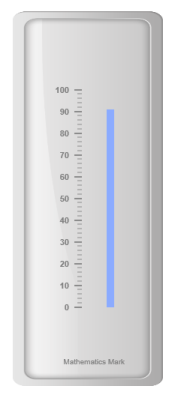

# Custom labels

Custom labels are the text that can paste in any location of the Linear Gauge. It is used to define the purpose of the gauge.

## Adding Custom label collection

Custom labels collection can be directly added to the scale object. Refer the following code to add custom labels collection in a Linear Gauge control.



<ej-linear-gauge id="LinearGauge" enable-animation="false"  >
 <e-frame  inner-width="8" outer-width="10" 
 background-image-url="../images/gauge/Gauge_linear_light.png" ></e-frame>
<e-linear-scale-collections>
<e-linear-scales width="0" show-bar-pointers="true" show-marker-pointers="false"
type="@ScaleType.RoundedRectangle" >
<e-border color="transparent" width="0"></e-border>
<e-bar-pointer-collections>
<e-bar-pointers width="10" bar-pointerdistance-from-scale="40" bar-pointer-value="91"
bar-pointer-background-color="#8BABFF" >
</e-bar-pointers>
</e-bar-pointer-collections>
<e-linear-tick-collections>
<e-linear-ticks type="MajorInterval"  width="2" color="#8c8c8c" >
<e-distance-from-scale x="7" y="0"></e-distance-from-scale>
</e-linear-ticks>
<e-linear-ticks type="MinorInterval" height="6"  width="1" color="#8c8c8c" >
<e-distance-from-scale x="7" y="0"></e-distance-from-scale>
</e-linear-ticks>
</e-linear-tick-collections>
<e-linear-custom-label-collections>
<e-linear-custom-labels value="Mathematics Mark">
<e-linear-position x="55" y="97"></e-linear-position>
</e-linear-custom-labels>
</e-linear-custom-label-collections>
</e-linear-scales>
</e-linear-scale-collections>
</ej-linear-gauge>



Execute the above code to render the following output.

## Basic Customization

### Appearance

* You can customize custom labels using the properties like textAngle, color and font. The API textAngle is used to display the custom labels in the specified angles and color attribute is used to display the custom labels in specified color. You can use value attribute to set the text value in the custom labels. 
* To display the custom labels, set showCustomLabels as ‘true’. Font option is also available on the custom labels. The basic three properties of fonts such as size, family and style can be achieved by size, fontStyle and fontFamily. You can adjust the opacity of the label with the property opacity and the value of opacity lies between 0 and 1.



<ej-linear-gauge id="LinearGauge" enable-animation="false"  >
 <e-frame  inner-width="8" outer-width="10" 
 background-image-url="../images/gauge/Gauge_linear_light.png" ></e-frame>
<e-linear-scale-collections>
<e-linear-scales width="0" show-bar-pointers="true" show-marker-pointers="false"
type="@ScaleType.RoundedRectangle" >
<e-border color="transparent" width="0"></e-border>
<e-bar-pointer-collections>
<e-bar-pointers width="10" bar-pointerdistance-from-scale="40" bar-pointer-value="91"
bar-pointer-background-color="#8BABFF" >
</e-bar-pointers>
</e-bar-pointer-collections>
<e-linear-tick-collections>
<e-linear-ticks type="MajorInterval"  width="2" color="#8c8c8c" >
<e-distance-from-scale x="7" y="0"></e-distance-from-scale>
</e-linear-ticks>
<e-linear-ticks type="MinorInterval" height="6"  width="1" color="#8c8c8c" >
<e-distance-from-scale x="7" y="0"></e-distance-from-scale>
</e-linear-ticks>
</e-linear-tick-collections>
<e-linear-custom-label-collections>
<e-linear-custom-labels value="Mathematics Mark" color="red" text-angle="30" 
custom-label-opacity="0.5">
<e-linear-position x="55" y="97"></e-linear-position>
</e-linear-custom-labels>
</e-linear-custom-label-collections>
</e-linear-scales>
</e-linear-scale-collections>
</ej-linear-gauge>



Execute the above code to render the following output.

## Locating the Custom Labels

To set the location of the custom label in Linear Gauge, position property is used. You can position the custom labels in horizontal and vertical axis using X and Y axis respectively.



<ej-linear-gauge id="LinearGauge" enable-animation="false"  >
 <e-frame  inner-width="8" outer-width="10" 
 background-image-url="../images/gauge/Gauge_linear_light.png" ></e-frame>
<e-linear-scale-collections>
<e-linear-scales width="0" show-bar-pointers="true" show-marker-pointers="false"
type="@ScaleType.RoundedRectangle" >
<e-border color="transparent" width="0"></e-border>
<e-bar-pointer-collections>
<e-bar-pointers width="10" bar-pointerdistance-from-scale="40" bar-pointer-value="91"
bar-pointer-background-color="#8BABFF" >
</e-bar-pointers>
</e-bar-pointer-collections>
<e-linear-tick-collections>
<e-linear-ticks type="MajorInterval"  width="2" color="#8c8c8c" >
<e-distance-from-scale x="7" y="0"></e-distance-from-scale>
</e-linear-ticks>
<e-linear-ticks type="MinorInterval" height="6"  width="1" color="#8c8c8c" >
<e-distance-from-scale x="7" y="0"></e-distance-from-scale>
</e-linear-ticks>
</e-linear-tick-collections>
<e-linear-custom-label-collections>
<e-linear-custom-labels value="Mathematics Mark">
<e-linear-position x="55" y="97"></e-linear-position>
</e-linear-custom-labels>
</e-linear-custom-label-collections>
</e-linear-scales>
</e-linear-scale-collections>
</ej-linear-gauge>



Execute the above code to render the following output.

## Multiple Custom Labels

You can set multiple custom labels in a single Linear Gauge by adding an array of custom label objects. Refer the following code example for multiple custom label functionality.



<ej-linear-gauge id="LinearGauge" enable-animation="false"  >
 <e-frame  inner-width="8" outer-width="10" 
 background-image-url="../images/gauge/Gauge_linear_light.png" ></e-frame>
<e-linear-scale-collections>
<e-linear-scales width="0" show-bar-pointers="true" show-marker-pointers="false"
type="@ScaleType.RoundedRectangle" >
<e-border color="transparent" width="0"></e-border>
<e-bar-pointer-collections>
<e-bar-pointers width="10" bar-pointerdistance-from-scale="40" bar-pointer-value="91"
bar-pointer-background-color="#8BABFF" >
</e-bar-pointers>
</e-bar-pointer-collections>
<e-linear-tick-collections>
<e-linear-ticks type="MajorInterval"  width="2" color="#8c8c8c" >
<e-distance-from-scale x="7" y="0"></e-distance-from-scale>
</e-linear-ticks>
<e-linear-ticks type="MinorInterval" height="6"  width="1" color="#8c8c8c" >
<e-distance-from-scale x="7" y="0"></e-distance-from-scale>
</e-linear-ticks>
</e-linear-tick-collections>
<e-linear-custom-label-collections>
<e-linear-custom-labels value="Mathematics Mark" color="red" >
<e-linear-position x="55" y="97"></e-linear-position>
</e-linear-custom-labels>
<e-linear-custom-labels value="Marks in %" color="red" text-angle="90" >
<e-linear-position x="15" y="97"></e-linear-position>
</e-linear-custom-labels>
</e-linear-custom-label-collections>
</e-linear-scales>
</e-linear-scale-collections>
</ej-linear-gauge>



Execute the above code to render the following output.

