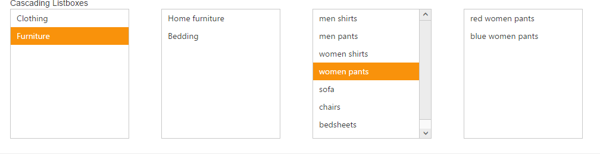

# Cascading Support 

Using cascade option, you can create a behavior of cascade between ListBox controls. For this, create a database with single field that is common between two ListBox data fields and then mention that column id in value field. With this, you can set second ListBox id in CascadeTo property in first ListBox. 

In the following code example, in the first and second ListBox, "categoryId" is the common field. 

The "categoryId" value of the selected item in the First Listbox that matches with "categoryId" value in the second Listbox, is retrieved and the item is loaded.

You can add any number of cascading ListBoxes. For this, create a Datasource with single field value that is common between the two consecutive cascading ListBoxes and cascading is achieved based on that common field.”  

The following steps explains you the behavior of cascade ListBox. 

1. Add the below code in your view page to render the ListBox with cascade option/



	 // Add the following code in View page to configure ListBox widget
	 
 
		 
			Cascading Listboxes
		 
		 @Html.EJ().ListBox("groupsList").Datasource((IEnumerable<groups>)ViewBag.datasource).ListBoxFields(df => 
		 df.Value("categoryid")).CascadeTo("subcategoryList")
	 

	 

		 @Html.EJ().ListBox("subcategoryList").Datasource((IEnumerable<category>)ViewBag.datasource1).ListBoxFields(df => 
		 df.Value("subcategoryid")).CascadeTo("productList").Enabled(false)
	 

	 

		@Html.EJ().ListBox("productList").Datasource((IEnumerable<subCategory>)ViewBag.datasource2).ListBoxFields(df => 
		df.Value("productid")).CascadeTo("subproductList").Enabled(false)
	 

	 
 
		@Html.EJ().ListBox("subproductList").Datasource((IEnumerable<subProduct>)ViewBag.datasource3).Enabled(false)
	 

 
 
   
   

   
	// Add the following code to add list items in the controller page
public partial class ListBoxController : Controller
    {
        public class groups
        {
            public string text { get; set; }
            public string categoryid { get; set; }
        }
            public class category
            {
                public string text { get; set; }
                public string categoryid { get; set; }
                public int subcategoryid { get; set; }
            }
            public class subCategory
            {
                public string text { get; set; }
                public int productid { get; set; }
                public int subcategoryid { get; set; }
            }
            public class subProduct
            {
                public string text { get; set; }
                public int productid { get; set; }
            }
            List<groups> group = new List<groups>();
            List<category> firstLevel = new List<category>();
            List<subCategory> secondLevel = new List<subCategory>();
            List<subProduct> thirdLevel = new List<subProduct>();
            public ActionResult Cascading()
            {
                group.Add(new groups { categoryid = "a", text = "Clothing" });
                group.Add(new groups { categoryid = "b", text = "Furniture" });
                ViewBag.datasource = group;
                //first level child 
                firstLevel.Add(new category { subcategoryid = 11, categoryid = "a", text = "Women" });
                firstLevel.Add(new category { subcategoryid = 12, categoryid = "b", text = "Home furniture" });
                firstLevel.Add(new category { subcategoryid = 13, categoryid = "b", text = "Bedding" });
                ViewBag.datasource1 = firstLevel;

                //second level child  
                secondLevel.Add(new subCategory { productid = 101, subcategoryid = 11, text = "men shirts" });
                secondLevel.Add(new subCategory { productid = 102, subcategoryid = 11, text = "men pants" });
                secondLevel.Add(new subCategory { productid = 103, subcategoryid = 12, text = "women shirts" });
                secondLevel.Add(new subCategory { productid = 104, subcategoryid = 12, text = "women pants" });
                secondLevel.Add(new subCategory { productid = 105, subcategoryid = 13, text = "sofa" });
                secondLevel.Add(new subCategory { productid = 106, subcategoryid = 13, text = "chairs" });
                secondLevel.Add(new subCategory { productid = 106, subcategoryid = 14, text = "bedsheets" });
                secondLevel.Add(new subCategory { productid = 108, subcategoryid = 14, text = "pillows" });
                ViewBag.datasource2 = secondLevel;

                //third level child 
                thirdLevel.Add(new subProduct { productid = 101, text = "red men shirts" });
                thirdLevel.Add(new subProduct { productid = 101, text = "blue men shirts" });
                thirdLevel.Add(new subProduct { productid = 102, text = "red men pants" });
                thirdLevel.Add(new subProduct { productid = 102, text = "blue men pants" });
                thirdLevel.Add(new subProduct { productid = 103, text = "blue women shirts" });
                thirdLevel.Add(new subProduct { productid = 103, text = "red women shirts" });
                thirdLevel.Add(new subProduct { productid = 104, text = "red women pants" });
                thirdLevel.Add(new subProduct { productid = 104, text = "blue women pants" });
                thirdLevel.Add(new subProduct { productid = 105, text = "red sofa" });
                thirdLevel.Add(new subProduct { productid = 105, text = "blue sofa" });
                thirdLevel.Add(new subProduct { productid = 106, text = "red chairs" });
                thirdLevel.Add(new subProduct { productid = 106, text = "blue chairs" });
                thirdLevel.Add(new subProduct { productid = 107, text = "red bedsheets" });
                thirdLevel.Add(new subProduct { productid = 107, text = "blue bedsheets" });
                thirdLevel.Add(new subProduct { productid = 108, text = "red pillows" });
                thirdLevel.Add(new subProduct { productid = 108, text = "blue pillows" });
                ViewBag.datasource3 = thirdLevel;
                return View();
            }

        }

 
   

2. Configure the styles as follows.



	

 
   

3. Output of the above steps.

