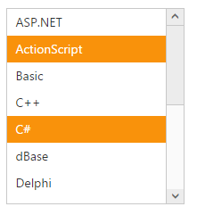
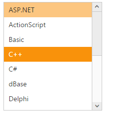
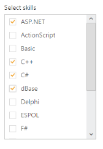
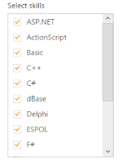

# Multiple Selection in ASP.NET Core ListBox

## Allow multiple selection

ListBox widget allows you to select multiple values from the list Items using allow-multi-selection property. You can select multiple list items along with Control key and Shift key press. To select multiple values we need to set allow-multi-selection value to true.

### Configuring multiple selection

The following steps explain you the configuration of the allow-multi-selection for a ListBox.

1. Add the below code in your view page to render the ListBox

 

	@{List<int> indexList = new List<int>();
		indexList.Add(1);
		indexList.Add(4); 
		}  
 

<ej-list-box id="listboxsample" datasource="ViewBag.datasource" selected-itemlist="indexList" allow-multi-selection="true">
    <e-list-box-fields id="empid" text="text"/>
</ej-list-box>  



2. Output for ListBox control that provides multiple selection is as follows.

   

## Multiple selection through index 

You can select the list of items from the ListBox using selected-indices property. Its data type is array. To achieve this, you need to set true to allow-multi-selection= property in ListBox. 

The following steps explains you the configuration of selected-indices property in ListBox

1. Add the below code in your view page to render the ListBox with allow multiple selection enabled.

 
		
	// Add the following code in View page to configure ListBox widget

@{List<int> indexList = new List<int>();
    indexList.Add(1);
    indexList.Add(4);
}
  

<ej-list-box id="listboxsample" datasource="ViewBag.datasource" enable-persistence="true" selected-indices="indexList" allow-multi-selection="true">
    <e-list-box-fields id="empid" text="text"/>
</ej-list-box>  


   
   

   
	// Add the following code to add list items in the controller page
	   public class skillset
        {
            public string text { get; set; }
        }
        public ActionResult Localdata()
        {
            List<skillset> skill = new List<skillset>();
            skill.Add(new skillset { text = "ASP.NET" });
            skill.Add(new skillset { text = "ActionScript" });
            skill.Add(new skillset { text = "Basic" });
            skill.Add(new skillset { text = "C++" });
            skill.Add(new skillset { text = "C#" });
            skill.Add(new skillset { text = "dBase" });
            skill.Add(new skillset { text = "Delphi" });
            skill.Add(new skillset { text = "ESPOL" });
            skill.Add(new skillset { text = "F#" });
            skill.Add(new skillset { text = "FoxPro" });
            skill.Add(new skillset { text = "Java" });
            skill.Add(new skillset { text = "J#" });
            skill.Add(new skillset { text = "Lisp" });
            skill.Add(new skillset { text = "Logo" });
            skill.Add(new skillset { text = "PHP" });
            ViewBag.datasource = skill;
            return View();
        }
 
   

2. Output of the above steps.

## Checkbox Support

### Show Checkbox 

You can enable the checkbox in the ListBox with this property. The data type of show-checkbox value is Boolean type. It maintains multiple selection and gets the checked items on its ListBox client side events.  

#### Defining the Checkbox support

The following steps explains you the configuration of checkbox options in ListBox.

1. Add the below code in your view page to render the ListBox with checkbox

 

	// Add the following code in View page to configure ListBox widget

<ej-list-box id="listboxsample" datasource="ViewBag.datasource" show-checkbox="true">
    <e-list-box-fields id="empid" text="text"/>
</ej-list-box>  

		

   

   
   
	// Add the following code to add list items in the controller page
	   public class skillset
        {
            public string text { get; set; }
        }
        public ActionResult Localdata()
        {
            List<skillset> skill = new List<skillset>();
            skill.Add(new skillset { text = "ASP.NET" });
            skill.Add(new skillset { text = "ActionScript" });
            skill.Add(new skillset { text = "Basic" });
            skill.Add(new skillset { text = "C++" });
            skill.Add(new skillset { text = "C#" });
            skill.Add(new skillset { text = "dBase" });
            skill.Add(new skillset { text = "Delphi" });
            skill.Add(new skillset { text = "ESPOL" });
            skill.Add(new skillset { text = "F#" });
            skill.Add(new skillset { text = "FoxPro" });
            skill.Add(new skillset { text = "Java" });
            skill.Add(new skillset { text = "J#" });
            skill.Add(new skillset { text = "Lisp" });
            skill.Add(new skillset { text = "Logo" });
            skill.Add(new skillset { text = "PHP" });
            ViewBag.datasource = skill;
            return View();
        }
 


2. Output of the above steps.

### Check All 

You can check all the check box in the list by using check-all property. The data type of check-all is Boolean type. To achieve this, set show-checkbox="true property as true.

The following steps explains you the configuration of checkbox options in ListBox.

1. Add the below code in your view page to render the ListBox with all items checked initially.

 
		
	// Add the following code in View page to configure ListBox widget

<ej-list-box id="listboxsample" datasource="ViewBag.datasource" show-checkbox="true" check-all="true">
    <e-list-box-fields id="empid" text="text"/>
</ej-list-box>  



   
   
	

   
	// Add the following code to add list items in the controller page
	   public class skillset
        {
            public string text { get; set; }
        }
        public ActionResult Localdata()
        {
            List<skillset> skill = new List<skillset>();
            skill.Add(new skillset { text = "ASP.NET" });
            skill.Add(new skillset { text = "ActionScript" });
            skill.Add(new skillset { text = "Basic" });
            skill.Add(new skillset { text = "C++" });
            skill.Add(new skillset { text = "C#" });
            skill.Add(new skillset { text = "dBase" });
            skill.Add(new skillset { text = "Delphi" });
            skill.Add(new skillset { text = "ESPOL" });
            skill.Add(new skillset { text = "F#" });
            skill.Add(new skillset { text = "FoxPro" });
            skill.Add(new skillset { text = "Java" });
            skill.Add(new skillset { text = "J#" });
            skill.Add(new skillset { text = "Lisp" });
            skill.Add(new skillset { text = "Logo" });
            skill.Add(new skillset { text = "PHP" });
            ViewBag.datasource = skill;
            return View();
        }
 

2. Output of the above steps.

### Uncheck All

You can uncheck all the check box in the list by using this property. The data type of uncheck-all is Boolean type. To achieve this, set show-checkbox property as true.

