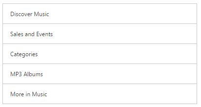
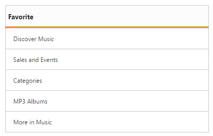

# Getting Started

This control allows you to select an item from a list-like interface and provides the infrastructure to display a set of data items in different layouts or views. It also has ajax loading support, from this you can load data from the cache when once the initial data loaded successfully. This section explains briefly on how to create a ListView control in your ASP.NET Core application.
 
## Create a simple ListView

1.	Refer the [Getting Started]( https://help.syncfusion.com/aspnet-core/getting-started ) page of the Introduction part to know more about the basic system requirements and the steps to configure the Syncfusion components in an ASP.NET Core application.
2.	Add the following code example to the corresponding view page for ListView rendering

    

        <ej-list-view id="locallistview"  width="400" height="300">
            <e-list-view-items>
                <e-list-view-item text="Discover Music"> </e-list-view-item>
                <e-list-view-item text="Sales and Events"></e-list-view-item>
                <e-list-view-item text="Categories"></e-list-view-item>
                <e-list-view-item text="Mp3 Albums"></e-list-view-item>
                <e-list-view-item text="More in Music"></e-list-view-item>
            </e-list-view-items>
        </ej-list-view>
            
    
            
3. Run the above code then you will get output as follows.
        
     
         
 ## Header support

You can add a header for ListView using show-header property. Refer the following code to render ListView with header text.



    <ej-list-view id="locallistview" show-header="true" header-title="Favorite" width="400" height="300">
        <e-list-view-items>
                <e-list-view-item text="Discover Music"> </e-list-view-item>
                <e-list-view-item text="Sales and Events"></e-list-view-item>
                <e-list-view-item text="Categories"></e-list-view-item>
                <e-list-view-item text="Mp3 Albums"></e-list-view-item>
                <e-list-view-item text="More in Music"></e-list-view-item>
            </e-list-view-items>
    </ej-list-view>


 
 Run the above code and you will get the below output.
 
 
 