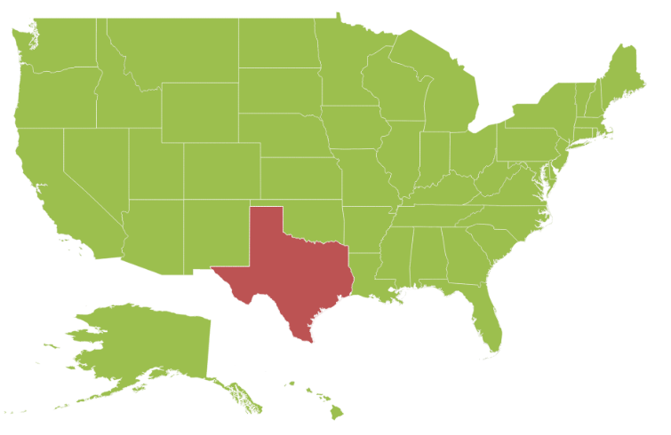
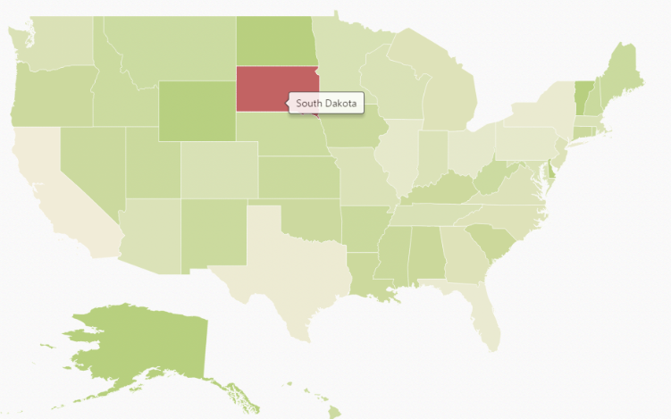

# Getting Started

This section explains briefly about how to create Maps in your application with ASP.NET Core.

## Create your first Map in Core

You can configure an Essential ASP.NET Core 1.0 Map with simple steps. In this example, you can learn how to configure USA population map with customized appearance and tooltip.

### Create a simple Core Application 

To begin, create a new ASP.NET Core project Web application. 

#### Preparing Shape Data

The Shape Data collection describing geographical shape information can be obtained from [GEOJSON format shapes](http://www.syncfusion.com/uploads/user/uploads/Maps_GeoJSON.zip). 

In this example, USA shape is used as shape data by utilizing the `United States of America.json` file in the following folder structure obtained from downloaded Maps_GeoJSON folder.

`..\ Maps_GeoJSON\All Countries with States`

You can store the `United States of America.json` file in data folder as `usa.json`. Then read the complete contents in “usa.json” file and assign to new MapData object in “MapController.cs”  in the following folder location,

~/Controller/MapController.cs



	public IActionResult Map()

	{
		ViewData["mapdata"] = GetUSMap();

		ViewData["datasource"] = GetUSPopulationData();

		return View();

	}

	public object GetUSMap()

	{

		string usajson = System.IO.File.ReadAllText(@"..\data\USA.json");
        
		return new Syncfusion.JavaScript.DataVisualization.Maps.MapData(usajson);

	}



### Prepare Data Source

The dataSource is populated with USA population data inside the controller relative to shape data. For better understanding, “MapController.cs” is populated with data of USA Population in “MapController.cs”.



	public IActionResult Map()

	{
		ViewData["mapdata"] = GetUSMap();

		ViewData["datasource"] = GetUSPopulationData();

		return View();

	}

	public object GetUSMap()

	{

		string usajson = System.IO.File.ReadAllText(@"..\data\USA.json");
        
		return new Syncfusion.JavaScript.DataVisualization.Maps.MapData(usajson);

	}

	public List<CountyPopulationData> GetUSPopulationData()

	{

		List<CountyPopulationData> populationData = new List<CountyPopulationData>

		{

			new CountyPopulationData(){ Name= "California", Population=38332521},

			new CountyPopulationData(){ Name= "Texas", Population=26448193},

			new CountyPopulationData(){ Name= "New York", Population=19651127},

			new CountyPopulationData(){ Name= "Florida", Population=19552860},

			new CountyPopulationData(){ Name= "Illinois", Population=12882135},

			new CountyPopulationData(){ Name= "Pennsylvania", Population=12773801},

			new CountyPopulationData(){ Name= "Ohio", Population=11570808},

			new CountyPopulationData(){ Name= "Georgia", Population=9992167},

			new CountyPopulationData(){ Name= "Michigan", Population=9895622},

			new CountyPopulationData(){ Name= "North Carolina", Population=9848060},

			new CountyPopulationData(){ Name= "New Jersey", Population=8899339},

			new CountyPopulationData(){ Name= "Virginia", Population=8260405},

			new CountyPopulationData(){ Name= "Washington", Population=6971406},

			new CountyPopulationData(){ Name= "Massachusetts", Population=6692824},

			new CountyPopulationData(){ Name= "Arizona", Population=6626624},

			new CountyPopulationData(){ Name= "Indiana", Population=6570902},

			new CountyPopulationData(){ Name= "Tennessee", Population=6495978},

			new CountyPopulationData(){ Name= "Missouri", Population=6044171},

			new CountyPopulationData(){ Name= "Maryland", Population=5928814},

			new CountyPopulationData(){ Name= "Wisconsin", Population=5742713},

			new CountyPopulationData(){ Name= "Minnesota", Population=5420380},

			new CountyPopulationData(){ Name= "Colorado", Population=5268367},

			new CountyPopulationData(){ Name= "Alabama", Population=4833722},

			new CountyPopulationData(){ Name= "South Carolina", Population=4774839},

			new CountyPopulationData(){ Name= "Louisiana", Population=4625470},

			new CountyPopulationData(){ Name= "Kentucky", Population=4395295},

			new CountyPopulationData(){ Name= "Oregon", Population=3930065},

			new CountyPopulationData(){ Name= "Oklahoma", Population=3850568},

			new CountyPopulationData(){ Name= "Puerto Rico", Population=3615086},

			new CountyPopulationData(){ Name= "Connecticut", Population=3596080},

			new CountyPopulationData(){ Name= "Iowa", Population=3090416},

			new CountyPopulationData(){ Name= "Mississippi", Population=2991207},

			new CountyPopulationData(){ Name= "Arkansas", Population=2959373},

			new CountyPopulationData(){ Name= "Utah", Population=2900872},

			new CountyPopulationData(){ Name= "Kansas", Population=2893957},

			new CountyPopulationData(){ Name= "Nevada", Population=2790136},

			new CountyPopulationData(){ Name= "New Mexico", Population=2085287},

			new CountyPopulationData(){ Name= "Nebraska", Population=1868516},

			new CountyPopulationData(){ Name= "West Virginia", Population=1854304},

			new CountyPopulationData(){ Name= "Idaho", Population=1612136},

			new CountyPopulationData(){ Name= "Hawaii", Population=1404054},

			new CountyPopulationData(){ Name= "Maine", Population=1328302},

			new CountyPopulationData(){ Name= "New Hampshire", Population=1323459},

			new CountyPopulationData(){ Name= "Rhode Island", Population=1051511},

			new CountyPopulationData(){ Name= "Montana", Population=1015165},

			new CountyPopulationData(){ Name= "Delaware", Population=925749},

			new CountyPopulationData(){ Name= "South Dakota", Population=844877},

			new CountyPopulationData(){ Name= "Alaska", Population=735132},

			new CountyPopulationData(){ Name= "North Dakota", Population=723393},

			new CountyPopulationData(){ Name= "District of Columbia", Population=646449},

			new CountyPopulationData(){ Name= "Vermont", Population=626630},

			new CountyPopulationData(){ Name= "Wyoming", Population=582658}

		};

		return populationData;

	}

	public class CountyPopulationData

	{

		public string name;

		public string Name

		{

			get { return name; }

			set { name = value; }

		}

		public double population;

		public double Population

		{

			get { return population; }

			set { population = value; }

		}

	}



You can refer to shape data and datasource as illustrated in the following “Map.cshtml”,



	@{       

    	var mapData = ViewData["mapdata"];

        var dataSource = ViewData["datasource"];    	 
	 
	}



## Initialize Map

* Create a &lt;div&gt; tag and set the height and width to determine the map size. 
      		


	
	


  

* Add the following code sample in “Map.cshtml” file, to create the Map control in the View page.



	
 

		@{Html.EJ().Map("container")

			.Layers(lr =>

			{

				lr.ShapeData(mapData).Add();

			})
			.Render();
		}     

	


   

* The Final Map.cshtml file appears as follows.



	@{

			var mapData = ViewData["mapdata"];

			var datasource = ViewData["datasource"];

	}

		

			@{Html.EJ().Map("container")

				.Layers(lr =>

				{

					lr.ShapeData(mapData).Add();

				})
			.Render();
			}     
		
   

		<ej-script-manager></ej-script-manager>


   

The above code renders a map with default properties and shape input provided through data in layers.

## Data Binding in Map

The following properties in shape layers is used for binding data in Maps control.

* DataSource
* ShapeDataPath
* ShapePropertyPath

### DataSource

The `DataSource` property accepts collection values as input. For example, you can provide the list of objects as input.

### Shape Data Path 

The `ShapeDataPath` property is used to refer the data ID in DataSource. For example, population MapData contains data ids ‘Name’ and ‘Population’. The `ShapeDataPath` and `ShapePropertyPath` properties are related to each other (refer to `ShapePropertyPath` for more details).

### Shape Property Path

The `ShapePropertyPath` property is similar to the `ShapeDataPath` that refers the column name in the Data property of shape layers to identify the shape. When the values of the `ShapeDataPath` property in the `DataSource` property and the value of `ShapePropertyPath` in the Data property match, then the associated object from the `DataSource` is bound to the corresponding shape.



	@{Html.EJ().Map("container")            

	.Layers(lr =>

	{         

		lr.ShapeData(mapData) 

		.ShapeDataPath("name")

		.ShapePropertyPath("name")

		.DataSource(datasource)

		.Add();           

	}) .Render();
   }  
	


### Customize Map Appearance 

You can customize the shape’s color by using `Fill`, `Stroke` and `StrokeThickness` properties in `ShapeSettings`.



@{Html.EJ().Map("container")            

	.Layers(lr =>

	{

		lr.ShapeData(mapData)              

	 	.ShapeDataPath("name")

		.ShapePropertyPath("name")

		.DataSource(datasource)

		.EnableSelection(false)

		.EnableMouseHover(true)

		.ShapeSettings(ss  =>

		{

	   		ss.Fill("#9CBF4E")

			.StrokeThickness(0.5)

			.Stroke("White")

			.HighlightStroke ("White")                           

			.HighlightColor("#BC5353")

			.HighlightBorderWidth(1);			

		})
   		
		.Add();         

	}).Render();
}  



### Customizing Map Appearance by Range

The Range color mapping is used to differentiate the shape’s fill based on its underlying value and color ranges. The `From` and `To` properties defines the value ranges and the `GradientColors` property defines the equivalent color ranges respective to their value ranges.

N> The `EnableGradient` property value should be true to apply gradient colors for maps.



	@{Html.EJ().Map("container")

	.Layers(lr =>

	{                                          

		lr.ShapeData(mapData)              

		.ShapeDataPath("name")

		.ShapePropertyPath("name")

		.DataSource(datasource)

		.ShowMapItems(false)

		.EnableSelection(false)

		.EnableMouseHover(true)

		.ShapeSettings(ss  =>

		{

			ss.Fill("#9CBF4E")

			.StrokeThickness(0.5)

			.Stroke("White")

			.HighlightStroke("White")                           

			.HighlightColor("#BC5353")

			.HighlightBorderWidth(1)	

			.ValuePath("population")

			.EnableGradient(true)

			.RangeColorMappings(cm =>

			{

				cm.From(500000).To(1000000).GradientColors(new List<string> { "#9CBF4E", "#B8CE7B" }).Add();

				cm.From(1000001).To(5000000).GradientColors(new List<string> { "#B8CE7B", "#CBD89A" }).Add();

				cm.From(5000001).To(10000000).GradientColors(new List<string> { "#CBD89A", "#DEE2B9" }).Add();

				cm.From(10000001).To(40000000).GradientColors(new List<string> { "#DEE2B9", "#F1ECD8" }).Add();

			});									

		})

		.Add();         

		}).Render();
	}  



The following screenshot illustrates a Map with gradient color property enable.

## Enable Tooltip

The tooltip is displayed only when `ShowTooltip` is set to ‘True’ in the shape layers. By default, it takes the property of the bound object that is referred in the `ValuePath` and displays its content on hovering the corresponding shape. The `TooltipTemplate` property is used for customizing the template for tooltip.



	@{Html.EJ().Map("container")

	.Layers(lr =>

	{                                          

		.ShapeSettings(ss  =>

		{

			.ValuePath("name")

		})

		.ShowTooltip(true);

		}).Render();
	}  



The following screenshot illustrates a map control displaying a Tooltip.

## Legend

A Legend can be made visible by setting the `ShowLegend` property in `LegendSetting`. 

### Interactive Legend

The legends can be made interactive with an arrow mark indicating the exact range color in the legend, when the mouse hovers the corresponding shapes. You can enable this option by setting `Mode` property in `LegendSettings` value as ‘Interactive’. The default value of `Mode` property is ‘Default’ to enable the normal legend.

#### Title

Use `Title` property to provide title for interactive legend.

#### Label

You can use `LeftLabel` and `RightLabel` property to provide left and right labels for interactive legend. 



	@{Html.EJ().Map("container")

	.Layers(lr =>

	{                                          
		
		lr.ShapeData(mapData)              

		.ShapeDataPath("name")

		.ShapePropertyPath("name")

		.DataSource(datasource)

		.ShowMapItems(false)

		.EnableSelection(false)

		.EnableMouseHover(true)

		.ShapeSettings(ss  =>

		{
			
			ss.Fill("#9CBF4E")

			.StrokeThickness(0.5)

			.Stroke("White")

			.HighlightStroke("White")                           

			.HighlightColor("#BC5353")

			.HighlightBorderWidth(1)	

			.ValuePath("population")

			.EnableGradient(true)

			.RangeColorMappings(cm =>

			{

				cm.From(500000).To(1000000).GradientColors(new List<string> { "#9CBF4E", "#B8CE7B" }).Add();

				cm.From(1000001).To(5000000).GradientColors(new List<string> { "#B8CE7B", "#CBD89A" }).Add();

				cm.From(5000001).To(10000000).GradientColors(new List<string> { "#CBD89A", "#DEE2B9" }).Add();

				cm.From(10000001).To(40000000).GradientColors(new List<string> { "#DEE2B9", "#F1ECD8" }).Add();

			});									

		})

		.LegendSettings(ml =>

		{

			ml.ShowLegend(true)

			.Height(15)

			.Width(150)

			.Position(Syncfusion.JavaScript.DataVisualization.Models.DockPosition.Topleft)

			.Type(Syncfusion.JavaScript.DataVisualization.Models.LegendType.Layers)

			.Mode(Syncfusion.JavaScript.DataVisualization.Models.LegendMode.Interactive)

			.Title("Population")

			.LeftLabel("0.5 M")

			.RightLabel("40 M");                        

		})

		.Add(); 

		}).Render();

	}


The following screenshot illustrates a map displaying an interactive legend.

The complete code sample can be found [here](http://www.syncfusion.com/downloads/support/directtrac/general/ze/Map_GettingStarted-1349939768)