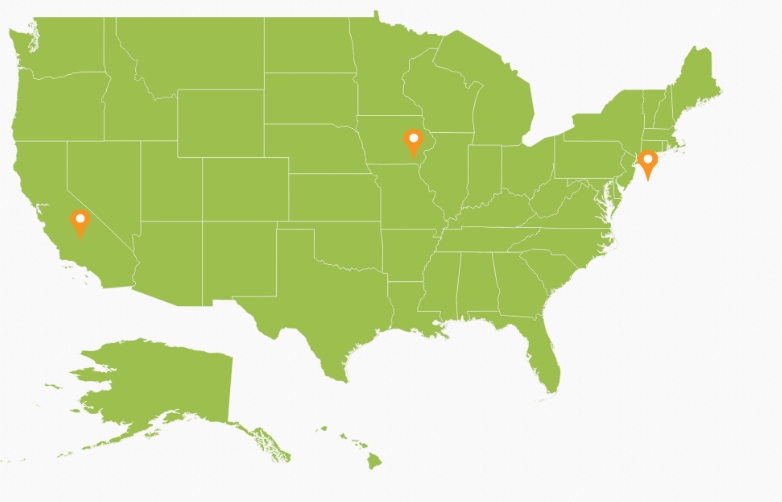
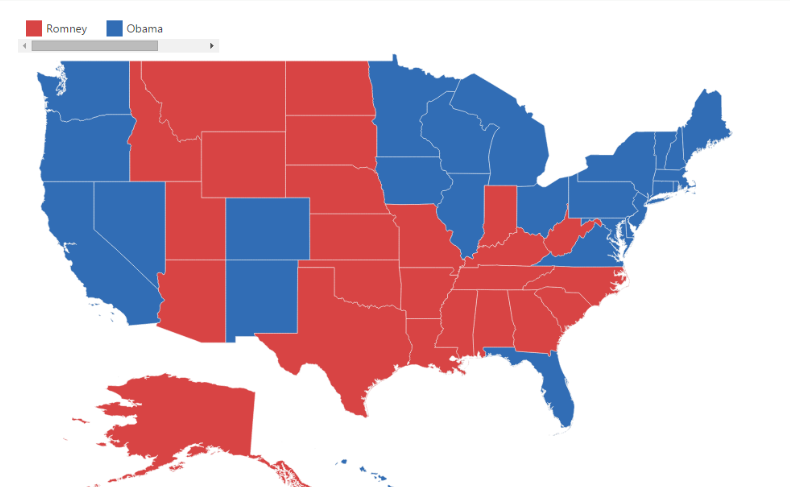
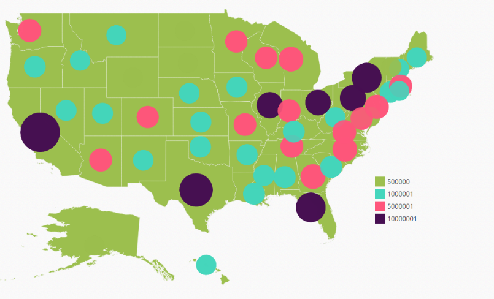

# Map Elements

Map control contains a set of map elements, including shapes, bubbles, markers, legend, labels and data items that can be visualized with customized appearance showing additional information on the map using bound data.

## Markers 

Markers are notes that is used to leave some message on the map. 

There are two ways to set marker for map.

* Using markers and marker template
* Adding marker objects to map.

### Markers 

The `Markers` property has a list of objects that contains the data for Annotation. You can visualize these data by using marker-template property.



	public ActionResult Map()

	{

		// ...

		ViewBag.AnnotationDatasource = GetMarkers();

		return View();

	}

	 // ...

   	
	public List<MarkerData> GetMarkers()

	{

		List<MarkerData> markerData = new List<MarkerData>

		{

			new MarkerData {City = "California", Latitude = 37.0000, Longitude = -120.0000 },

			new MarkerData {City = "New York", Latitude = 40.7127, Longitude = -74.0059 },

			new MarkerData {City = "Iowa", Latitude = 42, Longitude = -93}

		};

		return electionResults;

	}

	public class MarkerData

	{

		private double latitude;

		public double Latitude

		{

			get { return latitude; }

			set { latitude = value; }

		}

		public double longitude;

		public double Longitude

		{

			get { return longitude; }

			set { longitude = value; }

		}

		private string city;

		public string City

		{

			get { return city; }

			set { city = value; }

		}

	} 





<ej-map id="maps">
<e-layers >
<e-layer shape-data="ViewBag.worldMap"  markers=ViewBag.AnnotationDatasource marker-template="template"  >
</e-layer>
</e-layers>
</ej-map>

	

	
    	

        	<svg height="100" width="100">

				<circle cx="20" cy="20" r="10" stroke="black" stroke-width="1" fill="red" />

			</svg>

    	

	
      



## Bubbles 

Bubbles in the Maps control represent the underlying data values of the map. Bubbles are scattered throughout the map shapes that contain bound values.

Bubbles are included when data binding and the `BubbleSettings` is set to the shape layers. 

### Properties

<table>
<tr>
<th>
Property</th><th>
Type</th><th>
Description</th></tr>
<tr>
<td>
MaxValue</td><td>
String</td><td>
Get or sets the maximum height and width of the bubble.</td></tr>
<tr>
<td>
MinValue</td><td>
String</td><td>
Gets or sets the minimum height and width of the bubble.</td></tr>
<tr>
<td>
ColorValuePath</td><td>
String</td><td>
Get or sets the field value that is to be fetched from data for each bubble used for determining the bubble color.</td></tr>
<tr>
<td>
ValuePath</td><td>
String</td><td>
Gets or sets the field value that is to be fetched from data for each bubble.</td></tr>
<tr>
<td>
ColorMappings</td><td>
Collection of RangeColorMapping</td><td>
Gets or sets the tree map colors.</td></tr>
<tr>
<td>
Color</td><td>
String</td><td>
Gets or sets the fill color for bubbles.</td></tr>
<tr>
<td>
ShowTooltip</td><td>
Boolean</td><td>
Enable or disable the tooltip for bubbles.</td></tr>
<tr>
<td>
TooltipTemplate</td><td>
String</td><td>
Gets or sets the tooltip template for bubbles.</td></tr>
</table>

### Add Bubbles to a Map

To add bubbles to a map, the bubble marker setting is added to the shape file layer. Create the Model and ViewModel as illustrated in the Data Binding topic and add the following code. Also set the `MaxValue`, `MinValue`, and `ValuePath` properties as illustrated in the following code sample.

N>Tooltip and Color Mappings for bubble is to be set as similar to tooltip and color mappings set in layers and ShapeSettings. For more details, refer Tooltip and Color Mappings section.



<ej-map id="maps">
<e-layers >
<e-layer shape-data="ViewBag.mapData" datasource="ViewBag.population_data" enable-mouse-hover="true">
<e-shape-settings   stroke="white" fill="#9CBF4E"  
 stroke-thickness="0.5">
</e-shape-settings>   
 <e-bubble-settings max-value="40" min-value="20" value-path="Population" color="#C99639" show-bubble="true"></e-bubble-settings>          
</e-layer>
</e-layers>
</ej-map>           

   



## Legend

A legend is a key used on a map, contains swatches of symbols with descriptions. It provides valuable information for interpreting what the map is displaying you, and can be represented in various colors, shapes or other identifiers based on the data. It gives a breakdown of what each symbol represents throughout the map.

### Visibility of Legend

The Legends can be made visible by setting the `ShowLegend` property of legendSettings. 

### Positioning of Legend

The legend can be positioned in two ways.

* Absolute Position.
* Dock Position.

### Absolute Position

Based on the margin values of X and Y-axes, the Map legends can be positioned with the support of `PositionX` and `PositionY` properties available in `LegendSettings`. For positioning the legend based on margins corresponding to a map, `Position` value is set as ‘_None_’.

### Dock Position

The map legends can be positioned in following locations within the container.

* TopLeft
* TopCenter
* TopRight
* CenterLeft
* Center
* CenterRight
* BottomLeft
* BottomRight
* BottomCenter
* BottomRight
* None

You can set this option by using `Position` property in `LegendSettings`.

### Legend Size

The map legend size can be modified using `Height` and `Width` properties in `LegendSettings`.

### Legend for Shapes

The Layer shape type legends can be generated for each color mappings in shape settings. 

N> Here, Equal Color Mapping code sample for shapeSettings with color mappings is referred.


<ej-map id="maps">
<e-layers >
<e-layer >
<e-legend-settings show-legend="true" height="20" width="60" position-x="80" position-y="90"></e-legend-settings>           </e-layer>
</e-layers>
</ej-map>



### Interactive Legend

The legends can be made interactive with an arrow mark indicating the exact range color in the legend when the mouse hovers over the corresponding shapes. You can enable this option by setting `Mode` property in `LegendSettings` value as “Interactive” and default value of `Mode` property is “Default” to enable the normal legend.

#### Title for Interactive Legend

You can provide the title for interactive legend by using `Title` property in `LegendSettings`.

#### Label for Interactive Legend

You can provide the left and right labels to interactive legend by using `LeftLabel` and `RightLabel` properties in `LegendSettings`. 

N> Here, Range Color Mapping code snippet for shapeSettings with color mappings is referred.



<ej-map id="maps">
<e-layers >
<e-layer >
<e-legend-settings show-legend="true" height="15" width="150" position="@DockPosition.TopLeft" 
type="@LegendType.Layers" mode="@LegendMode.Interactive" title="populaiton" left-label="0.5M" right-label="40M"></e-legend-settings> </e-layer>
</e-layers>
</ej-map>



### Bubble Legend

A bubble legend feature is used to provide the key (legend) for another map element bubble. You can activate the Bubble legend by setting the enum `Type` in `LegendSettings` as “_Bubble_” and this enables you to easily identify what value a particular bubble is representing.



<ej-map id="maps">
<e-layers >
<e-layer >
<e-legend-settings show-legend="true" height="15" width="150" 
type="@LegendType.Bubbles"  title="population" ></e-legend-settings> 
<e-bubble-settings max-value="40" min-value="20" value-path="Population" show-bubble="true"></e-bubble-settings>  
</e-layer>
</e-layers>
</ej-map>

                   

			
		

