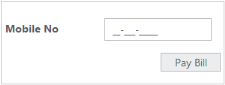

# Getting Started

This section explains you briefly on how to create a MaskEdit control in your ASP.NET Core application.

## Create your first MaskEdit Widget in ASP.NET Core

ASP.NET Core MaskEdit control allows you to set the type and format of the input mask that is used in the textbox and also the number of place holders. Using the following guidelines, you can create MaskEdit control for a real-time payment application.

The following screenshot illustrates the functionality of a MaskEdit. Using MaskEdit control textbox, you can enter only the assigned text format and no other formats. The input mask prevents you from entering invalid characters into the control. In this application, MobileNumber textbox has a mask value.

MaskEdit
{:.caption}

In the above screenshot, you can type only numbers and it does not allow text format.

### Create a MaskEdit control

ASP.NET Core MaskEdit control renders built-in features like text masking, number masking and flexible APIs. You can easily create the MaskEdit control using simple HTML helper class as follows:

1. Create an ASP.NET Core Project and add Syncfusion assembly packages, styles and scripts to it. Refer [ASP.NET Core-Getting Started](https://help.syncfusion.com/aspnet-core/getting-started)
2. Add the following code to the corresponding view page to render MaskEdit.

   ~~~ cshtml

    

        

            <table class="editors">

                <tbody>

                    <tr>

                        <td>

                            <label>

                                Kilometers
                            </label>

                        </td>

                        <td>

                            <ej-numeric-text-box id="numeric" value="1000" />

                        </td>

                    </tr>

                    <tr>

                        <td>

                            <label>

                                Service Tax
                            </label>

                        </td>

                        <td>

                            <ej-percentage-text-box id="percent" value="100" />

                        </td>

                    </tr>

                    <tr>

                        <td>

                            <label>

                                Fare
                            </label>

                        </td>

                        <td>

                            <ej-currency-text-box id="currency" value="50" />

                        </td>

                    </tr>

                    <tr>

                        <td>

                            <label>

                                Mobile No
                            </label>

                        </td>

                        <td>

                            @*creating MaskEdit control*@
                       
                            <ej-mask-edit id="maskedit" mask-format="99-999-99999" input-mode="@InputMode.Text" />

                        </td>

                    </tr>

                </tbody>

            </table>

            

                <ej-button id="btn" size="@ButtonSize.Small" text="PayBill" />            

            

        

    

	
   ~~~
   

3. Add the following styles to show MaskEdit and place it in a particular position.

   ~~~ css

	

   ~~~
   			

Execute the above code example to render the following output.

MaskEdit
{:.caption}

## Set Mask value to Mobile Number textbox

In this section, you can learn how to set mask value for MobileNumber textbox. To achieve this, set the mask value in the MaskEdit control to the desired values.

  	~~~ cshtml
  
		<ej-mask-edit id="maskedit" mask-format="99-999-99999" input-mode="@InputMode.Text" />
	
	~~~

## Create a MaskEdit control for Product Key Validation

### Create a MaskEdit

You can easily create the MaskEdit control using simple HTML helper class as follows.

1. Create a ASP.NET Core Project and add Syncfusion assembly packages and scripts to it. 

   Refer [ASP.NET Core-Getting Started](https://help.syncfusion.com/aspnet-core/getting-started).

2. Add the following code to the corresponding view page to render MaskEdit.

   ~~~ cshtml
   
	

		

			<table class="editors">

				<tbody>

					<tr>

						<td>

							<label>

								Product Key</label>

						</td>

						<td>

						  @*creating MaskEdit control for productkey validation*@   
						  
						  <ej-mask-edit id="maskedit" mask-format="aaaa-aaaa-aaaa-aaaa" input-mode="@InputMode.Text" />                     
						  
						</td>

					</tr>

				</tbody>

			</table>

			

				<ej-button id="btn" size="@ButtonSize.Small" text="Submit" />

			

		

	

   ~~~
   

3. Add the following styles to show the MaskEdit, and place it in a particular position.

   ~~~ css

	

   ~~~
   

4. Run the above code example to render the following output. 

Product Key
{:.caption}

## Set Mask value to Product key textbox

You can set mask value for Product key textbox by setting the desired values to the MaskEdit control.



	<ej-mask-edit id="maskedit" mask-format="aaaa-aaaa-aaaa-aaaa" input-mode="@InputMode.Text" />



