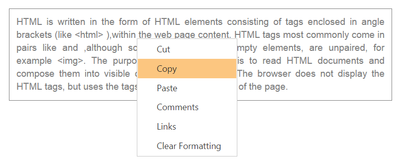

# Context Menu in ASP.NET Core

A context menu is a type of menu in a graphical user interface (GUI) that appears when you perform right click operation. In this Menu control you can use a context menu by specifying the type of menu as ContextMenu. A context also provides support for nested level of menu items.

Before you use the context menu, provide the target area for it. 

In the following example, a context menu for the division containing text is created. In this, when you perform right click operation, the following menu appears with open, edit, etc.

1. Add the following code in your View page.



    HTML is written in the form of HTML elements consisting of tags enclosed in angle
    brackets (like &lt;html&gt; ),within the web page content. HTML tags most commonly
    come in pairs like and ,although some tags, known as empty elements, are unpaired,
    for example &lt;img&gt;. The purpose of a web browser is to read HTML documents
    and compose them into visible or audible web pages. The browser does not display
    the HTML tags, but uses the tags to interpret the content of the page.

<ej-menu id="menu" menu-type="@MenuType.ContextMenu" open-on-click="true" context-menu-target="#target">
    <e-menu-items>
        <e-menu-item url="" text="Cut"></e-menu-item>
        <e-menu-item url="" text="Copy"></e-menu-item>
        <e-menu-item url="" text="Paste"></e-menu-item>
        <e-menu-item url="" text="Comments"></e-menu-item>
        <e-menu-item url="" text="Links"></e-menu-item>
        <e-menu-item url="" text="Clear Formatting"></e-menu-item>
    </e-menu-items>
</ej-menu>



2. Add the following code in your style section.





The following screen shot displays the output of the above code.

Context Menu
{:.caption}

You can hide and show the context menu using the following methods.

## HideContextMenu

Hides the context Menu control. Add the following script code in the sample in order to hide the context menu.



//initialize the menu object

var menuObj = $("#menu").data("ejMenu");

//To enable Menu item using item id

menuObj.hide();



## ShowContextMenu

Shows the context menu control. Add the following script code in the sample in order to show the context menu.


//initialize the menu object

var menuObj = $("#menu").data("ejMenu");

//To enable Menu item using item id

menuObj.show();

