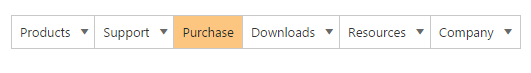
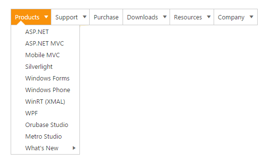
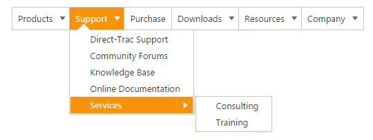

# Getting Started 

## Create Syncfusion Menu in ASP.NET Core

Menu supports you to display a Menu of list-out items. This Menu is based on UL-LI hierarchy, where the sub-list items can be rendered as the sub-menu items. Its possible to render the Menu control with local and remote data source. 

From the following guideline, you can learn how to customize the Menu control for a website. 
 
## Create your first Menu in ASP.NET Core

Create Syncfusion ASP.NET Core application. You can refer [ASP.NET Core Getting Started](https://help.syncfusion.com/aspnet-core/getting-started) documentation to initially configure the common specifications.



	

        <ej-menu id="syncfusionProducts"> </ej-menu>

    

    

        @{ Html.EJ().Menu("SyncfusionProducts").Render(); }

    



 
    
N> We can render the Menu control by using either razor or tag helper which is shown in the above code.To render the control using razor,the code is same as like the MVC but in addition here we need to add Render() method.

## Configure Parent Menu items

Each Menu consists of a list of Menu items with list of sub level Menu item. Refer the following guidelines to initialize the root level elements of Menu control with Remote data source value. RootLevelItems data service is created to define the root level Menu items, sub items and InnerItems data services to initialize the sub level and inner sub levels and both can be referred from the following service location. In Menu Widgets mention the RootLevelItem Data Source in the Datasource property. Elements’s properties like Id, Text, URL, and Parent Id can be defined using our menu fields and it explained briefly under the concept and features of Menu control.

[http://mvc.syncfusion.com/UGOdataServices/Northwnd.svc/](http://mvc.syncfusion.com/UGOdataServices/Northwnd.svc/)

To navigate the clicked Menu item to a specific URL, define the navigation URL to each Menu item.

Initialize the Menu with data source value as follows. 



	

        <ej-menu id="syncfusionProducts">
            <e-menu-fields query="ej.Query().from('RootLevelItems')" id="InfoID" text="InfoText"> 
                <e-datamanager url="http://mvc.syncfusion.com/UGOdataServices/Northwnd.svc/"></e-datamanager> 
            </e-menu-fields>
        </ej-menu>  

    

    

        @{ Html.EJ().Menu("SyncfusionProducts").Width("600px").MenuFields(f => f.Datasource(d => 
        d.URL("http://mvc.syncfusion.com/UGOdataServices/Northwnd.svc/")).Query("ej.Query().from('RootLevelItems')").Id("InfoID").Text("InfoText")).Render(); }

    



The following screenshot displays the resultant output Menu without sub menu item.

 

## Initialize sub-level Menu items

Each Menu items consist of list of sub level Menu items. Refer the following guidelines to initialize the sub level items of Menu control. The ParentId field property maps root level Menu item to its sub level Menu item. In Menu Widgets mention the RootLevelItems and SubLevelItems Data Source in the Datasource property. The Child field property is used to define sub level Menu items of parent Menu item.							

The following code example explains the initialization of first level sub menu items of Menu control.



	

        <ej-menu id="syncfusionProducts">
            <e-menu-fields query="ej.Query().from('RootLevelItems')" id="InfoID" text="InfoText"> 
                <e-child table-name="SubItems" id="SubItemID" parent-id="InfoID" text="SubItemText"> 
                    <e-datamanager url="http://mvc.syncfusion.com/UGOdataServices/Northwnd.svc/"></e-datamanager> 
                </e-child>
                <e-datamanager url="http://mvc.syncfusion.com/UGOdataServices/Northwnd.svc/"></e-datamanager> 
            </e-menu-fields>
        </ej-menu>  

    

    

       @{
           Html.EJ().Menu("SyncfusionProducts").Width("600px")
           .MenuFields(f => f.Datasource(d => 
                    d.URL("http://mvc.syncfusion.com/UGOdataServices/Northwnd.svc/"))
                    .Query("ej.Query().from('RootLevelItems')")
                    .Id("InfoID")
                    .Text("InfoText")
                    .Child(c => c.Datasource(cd => 
                    cd.URL("http://mvc.syncfusion.com/UGOdataServices/Northwnd.svc/"))
                    .TableName("SubItems")
                    .Id("SubItemID")
                    .ParentId("InfoID")
                    .Text("SubItemText"))).Render();
        }

    



Execute the above code example to render the following output Menu with sub menu item.

## Define multiple level Menu items

Render sub menu item to multiple level in Menu control. In Menu Widgets, mention the InnerItems Data Source in the Datasource property. The Child field property is used to define the sub level Menu item of parent Menu. Specify the ParentId value to render sub level Menu item for the Menu item. Each Level Menu item have Child field to define the child level Menu item. 

The following code example explains the initialization of multiple level sub menu items.



	

       <ej-menu id="syncfusionProducts">
            <e-menu-fields query="ej.Query().from('RootLevelItems')" id="InfoID" text="InfoText"> 
                <e-child table-name="SubItems" id="SubItemID" parent-id="InfoID" text="SubItemText"> 
                    <e-child table-name="InnerItems" id="InnerSubItemID" parent-id="SubItemID" text="InnerSubItemText"> 
                        <e-datamanager url="http://mvc.syncfusion.com/UGOdataServices/Northwnd.svc/"></e-datamanager> 
                    </e-child>
                    <e-datamanager url="http://mvc.syncfusion.com/UGOdataServices/Northwnd.svc/"></e-datamanager> 
                </e-child>
                <e-datamanager url="http://mvc.syncfusion.com/UGOdataServices/Northwnd.svc/"></e-datamanager> 
            </e-menu-fields>
        </ej-menu>  

    

    

       @{
           @Html.EJ().Menu("SyncfusionProducts").Width("600px")
           .MenuFields(f => f.Datasource(d => 
                d.URL("http://mvc.syncfusion.com/UGOdataServices/Northwnd.svc/"))
                .Query("ej.Query().from('RootLevelItems')")
                .Id("InfoID")
                .Text("InfoText")
                    .Child(c => c.Datasource(cd => 
                    cd.URL("http://mvc.syncfusion.com/UGOdataServices/Northwnd.svc/"))
                    .TableName("SubItems")
                    .Id("SubItemID")
                    .ParentId("InfoID")
                    .Text("SubItemText")
                        .Child(cc => cc.Datasource(ccd =>
                            ccd.URL("http://mvc.syncfusion.com/UGOdataServices/Northwnd.svc/"))
                            .TableName("InnerItems")
                            .Id("InnerSubItemID")
                            .ParentId("SubItemID")
                            .Text("InnerSubItemText")))).Render();

        }

    



The following screenshot is the resultant output Menu with multiple level sub menu item.

 