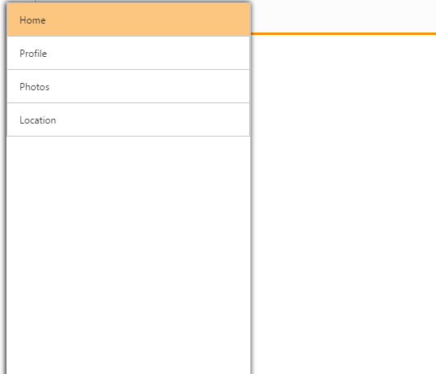

# Customize Position

Position property is used to specify the position whether it is in fixed or relative to the page. When you set a normal value to position property, it appears within the container. Otherwise, it appears in the whole body .The possible position values are fixed and normal. The Default value is normal.



@Html.EJ().NavigationDrawer("navpane").Width(300).Position(NavigationDrawerPosition.Fixed).ContentTemplate(@

        @Html.EJ().ListView("list").Width(300).Items(items =>

         {

             items.Add().Text("Home");

             items.Add().Text("Profile");

             items.Add().Text("Photos");

             items.Add().Text("Location");

         })

    
) 



The following screenshot illustrates the output by swiping from left to right at the left end of the screen.

