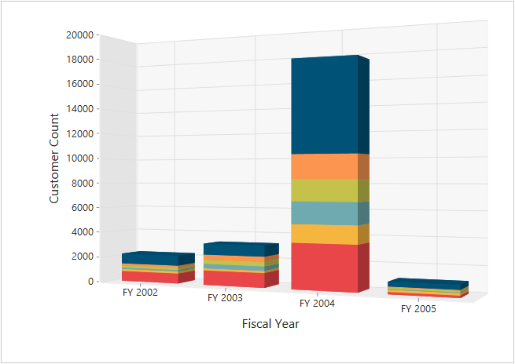

# 3D Visualization

The PivotChart control allows you to view the data in a 3D view. Following are the chart types that are supported:

* Bar
* Column
* Stacking Bar
* Stocking Column 
* Pie

## 3D Column Chart

3D Column Chart is rendered by specifying the chart type as **“Column”** in the **“e-common-series-options”** enumeration property as well as by setting the `enable3d` property to **“true”.**



<ej-pivot-chart id="PivotChart1" enable3d="true" rotation="24">
    <e-common-series-options type="Column"></e-common-series-options>
    <e-size width="100%" height="460px"></e-size>
</ej-pivot-chart>



## 3D Bar Chart

3D Bar Chart is rendered by specifying the chart type as **“Bar”** in the **“e-common-series-options”** enumeration property as well as by setting the `enable3d` property to **“true”.**



<ej-pivot-chart id="PivotChart1" enable3d="true" rotation="24">
    <e-common-series-options type="Bar"></e-common-series-options>
    <e-size width="100%" height="460px"></e-size>
</ej-pivot-chart>



## 3D Stacking Bar Chart

3D Stacking Bar Chart is rendered by specifying the chart type as **“Stacking Bar”** in the **“e-common-series-options”** enumeration property as well as by setting the `enable3d` property to **“true”.**



<ej-pivot-chart id="PivotChart1" enable3d="true" rotation="24">
    <e-common-series-options type="StackingBar"></e-common-series-options>
    <e-size width="100%" height="460px"></e-size>
</ej-pivot-chart>



## 3D Stacking Column Chart

3D Stacking Column Chart is rendered by specifying the chart type as **“Stacking Column”** in the **“e-common-series-options”** enumeration property as well as by setting the `enable3d` property to **“true”.**



<ej-pivot-chart id="PivotChart1" enable3d="true" rotation="24">
    <e-common-series-options type="StackingColumn"></e-common-series-options>
    <e-size width="100%" height="460px"></e-size>
</ej-pivot-chart>



## 3D Pie Chart

3D Pie Chart is rendered by specifying the chart type as **"Pie"** in the **"e-common-series-options"** enumeration property as well as by setting the `enable3d` property to **“true”.**



<ej-pivot-chart id="PivotChart1" enable3d="true" rotation="24">
    <e-common-series-options type="Pie"></e-common-series-options>
    <e-size width="100%" height="460px"></e-size>
</ej-pivot-chart>

   

## Rotating 3D Chart

We can rotate the 3D Chart towards left or right by setting an appropriate angle value to the `rotation` property. The direction of the Chart display depends upon the positive or negative angle value.



//Rotates the 3D Chart 
<ej-pivot-chart id="PivotChart1" enable3d="true" rotation="40">
    <e-common-series-options type="Column"></e-common-series-options>
    <e-size width="100%" height="460px"></e-size>
</ej-pivot-chart>

 

 
 