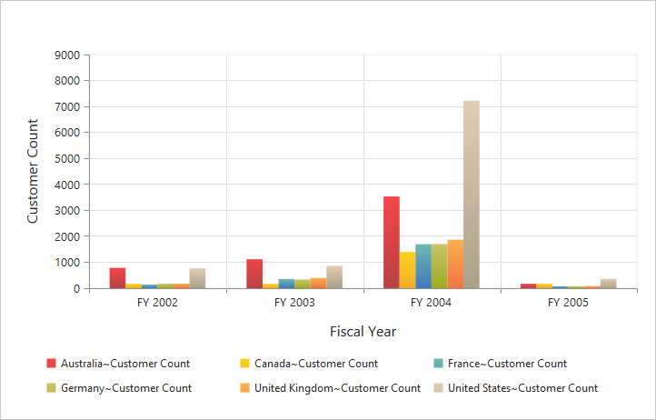
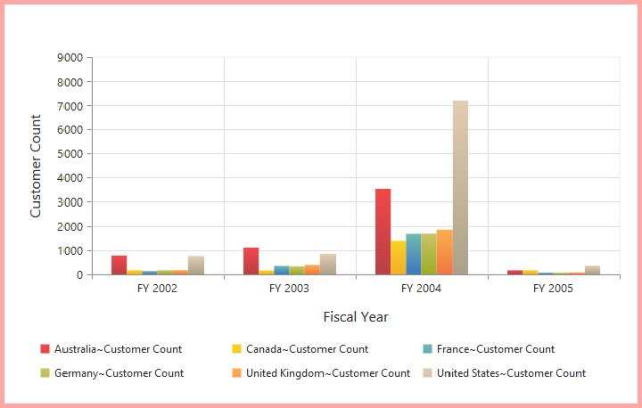

# Appearance

## Built-in themes

Following are the built-in themes available in the pivot chart:

* flatlight
* gradientlight
* gradientdark
* azure
* azuredark
* lime
* limedark
* saffron
* saffrondark
* gradientlight
* gradientdark
* highcontrast01
* highcontrast02
* material
* office365
* bootstrap

By using the `theme` property, you can set the desired theme in the pivot chart. By default, the **"FlatLight"** theme is applied to the pivot chart.



//Using gradient theme
<ej-pivot-chart id="PivotChart1" theme="LimeDark"></ej-pivot-chart>



## Pivot chart - area customization

### Border customization

To customize the pivot chart border, use `border` property in the pivot chart.



//Customize the chart border and opacity
<ej-pivot-chart id="PivotChart1" border-width="2" border-color="#FF0000"></ej-pivot-chart>



### Animation

You can enable the animation by using the `enable-animation` property under `e-common-series-options` of the pivot chart control. This animates the chart series on two occasions - when the chart is loaded for the first time and when the series type is changed by using the `type` property.



<ej-pivot-chart id="PivotChart1">
    <e-common-series-options enable-animation="true"></e-common-series-options>
    //Enabling animation in series
    <e-size width="100%" height="460px"></e-size>
</ej-pivot-chart>

   
