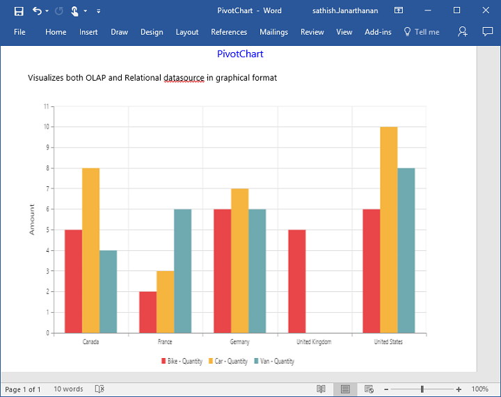

# Exporting

The PivotChart control can be exported to the following file formats.

* Excel
* Word
* PDF
* Image

The PivotChart control can be exported by invoking **“exportPivotChart”** method, with an appropriate export option as parameter.



    <ej-pivot-chart id="PivotChart1" is-responsive="true" load="onload" pre-render="preRender">
        <e-data-source>
            <e-pivot-rows>
                <e-row-field field-name="Product" field-caption="Product"></e-row-field>
                <e-row-field field-name="Date" field-caption="Date"></e-row-field>
            </e-pivot-rows>
            <e-pivot-columns>
                <e-column-field field-name="Country" field-caption="Country"></e-column-field>
            </e-pivot-columns>
            <e-pivot-values>
                <e-value-field field-name="Amount" field-caption="Amount"></e-value-field>
            </e-pivot-values>
        </e-data-source>
        <e-common-series-options type="Column" enable-animation="true">
            <e-chart-tooltip visible="true"></e-chart-tooltip>
        </e-common-series-options>
        <e-size width="100%" height="460px"></e-size>
        <e-primary-x-axis>
            <e-title text="Date - Fiscal"></e-title>
        </e-primary-x-axis>
        <e-primary-y-axis>
            <e-title text="Amount"></e-title>
        </e-primary-y-axis>
        <e-legend row-count="1"></e-legend>
    </ej-pivot-chart>

    <ej-button id="ExportBtn" width="100px" height="30px" type="Button" text="Export" click="exportBtnClick" />

  
    


To achieve exporting, we need to add **"Syncfusion.EJ.Export"** dependency library into the application.

When PivotChart is rendered, a method needs to be added in MVC controller file of the application and we need to import **"Syncfusion.EJ.Export"** namespace in the controller file. 



        private IHttpContextAccessor _contextAccessor;
        
        public PivotChartController(IHttpContextAccessor contextAccessor, IHostingEnvironment envrnmt)
        {
            _contextAccessor = contextAccessor;
        }

        public ActionResult ExportToExcel()
        {
            PivotChartExcelExport pivotChart = new PivotChartExcelExport();
            var context = _contextAccessor.HttpContext;
            var args = context.Request.Form.ElementAt(0).Value;
            Dictionary<string, string> clientParams = JsonConvert.DeserializeObject<Dictionary<string, string>>(args);
            clientParams["fileName"] = "sample";
            return pivotChart.ExportToExcel(clientParams);
        }
        


## Excel Export

User can export contents of the PivotChart to Excel document for future archival, references and analysis purposes.

To achieve Excel export, method name **"ExportToExcel"** and file name is sent as the parameter.



   
    
  

Following method need to be added in controller file of the application.



        public ActionResult ExportToExcel()
        {
            PivotChartExcelExport pivotChart = new PivotChartExcelExport();
            var context = _contextAccessor.HttpContext;
            var args = context.Request.Form.ElementAt(0).Value;
            Dictionary<string, string> clientParams = JsonConvert.DeserializeObject<Dictionary<string, string>>(args);
            clientParams["fileName"] = "sample";
            return pivotChart.ExportToExcel(clientParams);
        }



## Word Export
User can export contents of the PivotChart to Word document for future archival, references and analysis purposes.

To achieve Word export, method name **"ExportToWord"** and file name is sent as the parameter.



   
    
  

Following method need to be added in controller file of the application.



        public ActionResult ExportToWord()
        {
            PivotChartWordExport pivotChart = new PivotChartWordExport();
            var context = _contextAccessor.HttpContext;
            var args = context.Request.Form.ElementAt(0).Value;
            Dictionary<string, string> clientParams = JsonConvert.DeserializeObject<Dictionary<string, string>>(args);
            clientParams["fileName"] = "sample";
            return pivotChart.ExportToWord(clientParams);
        }



## PDF Export

User can export contents of the PivotChart to PDF document for future archival, references and analysis purposes.

To achieve PDF export, method name **"ExportToPDF"** and file name is sent as the parameter.



   
    
  

Following method need to be added in controller file of the application.



        public ActionResult ExportToPDF()
        {
            PivotChartPDFExport pivotChart = new PivotChartPDFExport();
            var context = _contextAccessor.HttpContext;
            var args = context.Request.Form.ElementAt(0).Value;
            Dictionary<string, string> clientParams = JsonConvert.DeserializeObject<Dictionary<string, string>>(args);
            clientParams["fileName"] = "sample";
            return pivotChart.ExportToPDF(clientParams);
        }      



## Image Export
User can export contents of the PivotChart to image format for future archival, references and analysis purposes. We can export PivotChart to the following image formats.

* PNG
* EMF
* JPG
* GIF
* BMP

To achieve image export, method name **"ExportToImage"** ,**“ej.PivotChart.ExportOptions.PNG”** and file name is sent as the parameter.This is similar to other image formats.



   
    
  

Following method need to be added in controller file of the application.



        static string path = "E:\\";

        public void ExportToImage()
        {
            PivotChartImageExport pivotChart = new PivotChartImageExport();
            var context = _contextAccessor.HttpContext;
            var args = context.Request.Form.ElementAt(0).Value;
            Dictionary<string, string> clientParams = JsonConvert.DeserializeObject<Dictionary<string, string>>(args);
            clientParams.Add("Path", path);
            clientParams["fileName"] = "sample";
            pivotChart.ExportToImage(clientParams);
        }



The below screenshot shows the PivotChart control exported to Excel document.

The below screenshot shows the PivotChart control exported to PDF document.

The below screenshot shows the PivotChart control exported to Word document.

The below screenshot shows the PivotChart control exported to PNG format.

