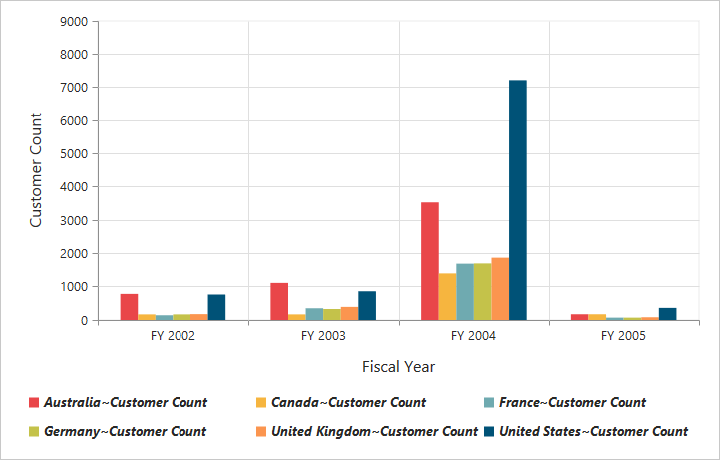

# Legend

## Legend Visibility

You can enable or disable legend using the `Visible` property inside the `Legend` object.

N> By default, the legend is visible in PivotChart.



<ej-pivot-chart id="PivotChart1">
    //Legend Visibility
    <e-legend visible="true"></e-legend>
    <e-size width="950px" height="460px"></e-size>
</ej-pivot-chart>



 

## Legend Shape

You can customize the legend `Shape` in PivotChart control. Default value of legend shape is “rectangle”. Following legend shapes that are supported:

* rectangle
* circle
* cross
* diamond
* pentagon
* hexagon
* star
* ellipse
* triangle etc.



<ej-pivot-chart id="PivotChart1">
    //Applying legend shape
    <e-legend visible="true" row-count="3" shape="star"></e-legend>
    <e-size width="950px" height="460px"></e-size>
</ej-pivot-chart>



 

## Legend Position

By using the `Position` property, you can place the legend at top, bottom, left or right of the PivotChart. 

N> Default value of legend position is "bottom" in PivotChart.



<ej-pivot-chart id="PivotChart1">
    //Applying legend position
    <e-legend visible="true" row-count="3" position="top"></e-legend>
    <e-size width="950px" height="460px"></e-size>
</ej-pivot-chart>



 

## Legend Title

To add the legend title, you have to specify the title text in `Title.text` property.



<ej-pivot-chart id="PivotChart1">
    //Place the legend at top of the Chart
    <e-legend visible="true">
        <e-title text="Countries"></e-title>
    </e-legend>
    <e-size width="950px" height="460px"></e-size>
</ej-pivot-chart>



 

## Legend Alignment

You can align the legend to center, far and near based on its position in the Chart area using the `Alignment` option.
 


<ej-pivot-chart id="PivotChart1">
    //Place the legend alignment at near to the Chart
    <e-legend visible="true" row-count="3" alignment="near"></e-legend>
    <e-size width="950px" height="460px"></e-size>
</ej-pivot-chart>



## Legend Items - Size and Border

By using the legend `ItemStyle.Width`, `ItemStyle.Height` and `ItemStyle.Border` properties, you can change the legend items - size and border.



<ej-pivot-chart id="PivotChart1">
    //Changing legend items border, height and width
    <e-legend visible="true" item-style-width="12" item-style-height="12" item-style-border-color="Magenta" item-style-border-width="1.5"></e-legend>
    <e-size width="950px" height="460px"></e-size>
</ej-pivot-chart>



 
## Legend Border

By using the `Border` option in legend, you can customize border color and width.



<ej-pivot-chart id="PivotChart1">
    //Setting border color and width to legend
    <e-legend visible="true" border-width="2" border-color="#FFC342"></e-legend>
    <e-size width="950px" height="460px"></e-size>
</ej-pivot-chart>



## Legend Text

By using the `Font` option, you can customize the font family, font style, font weight and size of the legend text. 



<ej-pivot-chart id="PivotChart1">
    //Setting border color and width to legend
    <e-legend>
        //Customizing the legend text
        <e-font font-family="SegoeUI" font-size="13px" font-style="Italic" font-weight="Bold"></e-font>
    </e-legend>
    <e-size width="950px" height="460px"></e-size>
</ej-pivot-chart>



