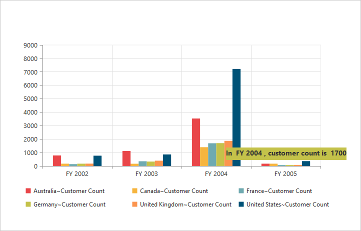
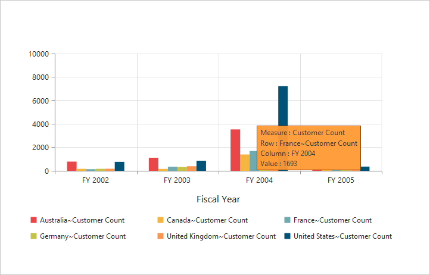
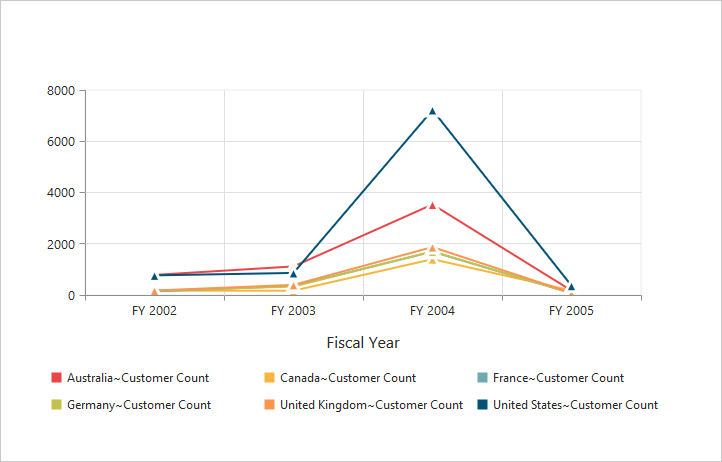
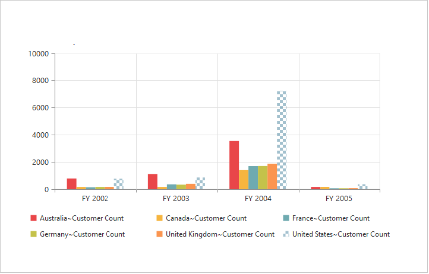

# User Interactions

## Tooltip

### Enable Tooltip for Data Points

Tooltip for the data points can be enabled using the **"Visible"** option of the `e-chart-tooltip` property under **"e-common-series-options"** of the PivotChart.



<ej-pivot-chart id="PivotChart1">
    //Enabling tooltip of data point
    <e-common-series-options>
        <e-chart-tooltip visible="true"></e-chart-tooltip>
    </e-common-series-options>
    <e-size width="950px" height="460px"></e-size>
</ej-pivot-chart>



 

### Tooltip Template

HTML elements can be displayed inside the tooltip by using the `Template` option. The template option takes the value of the "id" attribute from the HTML element. You can use the **#point.x#** and **#point.y#** as place holders in the HTML element to display the X and Y values of the corresponding data points.



    

        
 

    

    

        

            <label id="ccvalue">&nbsp;#point.y# </label>
            <label id="cc">Customer Count </label>
        

    

<ej-pivot-chart id="PivotChart1">
    <e-common-series-options>
        <e-chart-tooltip visible="false" tooltip-template="Tooltip"></e-chart-tooltip>
    </e-common-series-options>
    <e-size width="950px" height="460px"></e-size>
</ej-pivot-chart>



 

### Tooltip Customization

By using `Fill` and `Border` properties of tooltip, you can customize its background color, border color and border width.



<ej-pivot-chart id="PivotChart1">
    <e-common-series-options>
        <e-chart-tooltip visible="false" tooltip-fill="#FF9933" tooltip-border-width="1" tooltip-border-color="#993300"></e-chart-tooltip>
    </e-common-series-options>
    <e-size width="950px" height="460px"></e-size>
</ej-pivot-chart>

   

 

### Tooltip with Rounded Corners

The tooltip properties, `Rx` and `Ry` are used to customize its corner radius.



<ej-pivot-chart id="PivotChart1">
    //Customize the corner radius of the tooltip rectangle.
    <e-common-series-options>
        <e-chart-tooltip visible="false" tooltip-rx="50" tooltip-ry="50"></e-chart-tooltip>
    </e-common-series-options>
    <e-size width="950px" height="460px"></e-size>
</ej-pivot-chart>

 

 

## Marker and Crosshair

### Marker Shape Customization

In PivotChart, you can customize the marker `Shape` with following symbols.

* Rectangle
* Circle
* Cross
* Diamond 
* Pentagon
* Hexagon
* Star
* Ellipse
* Triangle etc.



<ej-pivot-chart id="PivotChart1" series-rendering="onSeriesRenders">
    <e-common-series-options type="Line"></e-common-series-options>
    <e-size width="950px" height="460px"></e-size>
</ej-pivot-chart>
                                        



 

## Highlight

PivotChart provides highlighting support for the series and data points on mouse hover. To enable highlighting, set the **“enable”** property to true in the `highlightSettings` option of the series.



<ej-pivot-chart id="PivotChart1" series-rendering="onSeriesRenders">
    <e-common-series-options type="Column"></e-common-series-options>
    <e-size width="950px" height="460px"></e-size>
</ej-pivot-chart>

                                         
 

### Highlight Mode

You can set three different modes for highlighting data points and series by using the `mode` property of the `highlightSettings`.
 
* series
* points
* cluster



<ej-pivot-chart id="PivotChart1" series-rendering="onSeriesRenders">
    <e-common-series-options type="Column"></e-common-series-options>
    <e-size width="950px" height="460px"></e-size>
</ej-pivot-chart>
                                          

 

 

### Customize the Highlight Styles

To customize the highlighted series, use `border.color`, `border.width` and `opacity`
 options in the `highlightSettings` property.



<ej-pivot-chart id="PivotChart1" series-rendering="onSeriesRenders">
    <e-common-series-options type="Column"></e-common-series-options>
    <e-size width="950px" height="460px"></e-size>
</ej-pivot-chart>
                                        

 

 

### Patterns to Highlight

PivotChart provides pattern support for highlighting the data by setting an appropriate value to the `pattern` property of the `highlightSettings`. The different types of highlight patterns are as follows.

* chessboard
* crosshatch
* dots
* pacman
* grid
* turquoise
* star
* triangle
* circle
* tile
* horizontalDash
* verticalDash
* rectangle
* box
* verticalStripe
* horizontalStripe
* bubble
* diagonalBackward
* diagonalForward



<ej-pivot-chart id="PivotChart1" series-rendering="onSeriesRenders">
    <e-common-series-options type="Column"></e-common-series-options>
    <e-size width="950px" height="460px"></e-size>
</ej-pivot-chart>
                                    

 

 

## Selection

PivotChart provides selection support for the series and data points on mouse click. To enable selection, set the **“enable”** property to true in the `selectionSettings` option of the series.



<ej-pivot-chart id="PivotChart1" series-rendering="onSeriesRenders">
    <e-common-series-options type="Column"></e-common-series-options>
    <e-size width="950px" height="460px"></e-size>
</ej-pivot-chart>
                                          



### Selection Mode

You can set three different selection mode for highlighting the data points and series by using the `mode` property of the `selectionSettings`.

* series
* points
* cluster



<ej-pivot-chart id="PivotChart1" series-rendering="onSeriesRenders">
    <e-common-series-options type="Column"></e-common-series-options>
    <e-size width="950px" height="460px"></e-size>
</ej-pivot-chart>
                                       



 

### Customize the Selection Styles

To customize the selection styles, use the `border.color`, `border.width` and `opacity` options in the `selectionSettings`.



<ej-pivot-chart id="PivotChart1" series-rendering="onSeriesRenders">
    <e-common-series-options type="Column"></e-common-series-options>
    <e-size width="950px" height="460px"></e-size>
</ej-pivot-chart>
                                          



 

### Patterns for Selection

PivotChart provides pattern support for the selecting the data by setting an appropriate value to the `pattern` property of the `selectionSettings` option. The different types of selection patterns are as follows.

* chessboard
* crosshatch
* dots
* pacman
* grid
* turquoise
* star
* triangle
* circle
* tile
* horizontalDash
* verticalDash
* rectangle
* box
* verticalStripe
* horizontalStripe
* bubble
* diagonalBackward
* diagonalForward



<ej-pivot-chart id="PivotChart1" series-rendering="onSeriesRenders">
    <e-common-series-options type="Column"></e-common-series-options>
    <e-size width="950px" height="460px"></e-size>
</ej-pivot-chart>
                                         



 
