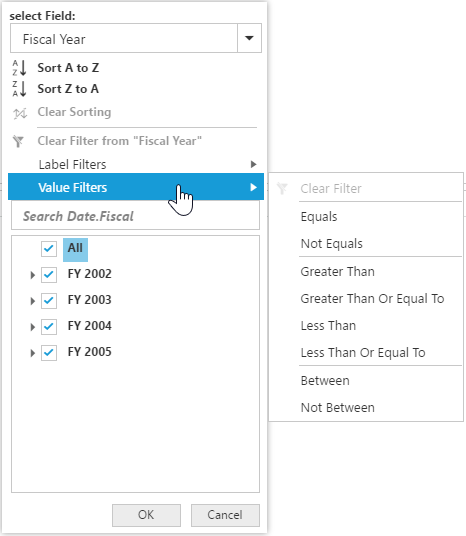

# Advanced Filtering & Sorting

It allows to filter and sort the field members in PivotClient.

You can enable "Advanced Filtering and Sorting" option in PivotClient by setting the [`enable-advanced-filter`] property under [`e-data-source`] to true.



<ej-pivot-client id="PivotClient1">
    <e-data-source enable-advanced-filter="true">
        //..
    </e-data-source>
</ej-pivot-client>



## Sorting

Sorting provides an option to sort the members of a field either in ascending or descending order. 

## Label Filtering

Label filtering provides an option to filter the members of a field purely based on their caption. 

## Value Filtering

Value filtering provides an option to filter members based on the total values of the appropriate measure between the members of the level. 

