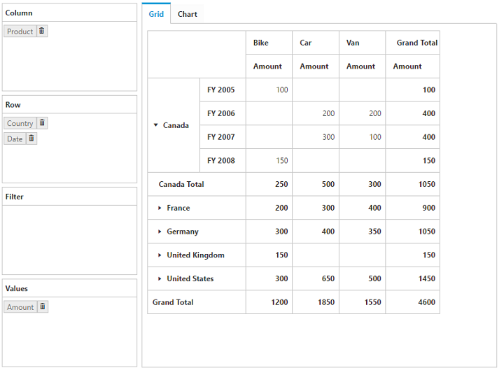

# Data exploration

## Filtering

### Filtering by member

By clicking the split button of a field, the Member Editor dialog opens through which members are filtered by checking and unchecking the check boxes corresponding to members.

 When you click OK, the report will get updated and the pivot grid and pivot chart controls will be refreshed based on the selected members in the Member Editor dialog. The Cancel button is used to cancel the selection.

The above filter illustrates the members 'Canada' and 'Germany' that are alone included in the grid and chart controls.

## Grouping

The data can be grouped when more than one field element is added to the column or row in the axis element builder. Based on the order of addition, the data is grouped and the report is updated. In the following example, the **Date** dimension values get grouped with respect to **Country** dimension values. Likewise, multiple field members can be grouped by dragging the elements from the pivot field list to the axis element builder.

## Searching

Members can be searched and displayed from the members list in the Member Editor dialog.

 
