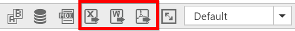
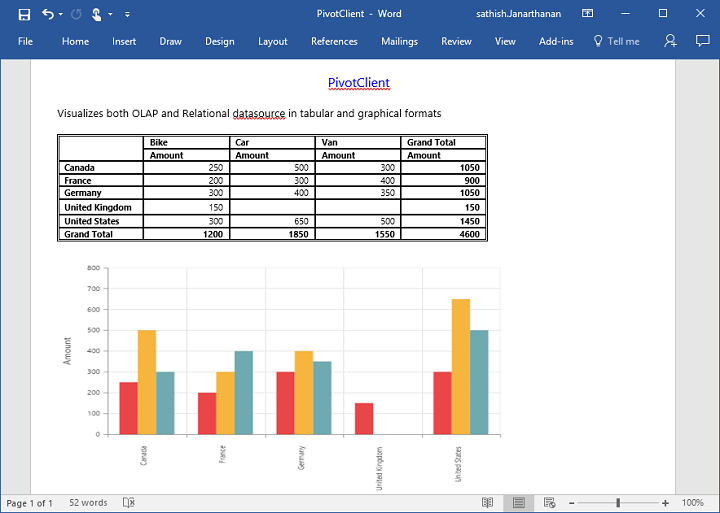
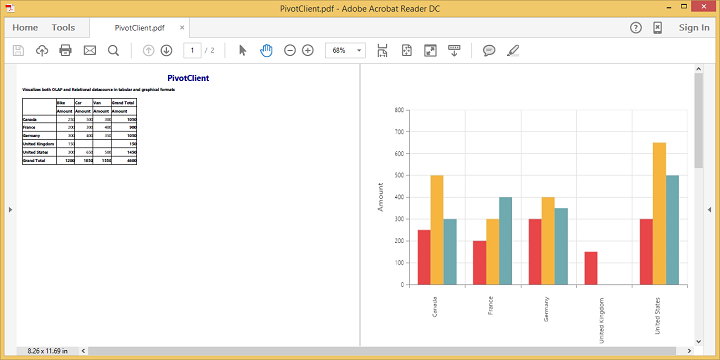

# Exporting

PivotChart and PivotGrid in the PivotClient widget can be exported to Excel, Word and PDF documents by clicking the respective toolbar icons.

Exporting feature provides an option that allows you to export either PivotChart or PivotGrid or both with the use of the property `client-export-mode`. 

The property `client-export-mode` takes any one of the following value:

* **ChartAndGrid** – Exports both PivotChart and PivotGrid controls. This is the default mode.
* **ChartOnly** – Exports PivotChart control alone.
* **GridOnly** – Exports PivotGrid control alone.

In order to make use of exporting with client side JSON data. The control can be exported by invoking `before-export` event, with an appropriate export option as parameter.

N> By default, we are using our online hosted URL link for exporting PivotClient control. If you have installed Essential Studio, then you can provide the URL link by hosting “ejServices” in IIS. “ejServices” folder is available in the below installed location.  
Location:  $system drive:\Users\$UserName#\AppData\Local\Syncfusion\EssentialStudio\$Version# \JavaScript\ejservices 
Eg: C:\Users\UserName\AppData\Local\Syncfusion\EssentialStudio\{{ site.releaseversion }}\JavaScript\ejservices



<ej-pivot-client id="PivotClient1" before-export="Export">
//..
</ej-pivot-client>



### Customize the export document name

The document name to be exported could be customized. Following code sample illustrates the same.



<ej-pivot-client id="PivotClient1" before-export="Export">
//..
</ej-pivot-client>
    

    


## PivotChart - Exporting Format

I> This option is applicable only for PivotChart specifically when exported to Excel document.

You can set an option to export PivotChart to an Excel document, either as image or PivotChart format itself by setting the boolean property 'exportChartAsImage', inside the `before-export` event.

N> By default PivotChart will be exported as image format to Excel document.



<ej-pivot-client id="PivotClient1" before-export="Export" client-export-mode="ChartOnly">
//..
</ej-pivot-client>

    


The below screenshot shows the control exported to Excel document showing its own format (Pivoting Chart).

## Exporting Customization

You can add title and description to the exporting document by using the title and description properties respectively obtained in the `before-export` event. Similarly, you can enable or disable styling on the exported document by using the `exportWithStyle` property.



<ej-pivot-client id="PivotClient1" before-export="Export">
//..
</ej-pivot-client>

    


### Exporting complete data on Paging

When paging is enabled, you can export the complete data by enabling the `enable-complete-data-export` property. It is supported for all kinds of exporting formats available in PivotClient.


   
<ej-pivot-client id="PivotClient1" enable-complete-data-export="true">
//..
</ej-pivot-client>
                                           


The below screenshot shows the PivotGrid and PivotChart controls exported to Excel document.

The below screenshot shows the PivotGrid and PivotChart controls exported to Word document.

The below screenshot shows the PivotGrid and PivotChart controls exported to PDF document.

