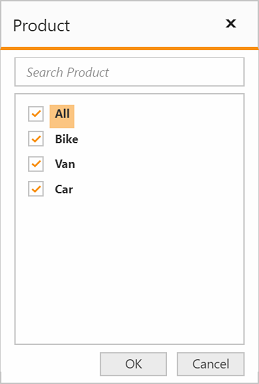

# Member editor paging

The member editor paging helps to improve the rendering performance of the dialog by dividing the large amount of data into sections and displaying them.

You can enable the member editor paging and set the member editor page size in the pivot client control by setting the [`enable-member-editor-paging`] and [`member-editor-page-size`] properties.



<ej-pivot-client id="PivotClient1" enable-member-editor-paging="true" member-editor-page-size="100">
   //..
</ej-pivot-client>



Following are the navigation options available in the member editor pager:
* Move first: Navigates to the first page.
* Move previous: Navigates to the previous page from the current page.
* Move next: Navigates to the next page from the current page.
* Move last: Navigates to the last page.
* Numeric box: Navigates to the desired page by entering an appropriate page number in numeric value.

