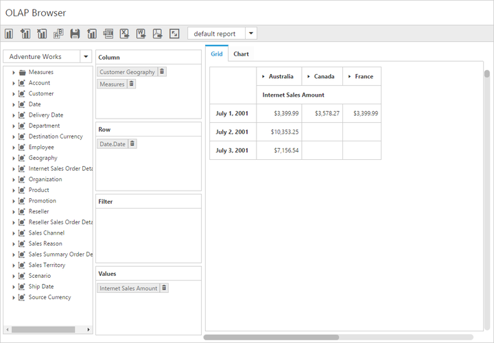

# Paging

Paging helps to improve the rendering performance of the PivotClient control by dividing large amount of data into sections and displaying one section at a time. You can enable paging in PivotClient by setting the `enable-paging` property to true.

## Using Pager

The page size and current page details for each axis can be provided through `e-pager-options` property within the `e-data-source` property of PivotClient. The following properties are available to customize the pager options:

* `categorical-page-size` - Specifies the number of categorical columns to be displayed in each page on applying the paging.
* `series-page-size` - Specifies the number of series rows to be displayed in each page on applying the paging.
* `categorical-current-page` -Specifies the page number to be loaded in the categorical axis by default.
* `series-current-page` - Specifies the page number to be loaded in the series axis by default.



    <ej-pivot-client id="PivotClient1" enable-complete-data-export="true" title="OLAP Browser" enable-paging="true" before-export="Export" render-success="setChartProperties" load-report="reportSettings" fetch-report="reportSettings" save-report="reportSettings">
        <e-size width="910px"></e-size>
        <e-data-source catalog="Adventure Works DW 2008 SE" cube="Adventure Works" data="//bi.syncfusion.com/olap/msmdpump.dll">
            <e-pivot-rows>
                <e-row-field field-name="[Date].[Date]"></e-row-field>
            </e-pivot-rows>
            <e-pivot-columns>
                <e-column-field field-name="[Customer].[Customer Geography]"></e-column-field>
            </e-pivot-columns>
            <e-pivot-values>
                <e-value-field axis="Column">
                    <e-measures>
                        <e-measure-items field-name="[Measures].[Internet Sales Amount]"></e-measure-items>
                    </e-measures>
                </e-value-field>
            </e-pivot-values>
            <e-pager-options categorical-page-size="3" categorical-current-page="1" series-page-size="3" series-current-page="1"></e-pager-options>
        </e-data-source>
    </ej-pivot-client>



### Pager Options

The following are the options available in Pager for navigating pages at run-time.

* Move First - Navigates to the first page.
* Move Last - Navigates to the last page.
* Move Previous - Navigates to the previous page from the current page.
* Move Next - Navigates to the next page from the current page.
* Numeric Box - Navigates to the desired page by entering an appropriate page number in the numeric box.

## Using virtual scrolling

Virtual scrolling is a technique that allows user to view the PivotClient information page by page with the use of vertical and horizontal scrollbar. You can enable virtual scrolling in PivotClient by setting the `enable-virtual-scrolling` property to true. You can also provide the page size and current page details for each axis through `e-pager-options` property.



    <ej-pivot-client id="PivotClient1" title="OLAP Browser" enable-virtual-scrolling="true"  load="onLoad">
        <e-size width="910px"></e-size>
        <e-data-source catalog="Adventure Works DW 2008 SE" cube="Adventure Works" data="//bi.syncfusion.com/olap/msmdpump.dll">
            <e-pivot-rows>
                <e-row-field field-name="[Date].[Date]"></e-row-field>
            </e-pivot-rows>
            <e-pivot-columns>
                <e-column-field field-name="[Customer].[Customer Geography]"></e-column-field>
            </e-pivot-columns>
            <e-pivot-values>
                <e-value-field axis="Column">
                    <e-measures>
                        <e-measure-items field-name="[Measures].[Internet Sales Amount]"></e-measure-items>
                    </e-measures>
                </e-value-field>
            </e-pivot-values>
            <e-pager-options categorical-page-size="3" categorical-current-page="1" series-page-size="3" series-current-page="1"></e-pager-options>
        </e-data-source>
    </ej-pivot-client>



