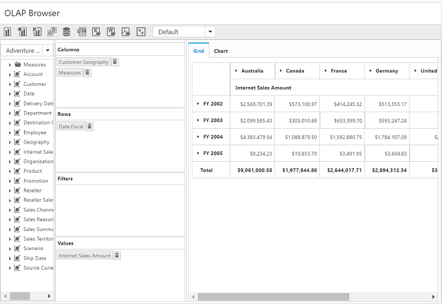

# Splitter

You can resize the cube dimension browser and axis element builder by setting the `enable-splitter` property to true. This property is disabled by default.



<ej-pivot-client id="PivotClient1" enable-splitter="true">
   //..
</ej-pivot-client>



