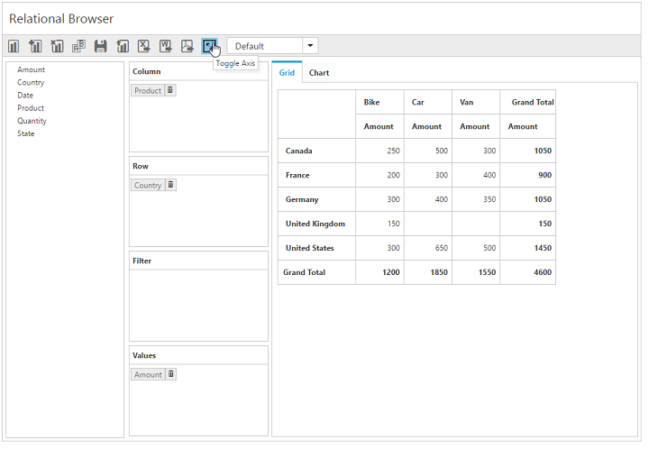

# Toggle axis

The toggle axis support swaps all axis elements between the column and row axes, thereby refreshing the pivot chart and pivot grid view. This can be achieved by using a toolbar icon.

