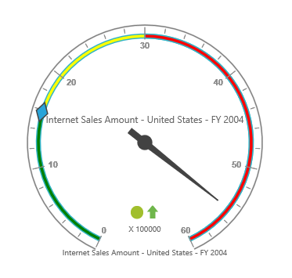

# Ranges

## Adding Range Collection

`RangeCollection` can be directly added to the scales option within the PivotGauge control.



<ej-pivot-gauge id="PivotGauge1">
    <e-scales>
        <e-circular-scales show-ranges="true">
            <e-circular-range-collections>
                <e-circular-ranges distance-from-scale="10"></e-circular-ranges>
            </e-circular-range-collections>
        </e-circular-scales>
    </e-scales>
</ej-pivot-gauge>



## Appearance Customization

The appearance of the range can be customized through the following properties.

* **StartValue** – defines the start position of the range.
* **EndValue** – defines the end position of the range.
* **StartWidth** – sets the width at starting position of the range.
* **EndWidth** – sets the width at ending position of the range.
* **BackgroundColor** – sets the background color of the range.
* **Border** – sets the height and width of the border of the range.
* **Placement** – sets the position of the range.
* **DistanceFromScale** – sets the distance between the range and scale.

Positioning the range could be set either through `Placement` or `DistanceFromScale` property. 

N> By default, placement takes the value “near”, whereas other enumeration values available are “far” and “center”.



<ej-pivot-gauge id="PivotGauge1">
    <e-scales>
        <e-circular-scales show-ranges="true">
            <e-circular-range-collections>
                <e-circular-ranges start-value="20" end-value="50" start-width="2" end-width="6" background-color="yellow" distance-from-scale="20">
                    <e-border color="red" width="2"></e-border>
                </e-circular-ranges>
                <e-circular-ranges start-value="50" end-value="100" start-width="2" end-width="7" background-color="blue" placement="Near">
                    <e-border color="green" width="2"></e-border>
                </e-circular-ranges>
            </e-circular-range-collections>
        </e-circular-scales>
    </e-scales>
</ej-pivot-gauge>



N> On setting both the position properties - "DistanceFromScale" and "Placement" for a range, the value set in "DistanceFromScale" is given preference. 

## Multiple Ranges

Multiple ranges can be added in `RangeCollection` to the scales option within the PivotGauge control.



<ej-pivot-gauge id="PivotGauge1">
    <e-scales>
        <e-circular-scales show-ranges="true">
            <e-circular-range-collections>
                <e-circular-ranges start-value="0" end-value="10" background-color="green" distance-from-scale="-5"></e-circular-ranges>
                <e-circular-ranges start-value="10" end-value="30" background-color="yellow" distance-from-scale="-5"></e-circular-ranges>
                <e-circular-ranges start-value="30" end-value="50" background-color="red" distance-from-scale="-5"></e-circular-ranges>
            </e-circular-range-collections>
        </e-circular-scales>
    </e-scales>
</ej-pivot-gauge>



