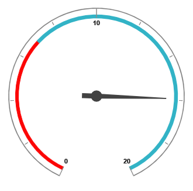

# Scale

## Adding Scale

Scales can be added within the PivotGauge control.



<ej-pivot-gauge id="PivotGauge1">
    <e-scales>
        <e-circular-scales show-ranges="true" radius="150" show-scale-bar="true"></e-circular-scales>
    </e-scales>
</ej-pivot-gauge>



 

## Scale Customization

### Pointer Cap

Pointer Cap is a circular shape element which is located at the center of the PivotGauge. It can be customized with the property `PointerCap` inside the scales option. Following are the properties used to customize its appearance.

* **Radius** – sets the radius of the pointer cap.
* **BorderColor** – sets the color of the pointer cap border.
* **BorderWidth** – sets the width of the pointer cap border.
* **BackgroundColor** – sets the background color of the pointer cap.



<ej-pivot-gauge id="PivotGauge1">
    <e-scales>
        <e-circular-scales radius="150" show-scale-bar="true">
            <e-pointer-cap background-color="yellow" border-color="green" radius="5" border-width="2"></e-pointer-cap>
        </e-circular-scales>
    </e-scales>
</ej-pivot-gauge>



### Appearance
The appearance of the scale can be customized through the following properties.

* **Radius** – sets the radius of the scale.
* **BackgroundColor** – sets the background color of the scale.
* **Border** – sets the border of the scale with color and width properties.
* **Size** – sets the size of the scale.
* **Minimum** – sets the least value of the scale.
* **Maximum** – sets the highest value of the scale.
* **MajorIntervalValue** – sets the interval between minor ticks in the scale.
* **MinorIntervalValue** – sets the interval between major ticks in the scale.
* **Direction** – sets the direction of the scale.  By default it takes “Clockwise” direction.

The `ShowIndicators`, `ShowTicks`, `ShowRanges`, `ShowPointers` and `ShowScaleBar` properties are used to enable/disable the indicators, ticks, ranges, pointers and scale bar respectively.  By default, `ShowTicks` and `ShowPointers` are set to true, other properties are set as false. 



<ej-pivot-gauge id="PivotGauge1">
    <e-scales>
        <e-circular-scales radius="120" show-scale-bar="true" size="10" background-color="yellow" minimum="20" maximum="120" major-interval-value="20" minor-interval-value="5" direction="CounterClockwise">
            <e-border width="0.5"></e-border>
        </e-circular-scales>
    </e-scales>
</ej-pivot-gauge>



