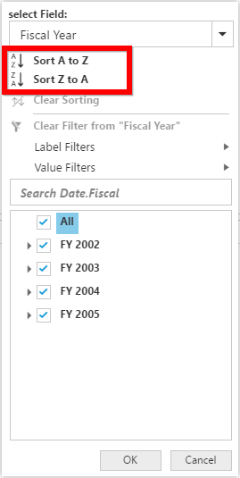
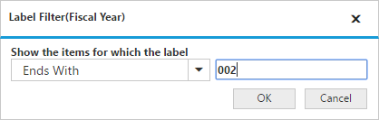
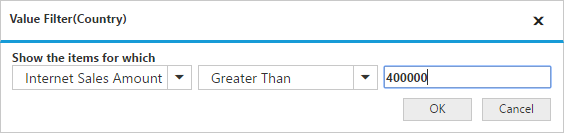

# Advanced filtering and sorting

It allows you to filter and sort the field members in the pivot grid.

In client mode, you can enable the advanced filtering and sorting option in the pivot grid by setting the [`enable-advanced-filter`] property to true.



<ej:PivotGrid ID=" PivotGrid1" enable-advanced-filter="true" runat="server"></ej:PivotGrid>



## Sorting

Sorting provides an option to sort the members of a field in an ascending or descending order. 

## Label filtering

Label filtering provides an option to filter the members of a field purely based on their caption.

## Value filtering

Value filtering provides an option to filter members based on the total values of the appropriate measure between the members of the level.

