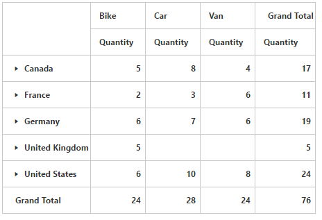

# Collapse by default

I> This feature is applicable only for Relational datasource.

Allows you to collapse all members displayed in the grid. You can enable collapsing all members by default in PivotGrid by setting `EnableCollapseByDefault` property to true.



<ej-pivot-grid id="PivotGrid1" enable-collapse-by-default="true"></ej-pivot-grid>



