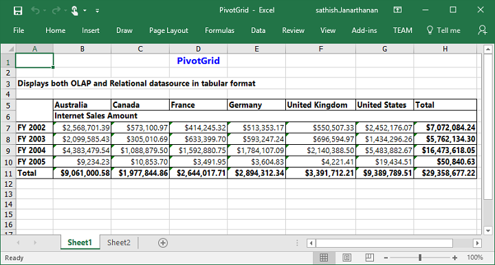
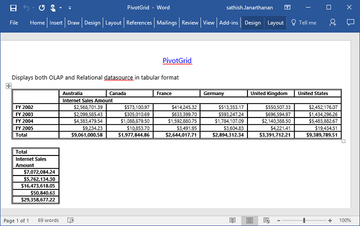
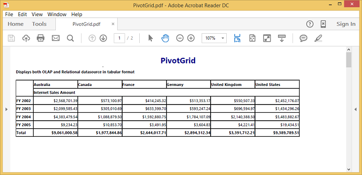

# Exporting

The PivotGrid control can be exported to the following file formats.

* Excel
* Word
* PDF

The PivotGrid control can be exported by invoking **“exportPivotGrid”** method, with an appropriate export option as parameter.

## JSON Export



    <ej-pivot-grid id="PivotGrid1" is-responsive="true" load="onload">
        <e-data-source>
            <e-pivot-rows>
                <e-row-field field-name="Country" field-caption="Country"></e-row-field>
            </e-pivot-rows>
            <e-pivot-columns>
                <e-column-field field-name="Date" field-caption="Date"></e-column-field>
            </e-pivot-columns>
            <e-pivot-values>
                <e-value-field field-name="Amount" field-caption="Amount"></e-value-field>
            </e-pivot-values>
        </e-data-source>
    </ej-pivot-grid>

    <ej-button id="ExportBtn" width="100px" height="30px" type="Button" text="Export" click="exportBtnClick" />

  
    


To achieve exporting, we need to add **"Syncfusion.EJ.Export"** dependency library into the application.

When PivotGrid is rendered, a method needs to be added in MVC controller file of the application and we need to import **"Syncfusion.EJ.Export"** namespace in the controller file. 



        //...
        using Syncfusion.EJ.Export;

        private IHttpContextAccessor _contextAccessor;

        public PivotGridController(IHttpContextAccessor contextAccessor, IHostingEnvironment envrnmt)
        {
            _contextAccessor = contextAccessor;
        }

        public ActionResult ExcelExport()
        {
            PivotGridExcelExport pGrid = new PivotGridExcelExport();
            var context = _contextAccessor.HttpContext;
            var args = context.Request.Form.ElementAt(0).Value;
            string fileName = "Sample";
            return pGrid.ExportToExcel(fileName, args, context.Response);
        }
        


### Excel Export

User can export the contents of PivotGrid to an Excel document for future archival, references and analysis purposes.

To achieve Excel export, the controller method name **"ExcelExport"** and file name is sent as the parameter.



   
    
  

Following method needs to be added in controller file of the application.



        public ActionResult ExcelExport()
        {
            PivotGridExcelExport pGrid = new PivotGridExcelExport();
            var context = _contextAccessor.HttpContext;
            var args = context.Request.Form.ElementAt(0).Value;
            string fileName = "Sample";
            return pGrid.ExportToExcel(fileName, args, context.Response);
        }



### Word Export
User can export the contents of PivotGrid to a Word document for future archival, references and analysis purposes.

To achieve Word export, controller method name **"WordExport"** and file name is sent as the parameter.



   
    
  

Following method needs to be added in controller file of the application.



        public ActionResult WordExport()
        {
            PivotGridWordExport pGrid = new PivotGridWordExport();
            var context = _contextAccessor.HttpContext;
            var args = context.Request.Form.ElementAt(0).Value;
            string fileName = "Sample";
            return pGrid.ExportToWord(fileName, args, context.Response);
        }



### PDF Export

User can export contents of the PivotGrid to PDF document for future archival, references and analysis purposes.

To achieve Word export, controller method name **"PDFExport"** and file name is sent as the parameter.



   
    
  

Following method needs to be added in MVC controller file of the application.



        public ActionResult PDFExport()
        {
            PivotGridPDFExport pGrid = new PivotGridPDFExport();
            var context = _contextAccessor.HttpContext;
            var args = context.Request.Form.ElementAt(0).Value;
            string fileName = "Sample";
            return pGrid.ExportToPDF(fileName, args, context.Response);
        }      



### Customize the export document name

For customizing file name, we need to send file name as parameter to the **“exportPivotGrid”**  method along with method name.



function exportBtnClick(args)
{
    var pGridObj = $('#PivotGrid1').data("ejPivotGrid");
    pGridObj.exportPivotGrid("ExcelExport","fileName");
}



The below screenshot shows the PivotGrid control exported to Excel document.

The below screenshot shows the PivotGrid control exported to Word document.

The below screenshot shows the PivotGrid control exported to PDF document.

