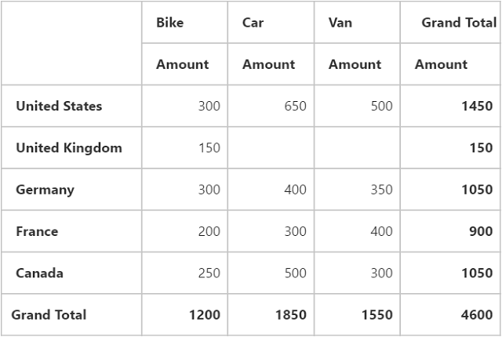
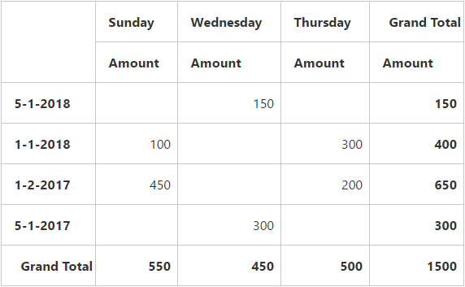
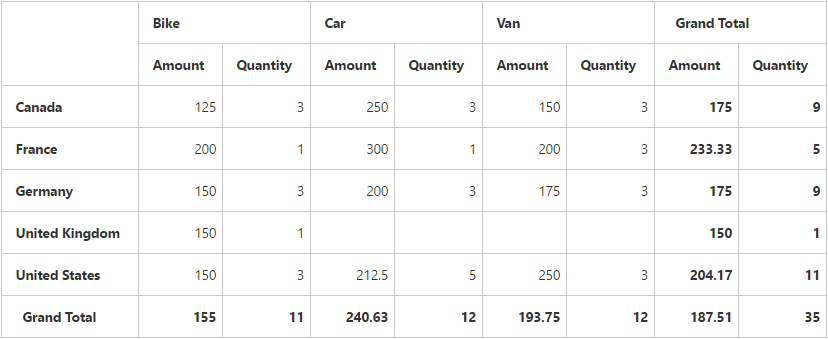

# Getting Started

Refer the [Getting Started](/aspnet-core/getting-started) page of the introduction part to know more about the basic system requirements and the steps to configure the Syncfusion components in an ASP.NET Core application.

Ensure once whether all the necessary dependency packages are included within the *bower.json* file as mentioned [here](/aspnet-core/getting-started#configure-syncfusion-components-in-aspnet-core-application), so that the required scripts and CSS to render the PivotGrid control gets installed and loads into the mentioned location (**wwwroot -> lib**) within your project.

Also, check whether the assembly dependency package **Syncfusion.EJ.Pivot**  added within the *project.json* file.

Now, refer the necessary scripts and CSS files into your *_Layout.cshtml* page from the **wwwroot -> lib -> syncfusion-javascript** folder.



<html>
<head>
    <environment names="Development">
        <link rel="stylesheet" href="~/lib/bootstrap/dist/css/bootstrap.css" />
        <link rel="stylesheet" href="~/css/site.css" />
        <link href="~/lib/syncfusion-javascript/Content/ej/web/default-theme/ej.web.all.min.css" rel="stylesheet" />
        <link href="~/lib/syncfusion-javascript/Content/ej/web/responsive-css/ej.responsive.css" rel="stylesheet" />
    </environment>
</head>
<body>

    <environment names="Development">
        
        
        
        
        
    </environment>

</body>
</html>



It is necessary to define the following namespace within the *_viewImports.cshtml* page in order to make use of the PivotGrid control with the tag helper support.
 

 
@using Syncfusion.JavaScript
@addTagHelper "*, Syncfusion.EJ"
@addTagHelper "*, Syncfusion.EJ.Pivot"
    


N> Script manager must be defined at the bottom of the *_Layout.cshtml* page.

## Relational

This section covers the information that you need to know to populate a simple PivotGrid with Relational data source.

### Initialize PivotGrid

Before initializing, empty the contents of Index.cshtml file under Views > Home folder and add the following codes.



<ej-pivot-grid id="PivotGrid1"></ej-pivot-grid>



### Populate PivotGrid With Data

Let us now see how to populate the PivotGrid control using a sample JSON data as shown below. 



<ej-pivot-grid id="PivotGrid1" load="onload"></ej-pivot-grid>



The JSON data is set to the **"data"** property present inside the **"e-data-source"** object. **"e-data-source"** object allows us to set both datasource as well as the fields that needs to be displayed in the row, column, value and filter section of the PivotGrid control.
  

  
<ej-pivot-grid id="PivotGrid1" load="onload">
    <e-data-source>
        <e-pivot-rows>
            <e-row-field field-name="Country" field-caption="Country"></e-row-field>
        </e-pivot-rows>
        <e-pivot-columns>
            <e-column-field field-name="Product" field-caption="Product"></e-column-field>
        </e-pivot-columns>
        <e-pivot-values>
            <e-value-field field-name="Amount" field-caption="Amount"></e-value-field>
        </e-pivot-values>
    </e-data-source>
</ej-pivot-grid>



The above code will generate a simple PivotGrid with "Country" field in Row, "Product" field in Column and "Amount" field in Value section.

### Apply Sorting

You can sort a field either to ascending or descending order using the "sort-order" property. Sorting is applicable only for Row and Column fields. By default, fields are arranged in ascending order.
 


<ej-pivot-grid id="PivotGrid1" load="onload">
    <e-data-source>
        <e-pivot-rows>
            <e-row-field field-name="Country" field-caption="Country" sort-order="Descending"></e-row-field>
        </e-pivot-rows>
        <e-pivot-columns>
            <e-column-field field-name="Product" field-caption="Product"></e-column-field>
        </e-pivot-columns>
        <e-pivot-values>
            <e-value-field field-name="Amount" field-caption="Amount"></e-value-field>
        </e-pivot-values>
    </e-data-source>
</ej-pivot-grid>



### Sort Row/Column by Date

You can sort a field either to ascending or descending order acording to date by using the **sortOrder** property. Sorting is applicable only for Row and Column fields. By default, fields are arranged in ascending order.

N> To apply sorting by date, you need to specify the require `format` and `formatString` to the field.



<ej-pivot-grid id="PivotGrid1" load="onload">
    <e-data-source>
        <e-pivot-rows>
            <e-row-field field-name="Date" field-caption="Date" format="date" format-string="dd-MM-yyy" sort-order="Descending"></e-row-field>
        </e-pivot-rows>
        <e-pivot-columns>
            <e-column-field field-name="Day" field-caption="Day" format="date" format-string="ddd" sort-order="Ascending"></e-column-field>
        </e-pivot-columns>
        <e-pivot-values>
            <e-value-field field-name="Amount" field-caption="Amount"></e-value-field>
        </e-pivot-values>
    </e-data-source>
</ej-pivot-grid>



### Apply Summary Types

Allow us to specify the required summary type that PivotGrid should use in its summary cells. **"Sum"** is the default summary type. Following are the summary types that are supported:

* Sum
* Average
* Count
* Min
* Max



<ej-pivot-grid id="PivotGrid1" is-responsive="true" load="onload">
    <e-data-source>
        <e-pivot-rows>
            <e-row-field field-name="Country" field-caption="Country"></e-row-field>
        </e-pivot-rows>
        <e-pivot-columns>
            <e-column-field field-name="Product" field-caption="Product"></e-column-field>
        </e-pivot-columns>
        <e-pivot-values>
            <e-value-field field-name="Amount" field-caption="Amount" summary-type="Average"></e-value-field>
            <e-value-field field-name="Quantity" field-caption="Quantity" summary-type="Count"></e-value-field>
        </e-pivot-values>
    </e-data-source>
</ej-pivot-grid>

    

## OLAP

This section covers the information that you need to know to populate a simple PivotGrid with OLAP data source.

### Initialize PivotGrid

Before initializing, empty the contents of Index.cshtml file under Views > Home folder and add the following codes.



<ej-pivot-grid id="PivotGrid1"></ej-pivot-grid>



### Populate PivotGrid With DataSource

Initializes the OLAP datasource for PivotGrid control as shown below.



<ej-pivot-grid id="PivotGrid1">
    <e-data-source catalog="Adventure Works DW 2008 SE" cube="Adventure Works" data="//bi.syncfusion.com/olap/msmdpump.dll">
        <e-pivot-rows>
            <e-row-field field-name="[Date].[Fiscal]"></e-row-field>
        </e-pivot-rows>
        <e-pivot-columns>
            <e-column-field field-name="[Customer].[Customer Geography]"></e-column-field>
        </e-pivot-columns>
        <e-pivot-values>
            <e-value-field axis="Column">
                <e-measures>
                    <e-measure-items field-name="[Measures].[Internet Sales Amount]"></e-measure-items>
                </e-measures>
            </e-value-field>
        </e-pivot-values>
    </e-data-source>
</ej-pivot-grid>



The above code will generate a simple PivotGrid with "Fiscal" field in Row, "Customer Geography" field in Column and "Internet Sales Amount" field in Value section.

