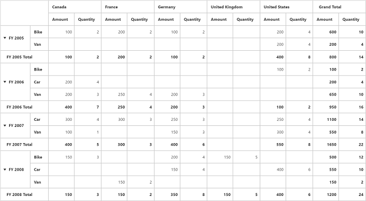

# Grand Total Hiding

Grand Total Hiding can be classified into three categories.

* Row Grand Total Hiding
* Column Grand Total Hiding
* Both

## Row Grand Total Hiding

You can hide the **Grand Total** in row alone by setting the property `enable-row-grand-total` to `false`.



<ej-pivot-grid id="PivotGrid1" enable-row-grand-total="false"></ej-pivot-grid>



## Column Grand Total Hiding

You can hide the **Grand Total** in column alone by setting the property `enable-column-grand-total` to `false`.



<ej-pivot-grid id="PivotGrid1" enable-column-grand-total="false"></ej-pivot-grid>



## Both

You can hide the **Grand Total** in both row and column by setting the property `enable-grand-total` to `false`.



<ej-pivot-grid id="PivotGrid1" enable-grand-total="false"></ej-pivot-grid>



