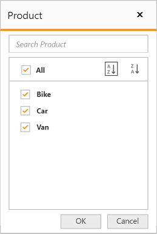
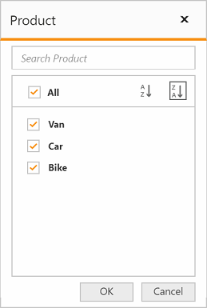

# Member Editor

The member editor dialog displays the members of current field in a tree view structure, which is opened by clicking the filter icon available in the grouping bar. It helps to search, filter, and sort the field members available in the pivot grid control.

## Member editor - Paging

The paging support in the member editor helps you to improve the rendering performance of the member editor dialog by dividing the large amounts of data into sections and displaying them.

You can enable the member editor paging and set the member editor page size in the pivot grid control by setting the [`enable-member-editor-paging`] and [`member-editor-page-size`] properties.



<ej-pivot-grid id="PivotGrid1" load="onload" enable-member-editor-paging="true" member-editor-page-size=100>
    <e-data-source>
        <e-pivot-rows>
            <e-row-field field-name="Country" field-caption="Country"></e-row-field>
            <e-row-field field-name="State" field-caption="State"></e-row-field>
        </e-pivot-rows>
        <e-pivot-columns>
            <e-column-field field-name="Product" field-caption="Product"></e-column-field>
        </e-pivot-columns>
        <e-pivot-values>
            <e-value-field field-name="Amount" field-caption="Amount"></e-value-field>
            <e-value-field field-name="Quantity" field-caption="Quantity"></e-value-field>
        </e-pivot-values>
        <e-pivot-filters>
            <e-filter-field field-name="Date" field-caption="Date"></e-filter-field>
        </e-pivot-filters>
    </e-data-source>
</ej-pivot-grid>



Following are the navigation options available in the member editor pager:
* Move first: Navigates to the first page.
* Move previous: Navigates to the previous page from the current page.
* Move next: Navigates to the next page from the current page.
* Move last: Navigates to the last page.
* Numeric box: Navigates to the desired page by entering an appropriate page number in the numeric value.

## Member editor - Sorting

The sorting support in the member editor helps you to sort the field members in ascending or descending order.

You can enable the member editor sorting in the pivot grid control by setting the [`enable-member-editor-sorting`] property.



<ej-pivot-grid id="PivotGrid1" enable-member-editor-sorting="true">
   //..
</ej-pivot-grid>



