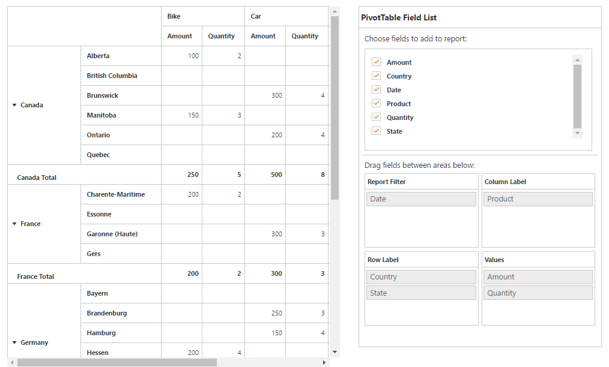
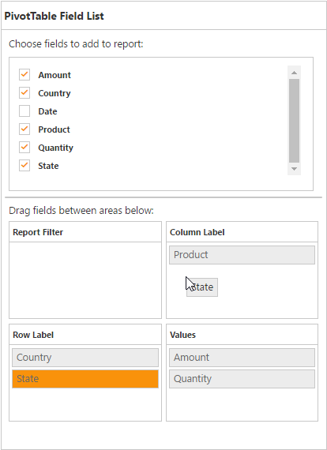
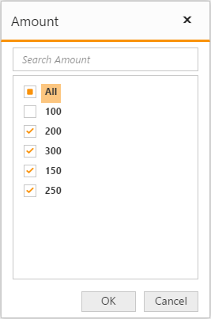

# PivotTable Field List

## Initialization  

Field List, also known as Pivot Schema Designer, allows user to add, rearrange, filter and remove fields to show data in PivotGrid exactly the way they want.

Based on the datasource, Relational, bound to the PivotGrid control, PivotTable Field List will be automatically populated with Cube Information or Field Names. PivotTable Field List provides an Excel like appearance and behavior.

In-order to initialize PivotTable Field List, first you need to define a “div” tag with an appropriate “id” attribute which acts as a container for the control. Then you need to initialize the PivotTable Field List by using the **"ej-pivot-schema-designer"** method.

### Relational



<ej-pivot-grid id="PivotGrid1" load="onload" pivot-table-field-list-id="PivotSchemaDesigner1">
        <e-data-source>
            <e-pivot-rows>
                <e-row-field field-name="Country" field-caption="Country"></e-row-field>
                <e-row-field field-name="State" field-caption="State"></e-row-field>
            </e-pivot-rows>
            <e-pivot-columns>
                <e-column-field field-name="Product" field-caption="Product"></e-column-field>
            </e-pivot-columns>
            <e-pivot-values>
                <e-value-field field-name="Amount" field-caption="Amount"></e-value-field>
                <e-value-field field-name="Quantity" field-caption="Quantity"></e-value-field>
            </e-pivot-values>
        </e-data-source>
</ej-pivot-grid>
<ej-pivot-schema-designer id="PivotSchemaDesigner1"></ej-pivot-schema-designer>



### OLAP 



<ej-pivot-grid id="PivotGrid1" pivot-table-field-list-id="PivotSchemaDesigner1">
    <e-data-source catalog="Adventure Works DW 2008 SE" cube="Adventure Works" data="//bi.syncfusion.com/olap/msmdpump.dll">
        <e-pivot-rows>
            <e-row-field field-name="[Customer].[Customer Geography]"></e-row-field>
        </e-pivot-rows>
        <e-pivot-columns>
            <e-column-field field-name="[Date].[Fiscal]"></e-column-field>
        </e-pivot-columns>
        <e-pivot-values>
            <e-value-field axis="Column">
                <e-measures>
                    <e-measure-items field-name="[Measures].[Internet Sales Amount]"></e-measure-items>
                </e-measures>
            </e-value-field>
        </e-pivot-values>
    </e-data-source>
</ej-pivot-grid>
<ej-pivot-schema-designer id="PivotSchemaDesigner1"></ej-pivot-schema-designer>



## Layout 

The top portion of the layout shows Field or Cube items in a categorized way. They can be dynamically added into the report either by drag and drop option or through simple check box selection.
 
On item(s) selection they will be placed in Row section by default except numeric based item(s) or measures, which will alone be placed in the Value section by default.

The bottom portion of the layout is segregated as below.

* Report Filter: Exclusively designed to filter an item(s) placed in this particular position of the layout. 
* Value Section: The value label usually displays the numeric value item(s) present in the report.
* Column Section: It is used to display item(s) as column header and values in the PivotGrid control. 
* Row Section: It is used to display item(s) as row header and values in the PivotGrid control.

## UI Interactions 
You can alter the report on fly through drag-and-drop operation. You can drag any item from Field List and drop into column, row, value or filter section available at the bottom of the Field List.

 

You can also alter the report on fly through check and uncheck option as an alternate. By default, fields will be added to the Row Label when checked.

 

## Searching Values
Search option available in Field List allows you to search a specific value that needs to be filtered from the list of values inside the filter pop-up window.

## Filtering
Values can be filtered by checking/unchecking the check box besides them, inside the filter pop-up window. At least one value needed to be checked state while filtering otherwise “Ok” button will be disabled.

 

 

