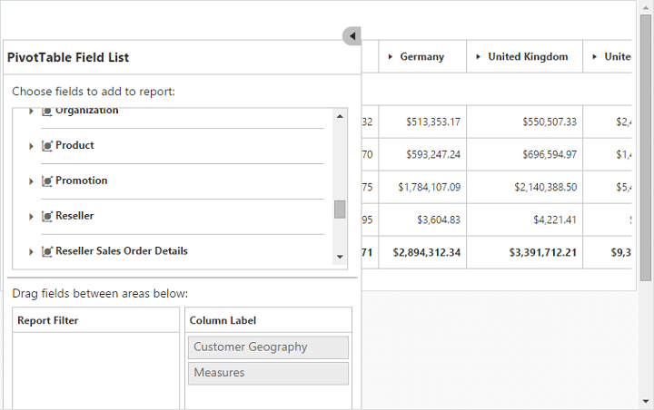

# Responsive

PivotGrid and PivotTable Field list control supports responsive rendering based on the target device (desktop & tablet) resolution. It supports resolution upto 1024x600. You can enable responsiveness in PivotGrid by setting `is-responsive` property to true.
 
On resizing the browser, the PivotTable Field list will get collapse and an icon will appear on the left-hand side of the browser. User can toggle its view and perform UI interaction.



<ej-pivot-grid id="PivotGrid1" is-responsive="true"></ej-pivot-grid>



_Normal PivotGrid_

_Responsive PivotGrid_

_Responsive PivotTable Field List - Collapsed_

_Responsive PivotTable Field List - Expanded_

