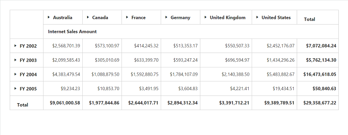

# Responsive

The pivot grid and pivot table field list control supports responsive rendering based on the target device (desktop and tablet) resolution. It supports resolution upto 1024x600. You can enable responsiveness in the pivot grid by setting the `is-responsive` property to true.
 
When resizing the browser, the pivot table field list will be collapsed, and an icon will appear on the left-hand side of the browser. You can toggle its view and perform UI interaction.



<ej-pivot-grid id="PivotGrid1" is-responsive="true"></ej-pivot-grid>



_Normal PivotGrid_

_Responsive PivotGrid_

_Responsive PivotTable Field List - Collapsed_

_Responsive PivotTable Field List - Expanded_

