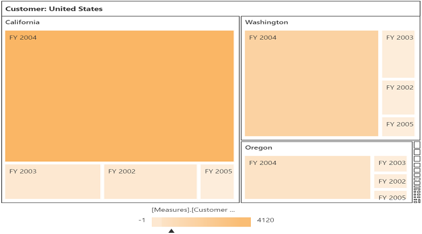
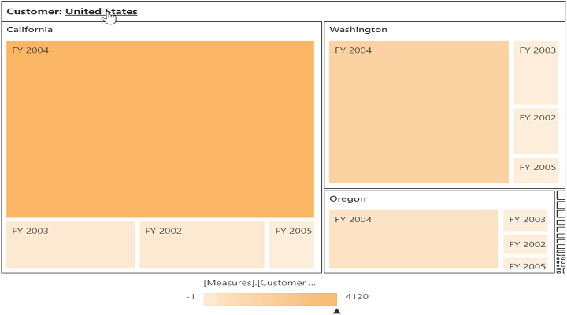

# Drill Operation

Drill down exposes the hierarchy by clicking on a node and this results in allowing the TreeMap to move to the next level or sub level. We can return back to the normal TreeMap view by clicking on the node header at the top.

