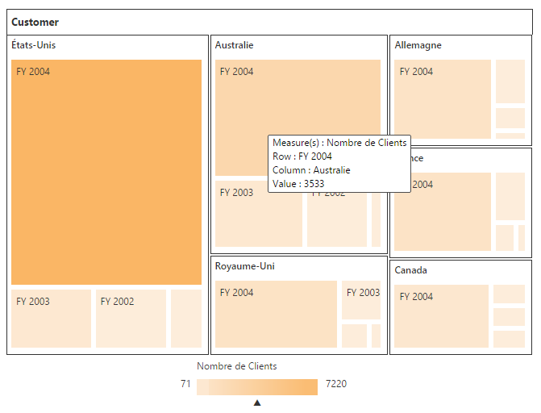

# Localization

## Localization and Globalization of Cube Info (Client Mode)

Content displayed within the PivotTreeMap control are obtained from the OLAP Cube. So following are the steps that needs to be done to get the localized and globalized Cube content.

* To get localized data from OLAP Cube, we need to set **"Locale Identifier"** in the connection string to a specific culture in the **"data"** property present inside **"dataSource"**. 



//1036 refers to “fr-FR” culture.
<ej-pivot-treemap id="PivotTreeMap1">
    <e-data-source catalog="Adventure Works DW 2008 SE" cube="Adventure Works" data="//bi.syncfusion.com/olap/msmdpump.dll">
        <e-pivot-rows>
            <e-row-field field-name="[Core Product Group]" is-named-sets="true"></e-row-field>
        </e-pivot-rows>
        <e-pivot-columns>
            <e-column-field field-name="[Customer].[Customer Geography]"></e-column-field>
        </e-pivot-columns>
        <e-pivot-values>
            <e-value-field axis="Column">
                <e-measures>
                    <e-measure-items field-name="[Measures].[Customer Count]"></e-measure-items>
                </e-measures>
            </e-value-field>
        </e-pivot-values>
    </e-data-source>
</ej-pivot-treemap>
<ej:PivotTreeMap ID="PivotTreeMap1" runat="server" IsResponsive="true" ClientIDMode="Static">
  <DataSource Catalog="Adventure Works DW 2008 SE" Cube="Adventure Works" Data="http://bi.syncfusion.com/olap/msmdpump.dll; Locale Identifier=1036;">
     //...
  </DataSource>
</ej:PivotTreeMap>



 

