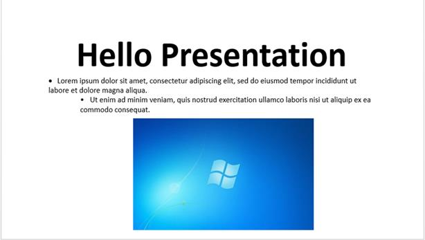

# Getting Started

## Creating a simple PowerPoint Presentation with basic elements from scratch

In this page, you can learn how to create a simple PowerPoint Presentation by using Essential Presentation API.

For creating and manipulating a PowerPoint Presentation, include the following assemblies in the application.

<table>
    <thead>
        <tr>
            <th>
                Assembly Name
            </th>
            <th>
                Short Description
            </th>
        </tr>
    </thead>
    <tbody>
        <tr>
            <td>
                Syncfusion.Presentation.AspNet.Core
            </td>
            <td>
                This assembly contains the core features required for creating, reading, manipulating a Presentation file.
            </td>
        </tr>
        <tr>
            <td>
                Syncfusion.Compression.AspNet.Core
            </td>
            <td>
                This assembly is used to package the Presentation contents.
            </td>
        </tr>
        <tr>
            <td>
                Syncfusion.OfficeChart.AspNet.Core
            </td>
            <td>
                This assembly contains the Office Chart Object model and core features needed for chart creation.
            </td>
        </tr>
    </tbody>
</table>

Include the following namespace in your .cs or .vb code as shown below





using Syncfusion.Presentation;





Imports Syncfusion.Presentation





An entire PowerPoint Presentation is represented by an instance of IPresentation interface and it is the root element of Essential Presentation’s DOM.

The following code example demonstrates how to create an instance of IPresentation interface.





//Creates a new instance of PowerPoint Presentation

IPresentation presentation = Presentation.Create();





'Creates a new instance of PowerPoint Presentation

Dim presentationDocument As IPresentation = Presentation.Create()





IPresentation instance has a slide collection that represents the individual slides present within PowerPoint Presentation. A slide may contain textual and other graphics contents like shapes, images, charts etc.

The following code example demonstrates how to add a blank slide to a PowerPoint Presentation.





//Adds a slide to the PowerPoint Presentation

ISlide firstSlide = presentation.Slides.Add(SlideLayoutType.Blank);





'Adds a slide to the PowerPoint Presentation

Dim firstSlide As ISlide = presentationDocument.Slides.Add(SlideLayoutType.Blank)





N> The “Point” typographic units are used to add or manipulate any element in a Presentation. 

All the textual contents in a Presentation document are represented by Paragraphs. Within the paragraph, textual contents are grouped into one or more child elements as TextParts. Each TextPart represents a region of text with a common set of formatted text.

The following code example demonstrates how to add text into a Presentation.





//Adds a textbox in a slide by specifying its position and size

IShape textShape = firstSlide.AddTextBox(100, 75, 756, 200);

//Adds a paragraph into the textShape

IParagraph paragraph = textShape.TextBody.AddParagraph();

//Set the horizontal alignment of paragraph
          
paragraph.HorizontalAlignment = HorizontalAlignmentType.Center;

//Adds a textPart in the paragraph

ITextPart textPart = paragraph.AddTextPart("Hello Presentation");

//Applies font formatting to the text

textPart.Font.FontSize = 80;

textPart.Font.Bold = true;





'Adds a textbox in a slide by specifying its position and size

Dim textShape As IShape  = firstSlide.AddTextBox(100, 75, 756, 200)

'Adds a paragraph into the textShape

Dim paragraph As IParagraph  = textShape.TextBody.AddParagraph()

'Set the horizontal alignment of paragraph

paragraph.HorizontalAlignment = HorizontalAlignmentType.Center

'Add a textPart in the paragraph

Dim textPart As ITextPart  = paragraph.AddTextPart("Hello Presentation")

'Applies font formatting to the text

textPart.Font.FontSize = 80

textPart.Font.Bold = True





Essential Presentation allows you to create simple and multi-level lists that make the content easier for reading. The following code example demonstrates how to add a bulleted list in a paragraph.





//Adds a new paragraph with text.

paragraph = textShape.TextBody.AddParagraph("Lorem ipsum dolor sit amet, consectetur adipiscing elit, sed do eiusmod tempor incididunt ut labore et dolore magna aliqua.");

//Sets the list type as bullet

paragraph.ListFormat.Type = ListType.Bulleted;

//Sets the bullet character for this list

paragraph.ListFormat.BulletCharacter = Convert.ToChar(183);

//Sets the font of the bullet character

paragraph.ListFormat.FontName = "Symbol";

//Sets the hanging value as 20

paragraph.FirstLineIndent = -20;





'Adds a new paragraph with text.

paragraph = textShape.TextBody.AddParagraph("Lorem ipsum dolor sit amet, consectetur adipiscing elit, sed do eiusmod tempor incididunt ut labore et dolore magna aliqua.")

'Sets the list type as bullet

paragraph.ListFormat.Type = ListType.Bulleted

'Sets the bullet character for this list

paragraph.ListFormat.BulletCharacter = Convert.ToChar(183)

'Sets the font of the bullet character

paragraph.ListFormat.FontName = "Symbol"

'Sets the hanging value as 20

paragraph.FirstLineIndent = -20





In PowerPoint Presentation, the multilevel lists are used for presenting the content in a hierarchy. You can create a multi-level list by setting the indentation levels. By default, the level begins at 0 and increments by 1 for each level. The following code example demonstrates how to add multi-level list in a paragraph.





//Adds a new paragraph  

paragraph = textShape.TextBody.AddParagraph("Ut enim ad minim veniam, quis nostrud exercitation ullamco laboris nisi ut aliquip ex ea commodo consequat.");

//Sets the list type as bullet

paragraph.ListFormat.Type = ListType.Bulleted;

//Sets the list level as 2. Possible values can range from 0 to 8

paragraph.IndentLevelNumber = 2;





'Adds a new paragraph  

paragraph = textShape.TextBody.AddParagraph("Ut enim ad minim veniam, quis nostrud exercitation ullamco laboris nisi ut aliquip ex ea commodo consequat.")

'Sets the list type as bullet

paragraph.ListFormat.Type = ListType.Bulleted

'Sets the list level as 2. Possible values can range from 0 to 8

paragraph.IndentLevelNumber = 2





You can add images to the Presentation by adding them in the picture collection of a slide. The following code example demonstrates how to add an image in a presentation.





//Gets the image from file path

Image image = Image.FromFile("image.jpg");

// Adds the image to the slide by specifying position and size

firstSlide.Pictures.AddPicture(new MemoryStream(image.ImageData), 300, 270, 410, 250);





'Gets the image from file path

Dim image__1 As Image = Image.FromFile("image.jpg")

' Adds the image to the slide by specifying position and size 
firstSlide.Pictures.AddPicture(New MemoryStream (image__1.ImageData), 300, 270, 410, 250)





Finally, save the Presentation in file system.





MemoryStream ms = new MemoryStream();

//Saves the presentation to the memory stream.

presentation.Save(ms);

//Set the position to the beginning of the stream.

ms.Position = 0;

//Initialize the file stream to download the presentation.

FileStreamResult fileStreamResult = new FileStreamResult(ms, "application/vnd.openxmlformats-officedocument.presentationml.presentation");

//Set the file name.

fileStreamResult.FileDownloadName = "Sample.pptx";





Dim ms As New MemoryStream()

'Saves the presentation to the memory stream.

presentation.Save(ms)

'Set the position to the beginning of the stream.

ms.Position = 0

'Initialize the file stream to download the presentation.

Dim fileStreamResult As New FileStreamResult(ms, "application/vnd.openxmlformats-officedocument.presentationml.presentation")

'Set the file name.

fileStreamResult.FileDownloadName = "Sample.pptx"





The resultant PowerPoint Presentation looks as follows.

