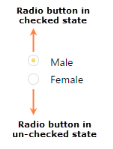
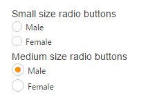

# Easy Customization

## Checked status

You have options to set the state of the radio button as either checked or unchecked. When you select any option from the group of radio buttons, a dot mark appears inside the circle. This is called the checked state. Previously selected radio buttons in this group are unselected that is they go to the unchecked state. The checked property is used to set the state of the radio button.

The following steps explain the details about rendering the Radio Button with the checked option

In the CSHTML page, add the following input elements to configure Radio Button widget.



// Add the code in CSHTML page to configure Radio Button

@* Here checked and unchecked type of radio buttons are rendered in same group

set checked state of radio button as follows*@

    <ej-radio-button id="radiobutton" name="Gender" size="@RadioButtonSize.Small" checked="true" />

    <label for="Radio_checked" class="clslab">Male</label>

     
    <ej-radio-button id="radiobutton1" name="Gender" size="@RadioButtonSize.Small" checked="false" />

    <label for="Radio_unchecked" class="clslab">Female</label>



The following image is displayed as the output for the above steps.

## Text

Specifies the text content for the radio button. In previous programs, separate labels were created for each radio button. But now you have the option to set the text for radio button using the text property. So here you do not have to add a label tag for each radio button in the HTML code.

The following steps explain the details about rendering the Radio Button with Text and without using the label tag options.

In the CSHTML page, add the following input elements to configure the Radio Button widget.



// Add the code in CSHTML page to configure Radio Button

@*radio button with text property*@

    <ej-radio-button id="radiobutton" name="Gender" size="@RadioButtonSize.Small" checked="true" text="Male" />

     
    <ej-radio-button id="radiobutton1" name="Gender" size="@RadioButtonSize.Small" checked="false" text="Female" />



The following image is displayed as the output for the above steps.

## Size

You can render the Radio Button in different sizes. There are some predefined size options available for rendering a Radio Button in an easy way. Each size option has different height and width. It mainly avoids the complexity in rendering Radio Button with complex CSS class. 

_Size_

<table>
<tr>
<th>
Property</th><th>
Description</th></tr>
<tr>
<td>
Small</td><td>
Creates radio button with Built-in small size height, width specified.</td></tr>
<tr>
<td>
Medium</td><td>
Creates radio button with Built-in medium size height, width specified.</td></tr>
</table>

The following steps explain the details about rendering Radio Button with different size options.

In the CSHTML page, add the following input elements to configure Radio Button widget.



// Add the code in CSHTML page to configure Radio Button

@* small and medium size of radio buttons in same group

By default, here no one radio button is checked*@

    Small size radio buttons 
    <ej-radio-button id="radiobutton" name="Gender" size="@RadioButtonSize.Small" checked="true" text="Male" />

     
    <ej-radio-button id="radiobutton1" name="Gender" size="@RadioButtonSize.Small" checked="false" text="Female" />

     
    Medium size radio buttons 

    <ej-radio-button id="radiobutton2" name="Gender" size="@RadioButtonSize.Medium" checked="true" text="Male" />

     
    <ej-radio-button id="radiobutton3" name="Gender" size="@RadioButtonSize.Medium" checked="false" text="Female" />



The following image is displayed as the output for the above steps.

## RTL Support 

In some cases you need to use right-to-left alignment. You can give RTL support by using enable-rtl property.  RTL mode works when you use the Text property in Radio Button. The Radio Buttons and text are aligned in the right-to-left format. For example, when text is right-aligned and Radio Button is left-aligned, after you apply right-to-left alignment, these positions are interchanged. 

The following steps explain the details about rendering the Radio Button with right-to-left alignment support. Here the text property is necessary.

In the CSHTML page, add the following button elements to configure Radio Button widget.



// Add the code in CSHTML page to configure Radio Button

@*set radio button with right to left format*@

    <ej-radio-button id="radiobutton" name="Gender" size="@RadioButtonSize.Small" checked="true" text="Male" enable-rtl="true" />

     
    <ej-radio-button id="radiobutton1" name="Gender" size="@RadioButtonSize.Small" checked="false" text="Female" enable-rtl="true" />



The following image is displayed as the output for the above steps.

