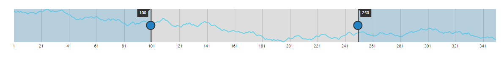
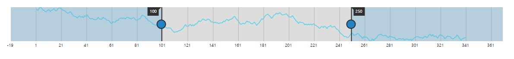
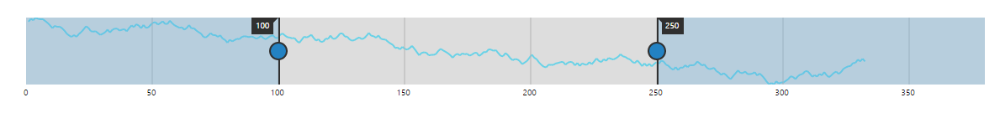
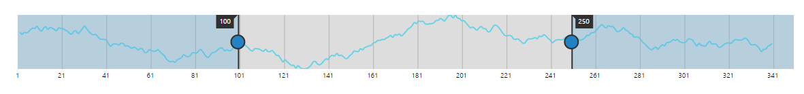
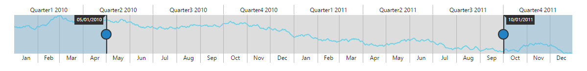
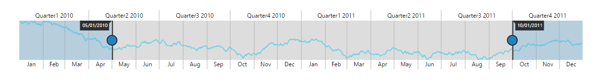
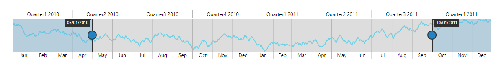

# Range Padding

Range Padding adds padding for range in RangeNavigator. It allows you to space the grid lines in the RangeNavigator.  By default, this property is set to none.

## Numeric

The RangePadding property allows you to customize the automatic range calculation using the default auto range calculation for RangeNavigator. 


 

    <ej-range-navigator id="range" load="loadingdata" value-type="Numeric" range-padding="None">
        <e-chart-series>
            <e-series name="Product A" type="Line" fill="#69D2E7">
            </e-series>
        </e-chart-series>
        <e-selected-range-settings start="100" end="250"></e-selected-range-settings>
    </ej-range-navigator>



## None:

By default, the RangePadding for numerical range is none. The range is calculated from the minimum value to the maximum value of data in the RangeNavigator.

The following screenshot illustrates a RangeNavigator with RangePadding set to none.

## Additional:

When you set the RangePadding for numerical range to Additional, range is padded with an interval.

The following screenshot illustrates a RangeNavigator with RangePadding set to additional.

## Normal:

In normal RangePadding, automatic range calculation differs based on the data. 

The following screenshot illustrates RangeNavigator with RangePadding set to normal

## Round:

Round RangePadding for a numerical range rounds the range of the control to the nearest possible value that is divisible by the interval.

The following screenshot illustrates a RangeNavigator with RangePadding set to Round.

## DateTime

Using the default range calculation for RangeNavigator, the RangePadding property allows you to customize the range. 


 

    <ej-range-navigator id="range" load="loadingdata" value-type="Datetime" range-padding="None">
        <e-chart-series>
            <e-series name="Product A" type="Line" fill="#69D2E7">
            </e-series>
        </e-chart-series>
        <e-selected-range-settings start="2010/5/1" end="2011/10/1"></e-selected-range-settings>
    </ej-range-navigator>



## None:

By default, the RangePadding for DateTime range is none. The range is calculated from the minimum value to the maximum value of data in the RangeNavigator

The following screenshot illustrates a RangeNavigator with RangePadding set to none.

## Round:

Round RangePadding for a DateTime range rounds the range of the control to the nearest possible value.

The following screenshot illustrates a RangeNavigator with RangePadding set to Round.

## Customize axis range of navigator

RangeNavigator calculates the range automatically based on the values of series data points. However you can explicitly specify the range using the Start, End properties in RangeSettings that is not possible when data is provided.

The following code example renders a RangeNavigator with a range from 2010 January 5 to 2011 January 10. 


 

    <ej-range-navigator id="range" load="loadingdata" value-type="Datetime">
        <e-chart-series>
            <e-series name="Product A" type="Line" fill="#69D2E7">
            </e-series>
        </e-chart-series>
        <e-selected-range-settings start="2010/5/1" end="2011/10/1"></e-selected-range-settings>
    </ej-range-navigator>



