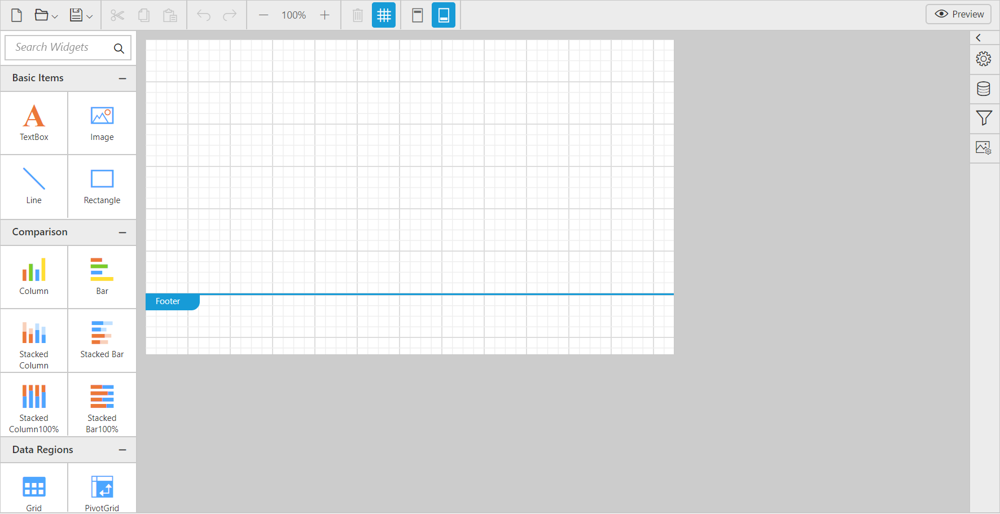

# Getting Started

This section explains briefly about how to create a ReportDesigner in your ASP.NET core application.

## Environment setup
Refer the [installation](/aspnet-core/configuration-and-installation) page to know more about the basic steps to configure the Syncfusion components to use with ASP.NET Core application. 

N> NuGet package reference will be mostly preferred with ASP.NET Core development to setup the environment without installation, if you missed to explore then refer to the [nuget-package-manager-settings](/aspnet-core/nuget-packages) to configure the Syncfusion NuGet source.

## Create your first ReportDesigner application in ASP.NET Core 1.0.1 

### References
You should add the following packages for the report designer:

<table>
<tr>
<th>
Package</th>
<th>
Purpose
</th>
</tr>
<tr>
<td>Syncfusion.EJ</td>
<td>Builds the report designer controls with the tag helper.</td>
</tr>
<tr>
<td>Syncfusion.EJ.AspNet.Core</td>
<td>Builds the report designer controls with the tag helper.</td>
</tr>
<tr>
<td>Syncfusion.EJ.ReportDesigner.AspNet.Core</td>
<td>Builds the server-side implementations.</td>
</tr>
<tr>
<td>Syncfusion.EJ.ReportViewer.AspNet.Core</td>
<td>Builds the server-side implementations.</td>
</tr>
<tr>
<td>Syncfusion.Report.Net.Core</td>
<td>It is a base library for the <b>Syncfusion.EJ.ReportDesigner.AspNet.Core</b> and <b>Syncfusion.EJ.ReportViewer.AspNet.Core</b>package.</td>
</tr>
<tr>
<td>Syncfusion.Compression.Net.Core</td>
<td>Supports for exporting the report to PDF, Microsoft Word, and Microsoft Excel format. It is a base library for the packages <b>Syncfusion.Pdf.Net.Core</b> , <b>Syncfusion.DocIO.Net.Core</b> and <b>Syncfusion.XlsIO.Net.Core</b>. </td>
</tr>
<tr>
<td>Syncfusion.Pdf.Net.Core</td>
<td>Supports for exporting the report to a PDF.</td>
</tr>
<tr>
<td>Syncfusion.DocIO.Net.Core</td>
<td>Supports for exporting the report to a Word.</td>
</tr>
<tr>
<td>Syncfusion.XlsIO.Net.Core</td>
<td>Supports for exporting the report to an Excel.</td>
</tr>
<tr>
<td>Syncfusion.OfficeChart.Net.Core</td>
<td>It is a base library of the <b>Syncfusion.XlsIO.Net.Core package</b>.</td>
</tr>
<tr>
<td>Newtonsoft.Json</td>
<td>Serialize and deserialize the data for report designer. It is a mandatory package for the report designer, and the package version should be higher of 10.0.1 for NET Core 2.0 and others should be higher of 9.0.1.</td>
</tr>
<tr>
<td>System.Data.SqlClient</td>
<td>This is an optional package for the report designer. It should be referred in project when renders the RDL report and which contains the SQL Server and SQL Azure datasource. Also, the package version should be higher of 4.1.0 . </td>
</tr>
</table>

### Styles and scripts

Ensure whether all the necessary dependency scripts and style packages are included within the *bower.json* file as mentioned [here](/aspnet-core/getting-started#configure-syncfusion-components-in-aspnet-core-application), so that the required scripts and CSS will be installed and loaded into the mentioned location (**wwwroot -> lib**) within your project.

Now, refer to the necessary scripts and CSS files in your *_Layout.cshtml* page from the **wwwroot -> lib -> syncfusion-javascript** folder.

N> Include the below mentioned scripts and CSS references under the appropriate environment. (For eg: If your environment is "Development", then refer the scripts and CSS files under the tag *environment names="Development"*). Refer all the required external and internal scripts only once in the page with proper order. Refer this [link](https://help.syncfusion.com/js/control-initialization#adding-the-required-javascript-files) to know about order of script reference.   



<!DOCTYPE html>
<html>
<head>
    <meta charset="utf-8" />
    <meta name="viewport" content="width=device-width, initial-scale=1.0" />
    <title>@ViewData["Title"] - ReportDesignerDemo</title>

    <environment include="Development">
        <link rel="stylesheet" href="~/lib/bootstrap/dist/css/bootstrap.css" />
        <link rel="stylesheet" href="~/css/site.css" />

        <link href="~/lib/syncfusion-javascript/Content/ej/web/default-theme/ej.web.all.min.css" rel="stylesheet" />
        <link href="~/lib/syncfusion-javascript/Content/ej/web/default-theme/ej.reportdesigner.min.css" rel="stylesheet" />
        <link href="~/lib/syncfusion-javascript/Content/ej/web/responsive-css/ej.responsive.css" rel="stylesheet" />
        <link href="https://cdnjs.cloudflare.com/ajax/libs/codemirror/5.37.0/codemirror.min.css" rel="stylesheet" />
        <link href="https://cdnjs.cloudflare.com/ajax/libs/codemirror/5.37.0/addon/hint/show-hint.min.css" rel="stylesheet" />

    </environment>
    <environment exclude="Development">
        <link rel="stylesheet" href="https://ajax.aspnetcdn.com/ajax/bootstrap/3.3.7/css/bootstrap.min.css"
              asp-fallback-href="~/lib/bootstrap/dist/css/bootstrap.min.css"
              asp-fallback-test-class="sr-only" asp-fallback-test-property="position" asp-fallback-test-value="absolute" />
        <link rel="stylesheet" href="~/css/site.min.css" asp-append-version="true" />

        <link href="~/lib/syncfusion-javascript/Content/ej/web/default-theme/ej.web.all.min.css" rel="stylesheet" />
        <link href="~/lib/syncfusion-javascript/Content/ej/web/default-theme/ej.reportdesigner.min.css" rel="stylesheet" />
        <link href="~/lib/syncfusion-javascript/Content/ej/web/responsive-css/ej.responsive.css" rel="stylesheet" />
        <link href="https://cdnjs.cloudflare.com/ajax/libs/codemirror/5.37.0/codemirror.min.css" rel="stylesheet" />
        <link href="https://cdnjs.cloudflare.com/ajax/libs/codemirror/5.37.0/addon/hint/show-hint.min.css" rel="stylesheet" />

    </environment>
</head>
<body>
    <environment include="Development">
        
        
        

        
        
        
        
        
        
        

    </environment>
    <environment exclude="Development">
        
        
        

        
        
        
        
        
        
        

    </environment>

    @RenderSection("Scripts", required: false)

</body>
</html>


*  Add **ScriptManager** to the bottom of the **layout.cshtml** page. The **ScriptManager** used to place our control initialization script in the page.

   
   
    <ej-script-manager></ej-script-manager>
	
   

### Tag helper

It is necessary to define the following namespace within the *_viewImports.cshtml* page to initialize the report designer component with the tag helper support.



    @addTagHelper *, Microsoft.AspNetCore.Mvc.TagHelpers
    @using Syncfusion.JavaScript
    @addTagHelper "*, Syncfusion.EJ"



## Add control with page

You can use the <ej-report-designer> tag to add the report designer control. For an example, the Index.cshtml page can be replaced with the following code by removing the existing codes to add the report designer.



@{
    ViewData["Title"] = "Home Page";
}

    <ej-report-designer id="reportdesigner1" service-url="https://js.syncfusion.com/demos/ejservices/api/ReportDesigner" />



N> In the report designer service url, need to mention the controller name of the reporting service. To create reporting service for report designer follow the steps explained in the following link [Reporting Service ](https://help.syncfusion.com/aspnetmvc/reportdesigner/getting-started#add-webapi-controller-for-reportdesigner).

## Run the application

Run the sample application and you can see the ReportDesigner on the page as displayed in the following screenshot:

